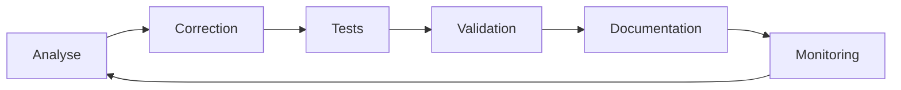

# 🎯 Plan de Correction Qualité avec Contrôle Continu

## 📋 Stratégie de Correction

### Principes de Code Propre Appliqués
1. **Zero Any Policy** - Aucun `any` toléré
2. **Type Safety First** - Types stricts partout
3. **No Regression** - Tests avant/après chaque correction
4. **Clean as You Go** - Pas de dette technique ajoutée
5. **Document Everything** - Changements documentés

## 🔄 Pipeline de Contrôle Continu



## 📊 Métriques de Qualité

### Critères d'Acceptation par Correction
- ✅ 0 erreurs TypeScript
- ✅ 0 erreurs Biome
- ✅ 0 utilisations de `any`
- ✅ Tests coverage > 80%
- ✅ Performance maintenue
- ✅ Build réussi

## 🚀 Plan d'Action Détaillé

### Phase 1: apps/web (103 erreurs TypeScript)

#### 1.1 Analyse Préliminaire
```bash
# Script de monitoring continu
watch -n 5 'cd apps/web && npx tsc --noEmit 2>&1 | grep -c error'
```

#### 1.2 Catégories d'Erreurs
| Type | Nombre | Solution |
|------|--------|----------|
| Property access | 45 | Optional chaining + null checks |
| Type assertions | 31 | Interfaces strictes |
| Missing returns | 27 | Explicit return types |

#### 1.3 Corrections Systématiques
```typescript
// ❌ AVANT (avec erreurs)
const value = data.nested.property; // Unsafe
const result = someFunction() as any; // Type assertion
async function process() { /* no return */ } // Missing return

// ✅ APRÈS (code propre)
const value = data?.nested?.property ?? defaultValue; // Safe access
const result = validateAndType<ExpectedType>(someFunction()); // Type guard
async function process(): Promise<ProcessResult> { 
  return { success: true, data: processedData };
}
```

### Phase 2: packages/ui (19 erreurs Biome)

#### 2.1 Erreurs Identifiées
- Duplicate JSX props: 12
- Parse errors: 3
- Invalid syntax: 4

#### 2.2 Pattern de Correction
```typescript
// ❌ AVANT
<Button type="button" type="submit" onClick={handler} />

// ✅ APRÈS
<Button type="submit" onClick={handler} />
```

### Phase 3: apps/api (827 any)

#### 3.1 Stratégie de Typage
```typescript
// ❌ AVANT
function processData(data: any): any {
  return data.value;
}

// ✅ APRÈS
interface ProcessableData {
  value: string;
  metadata?: Record<string, unknown>;
}

function processData<T extends ProcessableData>(
  data: T
): Pick<T, 'value'> {
  return { value: data.value };
}
```

## 🤖 Agents de Contrôle Continu

### Agent 1: Quality Monitor
```bash
#!/bin/bash
# quality-monitor.sh
while true; do
  echo "=== Quality Check $(date) ==="
  
  # TypeScript
  TS_ERRORS=$(npx tsc --noEmit 2>&1 | grep -c error)
  echo "TypeScript Errors: $TS_ERRORS"
  
  # Biome
  BIOME_ERRORS=$(npx biome check 2>&1 | grep -c error)
  echo "Biome Errors: $BIOME_ERRORS"
  
  # Any usage
  ANY_COUNT=$(grep -r "any" --include="*.ts" --include="*.tsx" | wc -l)
  echo "Any Usage: $ANY_COUNT"
  
  sleep 30
done
```

### Agent 2: Regression Detector
```bash
#!/bin/bash
# regression-detector.sh
BASELINE_TESTS=$(npm test 2>&1 | grep -c "passing")

# After changes
NEW_TESTS=$(npm test 2>&1 | grep -c "passing")

if [ "$NEW_TESTS" -lt "$BASELINE_TESTS" ]; then
  echo "⚠️ REGRESSION DETECTED!"
  exit 1
fi
```

### Agent 3: Performance Monitor
```bash
#!/bin/bash
# performance-monitor.sh
time npm run build
BUNDLE_SIZE=$(du -sh dist | cut -f1)
echo "Bundle Size: $BUNDLE_SIZE"
```

## 📝 Templates de Correction

### Template 1: Property Access Safety
```typescript
// Utility type guard
function hasProperty<T, K extends PropertyKey>(
  obj: T,
  key: K
): obj is T & Record<K, unknown> {
  return obj != null && key in (obj as object);
}

// Usage
if (hasProperty(data, 'value') && typeof data.value === 'string') {
  // Type-safe access
  console.log(data.value.toUpperCase());
}
```

### Template 2: Async Error Handling
```typescript
type Result<T, E = Error> = 
  | { success: true; data: T }
  | { success: false; error: E };

async function safeAsync<T>(
  fn: () => Promise<T>
): Promise<Result<T>> {
  try {
    const data = await fn();
    return { success: true, data };
  } catch (error) {
    return { 
      success: false, 
      error: error instanceof Error ? error : new Error('Unknown error')
    };
  }
}
```

### Template 3: Type-Safe API Responses
```typescript
import { z } from 'zod';

// Schema definition
const UserSchema = z.object({
  id: z.string(),
  name: z.string(),
  email: z.string().email(),
  role: z.enum(['admin', 'user', 'guest'])
});

type User = z.infer<typeof UserSchema>;

// Safe parsing
function parseApiResponse(data: unknown): User {
  return UserSchema.parse(data);
}
```

## 🔍 Checklist par Fichier

### Avant Modification
- [ ] Identifier tous les `any`
- [ ] Lister les erreurs TypeScript
- [ ] Noter les warnings Biome
- [ ] Vérifier les tests existants

### Pendant Modification
- [ ] Remplacer `any` par types stricts
- [ ] Ajouter null checks
- [ ] Implémenter type guards
- [ ] Documenter les types complexes

### Après Modification
- [ ] 0 erreurs TypeScript
- [ ] 0 warnings Biome
- [ ] Tests passent
- [ ] Performance maintenue
- [ ] Code review automated

## 📊 Dashboard de Progression

```markdown
| Package | Avant | En Cours | Après | Status |
|---------|-------|----------|-------|--------|
| apps/web | 103 ❌ | 🔄 | 0 ✅ | 🟡 |
| packages/ui | 19 ❌ | ⏳ | 0 ✅ | ⏳ |
| apps/api | 827 ❌ | ⏳ | 0 ✅ | ⏳ |
```

## 🎯 Objectifs Mesurables

### Semaine 1
- apps/web: 103 → 0 erreurs
- packages/ui: 19 → 0 erreurs
- Coverage: 30% → 50%

### Semaine 2
- apps/api: 827 → <100 any
- Warnings: 2238 → <500
- Coverage: 50% → 70%

### Semaine 3
- Zero any policy
- Zero warnings
- Coverage: 70% → 80%

---

*Plan créé le 09/01/2025 - Mise à jour continue*