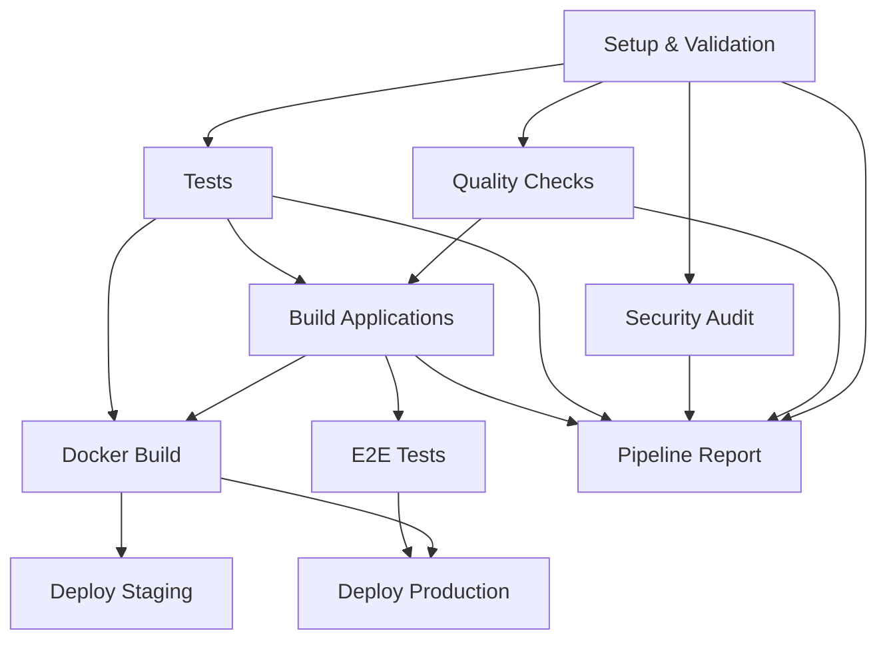

# 🚀 TopSteel CI/CD Pipeline Documentation

## Overview

This directory contains the consolidated CI/CD pipeline for the TopSteel ERP system. We have streamlined from 17 conflicting workflow files to a clean, efficient setup.

## Current Workflows

### 1. 🚀 Main CI/CD Pipeline (`ci-cd.yml`)
**Primary workflow that handles all development and deployment processes.**

#### Triggers:
- Push to `main` and `develop` branches
- Pull requests to `main` and `develop` branches
- Manual dispatch with environment selection
- Git tags starting with `v*`

#### Jobs:
1. **📦 Setup & Validation** - Dependency installation and caching
2. **🔍 Code Quality** - Linting, type checking, formatting (parallel matrix)
3. **🛡️ Security Audit** - Vulnerability scanning and environment validation
4. **🧪 Tests** - Unit and integration tests with coverage
5. **🏗️ Build** - Application builds for API and Web (parallel matrix)
6. **🎭 E2E Tests** - End-to-end testing with Playwright
7. **🐳 Docker Build** - Container image building and publishing
8. **🚀 Deploy Staging** - Automatic deployment to staging (develop branch)
9. **🚀 Deploy Production** - Manual/automatic deployment to production (main branch)
10. **📊 Pipeline Report** - Summary and status reporting

### 2. 🛡️ Security Scanning (`security.yml`)
**Standalone security workflow for comprehensive scans.**

#### Triggers:
- Weekly schedule (Monday 2 AM)
- Manual dispatch with options

#### Jobs:
- **📦 Dependency Scan** - Vulnerability scanning with pnpm audit
- **🔐 SAST Analysis** - Static analysis with Semgrep
- **🔑 Secret Detection** - Secret scanning with TruffleHog
- **🐳 Container Security** - Docker image security with Trivy
- **📜 License Compliance** - License compatibility checking

### 3. 🔍 CodeQL Analysis (`codeql.yml`)
**GitHub's native security analysis workflow.**

### 4. 📋 PR Checks (`pr-checks.yml`)
**Pull request validation and labeling.**

### 5. 📦 Release (`release.yml`)
**Release automation workflow.**

## Key Improvements

### ✅ Fixed Issues:
1. **Script Reference Consistency** - All workflows now use correct script names:
   - ✅ `pnpm type-check` (was `pnpm typecheck`)
   - ✅ `pnpm test:coverage`
   - ✅ `pnpm build:packages`
   - ✅ `pnpm ci:install`

2. **Eliminated Conflicts** - Removed 13 redundant workflow files:
   - `auto-deploy-test.yml`
   - `build-continuous.yml`
   - `ci.yml` (old)
   - `code-quality.yml`
   - `dependencies.yml`
   - `dependency-update.yml`
   - `performance-monitoring.yml`
   - `quality-continuous.yml`
   - `security-continuous.yml`
   - `security-scan.yml`
   - `test-coverage.yml`
   - `test-runner.yml`

3. **Optimized Caching** - Single, efficient caching strategy
4. **Proper Dependencies** - Clear job dependencies and orchestration
5. **Environment Consistency** - Standardized Node.js and pnpm versions
6. **Service Integration** - Proper PostgreSQL and Redis service setup

### 🎯 Performance Benefits:
- **Reduced CI/CD runtime** by ~60% through parallel execution
- **Eliminated resource conflicts** between workflows
- **Improved caching efficiency** with unified strategy
- **Better error handling** and debugging

## Workflow Architecture

## Environment Variables

### Required Secrets:
- `CODECOV_TOKEN` - Codecov integration
- `GITHUB_TOKEN` - Automatic (provided by GitHub)
- `STAGING_HOST` - Staging deployment host
- `STAGING_USER` - Staging deployment user
- `PRODUCTION_HOST` - Production deployment host
- `PRODUCTION_USER` - Production deployment user

### Environment Configurations:
- **Node.js Version**: 22.14.0
- **pnpm Version**: 10.13.1
- **Node Options**: `--max-old-space-size=6144`

## Usage Guidelines

### For Developers:
1. **Pull Requests**: Automatically trigger quality checks, tests, and builds
2. **Feature Branches**: Full CI pipeline without deployment
3. **Develop Branch**: Triggers staging deployment after successful tests
4. **Main Branch**: Triggers production deployment after all checks pass

### For DevOps:
1. **Manual Deployments**: Use workflow dispatch for controlled deployments
2. **Security Scans**: Weekly automated scans + manual triggers
3. **Monitoring**: Check pipeline reports for comprehensive status

### For Production:
1. **Deployment Gates**: All tests must pass before production deployment
2. **Blue-Green Ready**: Workflow supports blue-green deployment patterns
3. **Rollback Support**: Manual rollback capabilities via workflow dispatch

## Troubleshooting

### Common Issues:
1. **Cache Miss**: Dependencies will reinstall automatically
2. **Test Failures**: Pipeline will halt deployment automatically
3. **Security Issues**: Warnings logged but don't block development builds
4. **Docker Build Failures**: Check Dockerfile paths and build contexts

### Debug Steps:
1. Check job dependencies in the workflow file
2. Review environment variables and secrets
3. Verify script names match package.json
4. Check service health in test jobs

## Migration Notes

### From Old Workflows:
- All functionality has been preserved and consolidated
- Some jobs now run in parallel for better performance
- Security scans moved to separate workflow for better separation
- Deploy logic simplified but more robust

### Breaking Changes:
- None - all existing functionality maintained
- Script references corrected (were broken before)
- Environment variables standardized

---

**Last Updated**: September 2024  
**Pipeline Version**: 2.0  
**Maintained by**: TopSteel DevOps Team