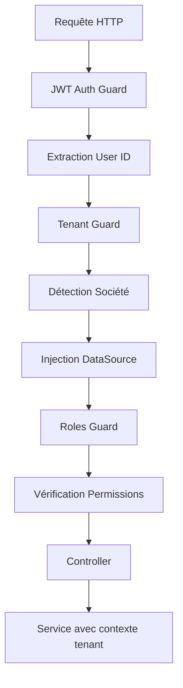

# Architecture Multi-Tenant TopSteel ERP

## Vue d'ensemble

TopSteel ERP utilise une architecture multi-tenant hybride avec isolation des données au niveau base de données pour garantir la sécurité et la performance.

## Structure des bases de données

### 1. **Base Auth** (`erp_topsteel_auth`)
Base centralisée pour l'authentification et les autorisations.

**Tables principales:**
- `users` - Utilisateurs globaux du système
- `roles` - Rôles système (SUPER_ADMIN, ADMIN, USER)
- `permissions` - Permissions granulaires
- `user_societe_roles` - Association utilisateur/société/rôle
- `user_sessions` - Sessions actives
- `user_mfa` - Configuration 2FA

### 2. **Base Shared** (`erp_topsteel_shared`)
Données partagées entre tous les tenants.

**Tables principales:**
- `societes` - Organisations/entreprises (tenants)
- `sites` - Sites physiques des sociétés
- `parameters_system` - Configuration système globale
- `menus` - Structure de navigation
- `discovered_pages` - Pages découvertes automatiquement

### 3. **Base Tenant** (`erp_topsteel_topsteel`)
Données métier spécifiques à chaque tenant.

**Tables principales:**
- `articles` - Catalogue produits
- `partners` - Clients et fournisseurs
- `projects` - Projets de métallerie
- `orders` - Ordres de fabrication
- `invoices` - Factures
- `stocks` - Gestion des stocks

## Mécanisme d'isolation

### Niveau API (NestJS)

```typescript
// Configuration multi-tenant dans multi-tenant-database.config.ts
@Injectable()
export class MultiTenantDatabaseConfig {
  private dataSources: Map<string, DataSource> = new Map()
  
  async getDataSource(tenantId: string): Promise<DataSource> {
    // Récupération ou création de la connexion tenant
    if (!this.dataSources.has(tenantId)) {
      const dataSource = await this.createTenantDataSource(tenantId)
      this.dataSources.set(tenantId, dataSource)
    }
    return this.dataSources.get(tenantId)!
  }
}
```

### Guards de sécurité

1. **JwtAuthGuard** - Authentification JWT
2. **TenantGuard** - Injection du contexte tenant
3. **EnhancedRolesGuard** - Vérification des permissions

### Flux de requête



## Hiérarchie des rôles

### Rôles globaux
- **SUPER_ADMIN** - Accès total système
- **ADMIN** - Administration multi-société
- **USER** - Utilisateur standard

### Rôles société
- **OWNER** - Propriétaire de la société
- **ADMIN** - Administrateur société
- **MANAGER** - Gestionnaire
- **EMPLOYEE** - Employé
- **VIEWER** - Lecture seule

## Gestion des connexions

### Pool de connexions
```typescript
// Configuration optimisée par tenant
DB_POOL_MIN=2        // Connexions minimales
DB_POOL_MAX=10       // Connexions maximales
CONNECTION_TIMEOUT=5000
```

### Cache Redis
- Sessions utilisateurs
- Cache de recherche par tenant
- Invalidation automatique

## Migration des données

### Scripts de migration
```bash
# Migrations par base
npm run migration:auth:run      # Base auth
npm run migration:shared:run    # Base shared  
npm run migration:tenant:run    # Base tenant
```

### Ordre de migration
1. Auth (utilisateurs, rôles)
2. Shared (sociétés, configuration)
3. Tenant (données métier)

## Sécurité

### Isolation des données
- ✅ Connexions séparées par tenant
- ✅ Validation société dans chaque requête
- ✅ Audit trail par société
- ✅ Chiffrement des données sensibles

### Contrôles d'accès
- JWT avec refresh tokens
- MFA optionnel
- Rate limiting par tenant
- Session management

## Performance

### Optimisations
- Pool de connexions par tenant
- Cache Redis multiniveau
- Lazy loading des DataSources
- Query optimization

### Monitoring
- Métriques par tenant
- Alertes de performance
- Logs structurés

## Points d'attention

### Limites actuelles
- Maximum 100 connexions simultanées par tenant
- Cache Redis partagé (isolation par préfixe)
- Pas de sharding horizontal

### Évolutions futures
- [ ] Sharding par région
- [ ] Cache dédié par gros tenant
- [ ] Backup isolé par tenant
- [ ] API rate limiting dynamique

## Configuration exemple

```env
# Base Auth
AUTH_DB_HOST=localhost
AUTH_DB_NAME=erp_topsteel_auth

# Base Shared  
SHARED_DB_HOST=localhost
SHARED_DB_NAME=erp_topsteel_shared

# Base Tenant (template)
TENANT_DB_HOST=localhost
TENANT_DB_NAME_PREFIX=erp_topsteel_

# Redis pour cache/sessions
REDIS_HOST=localhost
REDIS_PORT=6379
```

## Commandes utiles

```bash
# Vérifier les connexions
npm run db:check-consistency

# Créer un nouveau tenant
npm run tenant:create --name="NouveauClient"

# Migrer un tenant spécifique
npm run migration:tenant:run --tenant="client_123"

# Audit des permissions
npm run security:audit --tenant="all"
```

## Support

Pour toute question sur l'architecture multi-tenant:
- Documentation technique: `/docs/multi-tenant`
- Contact: architecture@topsteel.fr