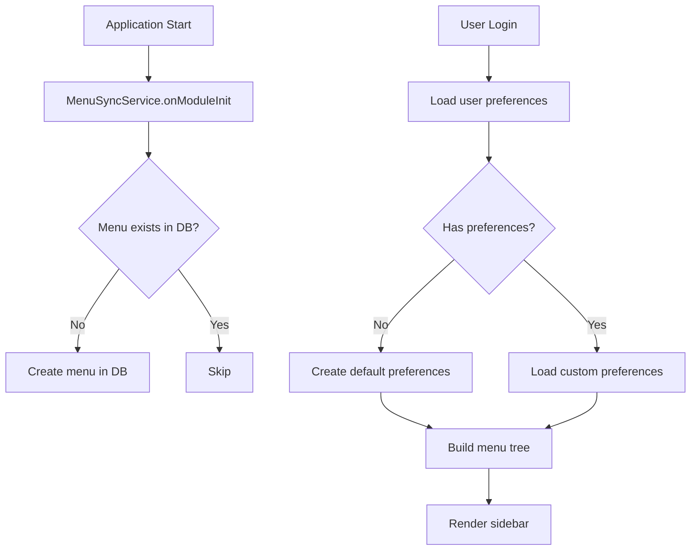

# 🎯 Architecture du Système de Menus TopSteel

## 📊 Vue d'Ensemble

Le système de menus fonctionne sur 3 niveaux :

1. **Base de données** : Table `menu_items` (source de vérité)
2. **Admin** : Gestion centralisée des menus pour tous
3. **Utilisateur** : Personnalisation individuelle des menus

## 🗄️ Structure Base de Données

### Table `menu_items`
```sql
menu_items {
  id: UUID
  configId: UUID           # Configuration associée
  parentId: UUID?          # Pour hiérarchie
  title: string            # Titre affiché
  type: ENUM               # M=Dossier, P=Programme, L=Lien, D=DataView
  programId: string?       # ID unique du programme/route
  orderIndex: integer      # Ordre d'affichage
  isVisible: boolean       # Visibilité par défaut
  permissions: JSON?       # Permissions requises
  roles: JSON?            # Rôles requis
}
```

### Table `user_menu_preferences`
```sql
user_menu_preferences {
  userId: UUID
  menuId: string
  isVisible: boolean
  order: integer
  customLabel: string?
}
```

## 🔄 Système d'Auto-Insertion des Menus

### Principe
Si un menu n'existe pas en base, il doit s'ajouter automatiquement au démarrage de l'application.

### Implementation Proposée

```typescript
// apps/api/src/features/menu/services/menu-sync.service.ts
import { Injectable, OnModuleInit } from '@nestjs/common'
import { InjectRepository } from '@nestjs/typeorm'
import { Repository } from 'typeorm'
import { MenuItem, MenuItemType } from '../entities/menu-item.entity'

@Injectable()
export class MenuSyncService implements OnModuleInit {
  constructor(
    @InjectRepository(MenuItem, 'auth')
    private menuRepository: Repository<MenuItem>
  ) {}

  async onModuleInit() {
    await this.syncMenus()
  }

  /**
   * Synchronise les menus définis dans le code avec la base de données
   */
  private async syncMenus() {
    const defaultMenus = this.getDefaultMenuStructure()
    
    for (const menu of defaultMenus) {
      await this.ensureMenuExists(menu)
    }
  }

  /**
   * Vérifie qu'un menu existe, le crée sinon
   */
  private async ensureMenuExists(menuDef: MenuDefinition) {
    const existing = await this.menuRepository.findOne({
      where: { programId: menuDef.programId }
    })

    if (!existing) {
      const newMenu = this.menuRepository.create({
        ...menuDef,
        configId: await this.getDefaultConfigId(),
        createdAt: new Date(),
        createdBy: 'SYSTEM'
      })
      
      await this.menuRepository.save(newMenu)
      console.log(`✅ Menu créé automatiquement: ${menuDef.title}`)
    }

    // Récursif pour les sous-menus
    if (menuDef.children) {
      for (const child of menuDef.children) {
        await this.ensureMenuExists({
          ...child,
          parentId: existing?.id || newMenu.id
        })
      }
    }
  }

  /**
   * Structure des menus par défaut de l'application
   */
  private getDefaultMenuStructure(): MenuDefinition[] {
    return [
      {
        programId: 'dashboard',
        title: 'Tableau de bord',
        type: MenuItemType.PROGRAM,
        route: '/dashboard',
        icon: 'LayoutDashboard',
        orderIndex: 0,
        isVisible: true
      },
      {
        programId: 'inventory',
        title: 'Inventaire',
        type: MenuItemType.FOLDER,
        icon: 'Package',
        orderIndex: 10,
        isVisible: true,
        children: [
          {
            programId: 'inventory-articles',
            title: 'Articles',
            type: MenuItemType.PROGRAM,
            route: '/inventory/articles',
            icon: 'Box',
            orderIndex: 11,
            isVisible: true
          },
          {
            programId: 'inventory-materials',
            title: 'Matériaux',
            type: MenuItemType.PROGRAM,
            route: '/inventory/materials',
            icon: 'Layers',
            orderIndex: 12,
            isVisible: true
          },
          {
            programId: 'inventory-stock',
            title: 'Stock',
            type: MenuItemType.PROGRAM,
            route: '/inventory/stock',
            icon: 'Package2',
            orderIndex: 13,
            isVisible: true
          }
        ]
      },
      {
        programId: 'partners',
        title: 'Partenaires',
        type: MenuItemType.FOLDER,
        icon: 'Users',
        orderIndex: 20,
        isVisible: true,
        children: [
          {
            programId: 'partners-clients',
            title: 'Clients',
            type: MenuItemType.PROGRAM,
            route: '/partners/clients',
            icon: 'UserCheck',
            orderIndex: 21,
            isVisible: true
          },
          {
            programId: 'partners-suppliers',
            title: 'Fournisseurs',
            type: MenuItemType.PROGRAM,
            route: '/partners/suppliers',
            icon: 'Truck',
            orderIndex: 22,
            isVisible: true
          }
        ]
      },
      {
        programId: 'sales',
        title: 'Ventes',
        type: MenuItemType.FOLDER,
        icon: 'ShoppingCart',
        orderIndex: 30,
        isVisible: true,
        children: [
          {
            programId: 'sales-quotes',
            title: 'Devis',
            type: MenuItemType.PROGRAM,
            route: '/sales/quotes',
            icon: 'FileText',
            orderIndex: 31,
            isVisible: true
          },
          {
            programId: 'sales-orders',
            title: 'Commandes',
            type: MenuItemType.PROGRAM,
            route: '/sales/orders',
            icon: 'ShoppingBag',
            orderIndex: 32,
            isVisible: true
          }
        ]
      },
      {
        programId: 'finance',
        title: 'Finance',
        type: MenuItemType.FOLDER,
        icon: 'DollarSign',
        orderIndex: 40,
        isVisible: true,
        children: [
          {
            programId: 'finance-invoices',
            title: 'Factures',
            type: MenuItemType.PROGRAM,
            route: '/finance/invoices',
            icon: 'Receipt',
            orderIndex: 41,
            isVisible: true
          }
        ]
      },
      {
        programId: 'projects',
        title: 'Projets',
        type: MenuItemType.PROGRAM,
        route: '/projects',
        icon: 'Briefcase',
        orderIndex: 50,
        isVisible: true
      }
    ]
  }
}

interface MenuDefinition {
  programId: string
  title: string
  type: MenuItemType
  route?: string
  icon?: string
  orderIndex: number
  isVisible: boolean
  parentId?: string
  children?: MenuDefinition[]
  permissions?: string[]
  roles?: string[]
}
```

## 🎨 Composant Sidebar Frontend

### Récupération des menus
```typescript
// apps/web/src/components/layout/sidebar.tsx
export function Sidebar() {
  const { data: menus } = useQuery({
    queryKey: ['user-menus'],
    queryFn: async () => {
      // 1. Récupère les menus de l'utilisateur (avec ses préférences)
      const response = await fetch('/api/user/menu')
      return response.json()
    }
  })

  return (
    <nav>
      {menus?.map(menu => (
        <MenuItem key={menu.programId} menu={menu} />
      ))}
    </nav>
  )
}
```

## 📋 Flux de Données



## 🔐 Gestion des Permissions

### Niveaux de contrôle
1. **Base** : Menu visible ou non dans `menu_items`
2. **Rôles** : Relation avec `menu_item_roles`
3. **Permissions** : Relation avec `menu_item_permissions`
4. **Utilisateur** : Préférences dans `user_menu_preferences`

### Logique d'affichage
```typescript
function isMenuVisible(menu: MenuItem, user: User): boolean {
  // 1. Vérifier visibilité de base
  if (!menu.isVisible) return false
  
  // 2. Vérifier les rôles
  if (menu.roles?.length > 0) {
    if (!user.roles.some(r => menu.roles.includes(r))) {
      return false
    }
  }
  
  // 3. Vérifier les permissions
  if (menu.permissions?.length > 0) {
    if (!user.permissions.some(p => menu.permissions.includes(p))) {
      return false
    }
  }
  
  // 4. Vérifier préférences utilisateur
  const preference = user.menuPreferences.find(p => p.menuId === menu.programId)
  if (preference && !preference.isVisible) {
    return false
  }
  
  return true
}
```

## 🚀 Migration vers la Nouvelle Architecture

### Phase 1 : Sync Service
1. Créer `MenuSyncService`
2. L'ajouter au module Menu
3. Tester l'auto-création des menus

### Phase 2 : Mise à jour des menus
1. Ajouter les nouveaux modules (inventory, sales, finance, etc.)
2. Marquer les anciens comme obsolètes
3. Gérer la transition

### Phase 3 : Frontend
1. Adapter la sidebar pour utiliser les menus de la DB
2. Implémenter la personnalisation utilisateur
3. Gérer le cache et les performances

## ✅ Checklist d'Implémentation

- [ ] Créer `MenuSyncService` avec auto-insertion
- [ ] Ajouter au démarrage de l'application
- [ ] Définir tous les nouveaux menus (inventory, sales, etc.)
- [ ] Créer migration pour nettoyer les anciens menus
- [ ] Adapter la sidebar frontend
- [ ] Implémenter cache Redis pour performances
- [ ] Tester avec différents rôles/permissions
- [ ] Documenter pour les admins

## 📝 Notes Importantes

1. **Idempotence** : Le sync doit pouvoir s'exécuter plusieurs fois sans problème
2. **Performance** : Utiliser le cache pour éviter les requêtes répétées
3. **Multi-tenant** : Les menus sont globaux mais les préférences sont par tenant
4. **Évolution** : Prévoir un système de versioning des menus

Cette architecture permet :
- ✅ Auto-création des nouveaux menus
- ✅ Gestion centralisée par les admins
- ✅ Personnalisation par utilisateur
- ✅ Respect des permissions
- ✅ Évolution facile de la structure