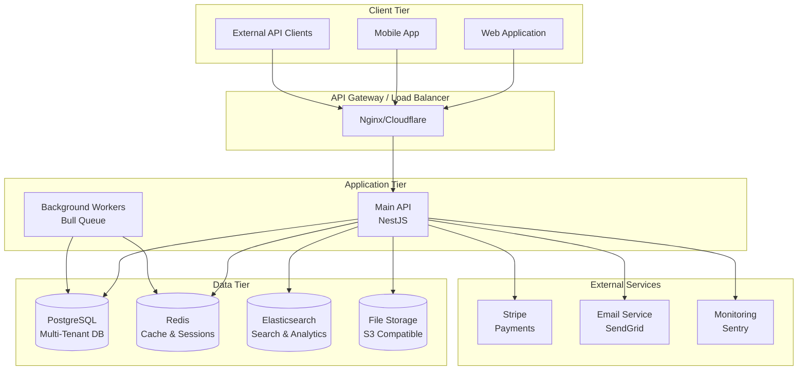
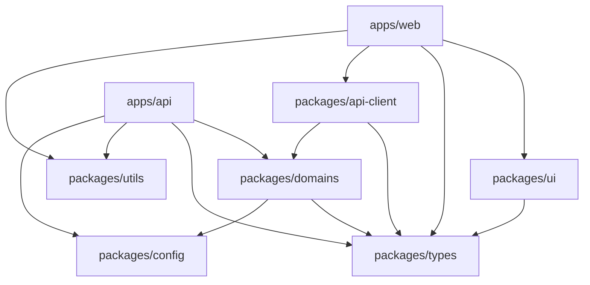
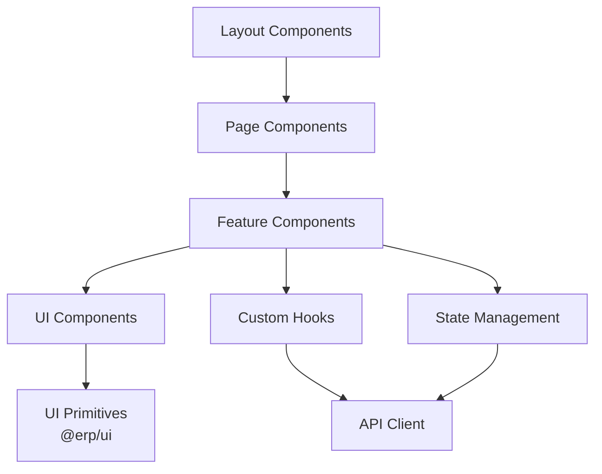
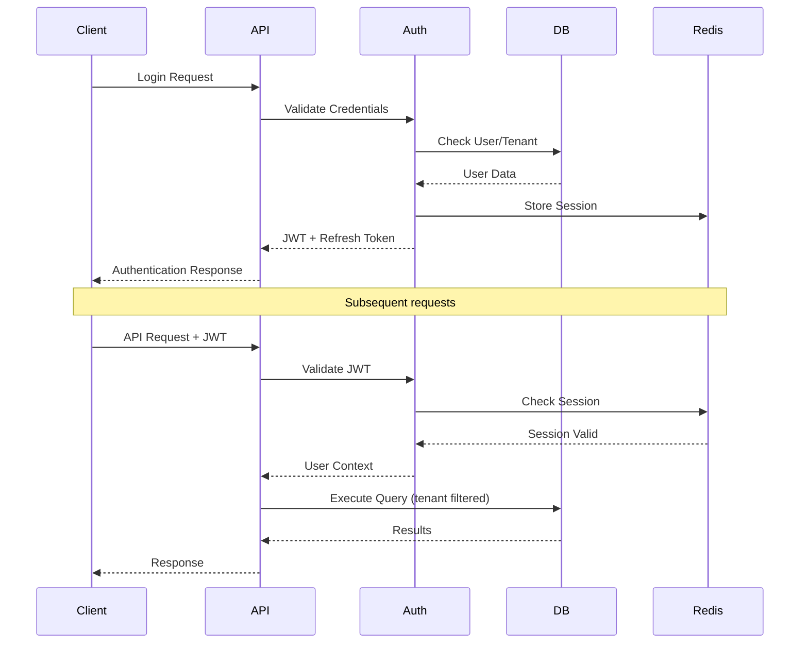
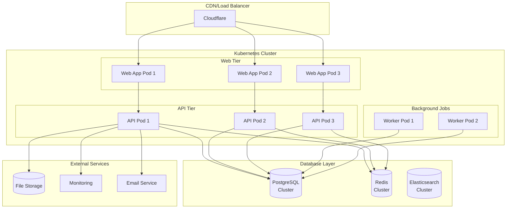
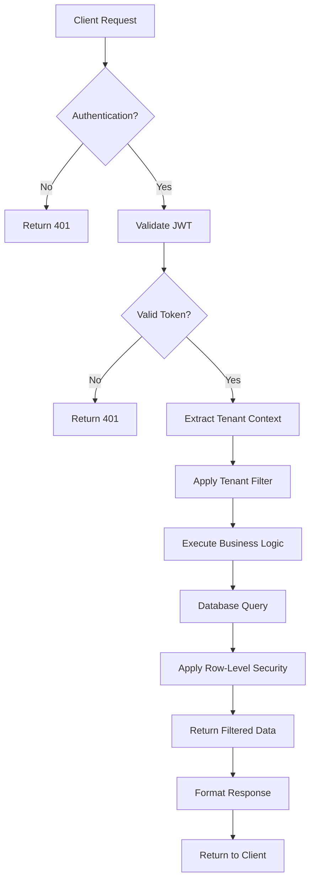

# TopSteel ERP - System Architecture

*Version 1.0 - August 2025*

## Table of Contents

- [Overview](#overview)
- [System Architecture](#system-architecture)
- [Monorepo Structure](#monorepo-structure)
- [Application Architecture](#application-architecture)
- [Database Architecture](#database-architecture)
- [Security Architecture](#security-architecture)
- [Infrastructure Architecture](#infrastructure-architecture)
- [Data Flow](#data-flow)
- [Scalability Considerations](#scalability-considerations)
- [Technology Stack](#technology-stack)

## Overview

TopSteel ERP is a modern, multi-tenant enterprise resource planning system built with a monorepo architecture. The system is designed to handle complex business operations for steel trading companies with multiple subsidiaries and locations.

### Key Architectural Principles

- **Multi-Tenant**: Complete data isolation between companies
- **Microservices Ready**: Modular design for future service extraction  
- **Type-Safe**: End-to-end TypeScript with strict typing
- **Security First**: Built-in security controls and audit trails
- **Scalable**: Designed for horizontal and vertical scaling
- **Maintainable**: Clean code practices and comprehensive testing

## System Architecture



## Monorepo Structure

```
TopSteel/
├── apps/                           # Applications
│   ├── api/                        # Main NestJS API
│   │   ├── src/
│   │   │   ├── core/              # Core services (config, database)
│   │   │   ├── domains/           # Business domains
│   │   │   ├── features/          # Application features
│   │   │   ├── infrastructure/    # Cross-cutting concerns
│   │   │   └── shared/            # Shared utilities
│   │   └── test/                  # E2E tests
│   └── web/                       # Next.js Web Application
│       ├── src/
│       │   ├── app/              # Next.js App Router
│       │   ├── components/       # React components
│       │   ├── hooks/            # Custom hooks
│       │   ├── lib/              # Utility libraries
│       │   └── stores/           # State management
│       └── public/               # Static assets
├── packages/                      # Shared packages
│   ├── ui/                       # Shared UI components
│   ├── types/                    # TypeScript type definitions
│   ├── domains/                  # Business logic
│   ├── api-client/               # API client library
│   ├── utils/                    # Utility functions
│   └── config/                   # Shared configuration
├── docs/                         # Documentation
├── scripts/                      # Build and deployment scripts
└── deployment/                   # Infrastructure as code
```

### Package Dependencies



## Application Architecture

### Backend API Architecture (NestJS)

#### Layered Architecture

```
┌─────────────────────────────────────┐
│            Controllers              │  ← HTTP Layer
├─────────────────────────────────────┤
│              Guards                 │  ← Security Layer
├─────────────────────────────────────┤
│             Services                │  ← Business Logic Layer
├─────────────────────────────────────┤
│            Repositories             │  ← Data Access Layer
├─────────────────────────────────────┤
│             Database                │  ← Persistence Layer
└─────────────────────────────────────┘
```

#### Core Modules

```typescript
// Core application structure
@Module({
  imports: [
    // Core Infrastructure
    CoreModule,           // Database, config, monitoring
    SecurityModule,       // Authentication, authorization
    MonitoringModule,     // Logging, metrics, health checks
    
    // Business Domains
    AuthModule,           // Authentication & authorization
    UsersModule,          // User management
    PartnersModule,       // Partner/customer management
    InventoryModule,      // Inventory management
    OrdersModule,         // Order processing

    // Features
    QueryBuilderModule,   // Dynamic query building
    NotificationsModule,  // Notification system
  ],
})
export class AppModule {}
```

#### Module Structure Pattern

```typescript
// Standard module structure
@Module({
  imports: [
    TypeOrmModule.forFeature([EntityClass]),
    forwardRef(() => RelatedModule), // Avoid circular dependencies
  ],
  controllers: [EntityController],
  providers: [
    EntityService,
    EntityRepository,
    EntityValidator,
  ],
  exports: [EntityService], // Only export what's needed
})
export class EntityModule {}
```

### Frontend Architecture (Next.js)

#### App Router Structure

```
src/app/
├── (app)/                 # Main application routes
│   ├── layout.tsx         # App shell layout
│   ├── page.tsx          # Dashboard
│   ├── inventory/        # Inventory pages
│   ├── orders/           # Order management
│   └── partners/         # Partner management
├── (auth)/               # Authentication routes
│   ├── layout.tsx        # Auth layout
│   ├── login/           # Login page
│   └── register/        # Registration
├── api/                  # API routes
│   ├── auth/            # Authentication endpoints
│   └── webhooks/        # Webhook handlers
├── globals.css          # Global styles
└── layout.tsx           # Root layout
```

#### Component Architecture



#### State Management Strategy

```typescript
// Zustand store pattern
interface AppStore {
  // State
  user: User | null
  tenantId: string | null
  
  // Actions
  setUser: (user: User) => void
  setTenant: (tenantId: string) => void
  
  // Computed values
  isAuthenticated: boolean
}

export const useAppStore = create<AppStore>((set, get) => ({
  user: null,
  tenantId: null,
  
  setUser: (user) => set({ user }),
  setTenant: (tenantId) => set({ tenantId }),
  
  get isAuthenticated() {
    return get().user !== null
  },
}))
```

## Database Architecture

### Multi-Tenant Strategy

We use a **shared database, separate schemas** approach:

```sql
-- Database structure
topsteel_erp/
├── auth_schema/              -- Global authentication data
│   ├── tenants               -- Tenant definitions
│   ├── users                 -- Global user accounts
│   ├── user_tenant_access    -- User-tenant relationships
│   └── system_settings       -- Global system configuration
├── tenant_001/               -- Tenant-specific schema
│   ├── articles              -- Products/inventory
│   ├── orders                -- Order management
│   ├── partners              -- Customer/supplier data
│   └── ...                   -- All business data
└── tenant_002/               -- Another tenant's schema
    ├── articles
    ├── orders
    └── ...
```

#### Tenant Isolation Pattern

```typescript
// Base entity with tenant isolation
export abstract class TenantEntity extends BaseEntity {
  @Column('uuid')
  @Index()
  tenantId!: string

  @ManyToOne(() => Tenant)
  @JoinColumn({ name: 'tenant_id' })
  tenant!: Tenant
}

// Repository with automatic tenant filtering
@Injectable()
export class ArticleRepository extends Repository<Article> {
  async findByTenant(tenantId: string, options?: FindManyOptions<Article>) {
    return this.find({
      ...options,
      where: {
        tenantId,
        ...options?.where,
      },
    })
  }
}
```

### Entity Relationship Patterns

```typescript
// Standard entity relationship structure
@Entity('orders')
@Index(['tenantId', 'orderNumber'], { unique: true })
@Index(['tenantId', 'status'])
@Index(['tenantId', 'createdAt'])
export class Order extends TenantEntity {
  @Column({ unique: false }) // Not globally unique, only per tenant
  orderNumber!: string

  @Column({
    type: 'enum',
    enum: OrderStatus,
    default: OrderStatus.PENDING,
  })
  @Index()
  status!: OrderStatus

  // Many-to-one relationship
  @ManyToOne(() => Partner, { eager: false })
  @JoinColumn({ name: 'partner_id' })
  partner!: Partner

  @Column('uuid')
  partnerId!: string

  // One-to-many relationship with cascade
  @OneToMany(() => OrderItem, item => item.order, {
    cascade: ['insert', 'update'],
    orphanedRowAction: 'delete',
  })
  items!: OrderItem[]

  // Computed properties
  @Column('decimal', { precision: 10, scale: 2, default: 0 })
  totalAmount!: number

  // Audit fields
  @CreateDateColumn()
  createdAt!: Date

  @UpdateDateColumn()
  updatedAt!: Date
}
```

### Database Indexing Strategy

```sql
-- Performance indexes
CREATE INDEX CONCURRENTLY idx_orders_tenant_status ON orders(tenant_id, status);
CREATE INDEX CONCURRENTLY idx_orders_tenant_created ON orders(tenant_id, created_at);
CREATE INDEX CONCURRENTLY idx_articles_tenant_sku ON articles(tenant_id, sku);

-- Search indexes
CREATE INDEX CONCURRENTLY idx_partners_search ON partners 
  USING gin(to_tsvector('french', name || ' ' || COALESCE(email, '')));

-- Partial indexes for soft deletes
CREATE INDEX CONCURRENTLY idx_active_users ON users(tenant_id, email) 
  WHERE deleted_at IS NULL;
```

## Security Architecture

### Authentication & Authorization Flow



### Security Layers

1. **Network Security**
   - TLS/HTTPS everywhere
   - CORS configuration
   - Rate limiting
   - DDoS protection

2. **Application Security**
   - JWT authentication
   - RBAC authorization
   - CSRF protection
   - Input validation
   - SQL injection prevention

3. **Data Security**
   - Tenant isolation
   - Sensitive data encryption
   - Audit logging
   - PII protection

### Security Guards Implementation

```typescript
// Compound security guard
@Injectable()
export class CompoundGuard implements CanActivate {
  constructor(
    private jwtGuard: JwtAuthGuard,
    private tenantGuard: TenantGuard,
    private roleGuard: RoleGuard,
    private csrfGuard: CsrfGuard,
  ) {}

  async canActivate(context: ExecutionContext): Promise<boolean> {
    // Sequential guard execution
    const guards = [
      this.jwtGuard,      // Authentication
      this.tenantGuard,   // Tenant access validation
      this.roleGuard,     // Role-based access
      this.csrfGuard,     // CSRF protection
    ]

    for (const guard of guards) {
      const canActivate = await guard.canActivate(context)
      if (!canActivate) {
        return false
      }
    }

    return true
  }
}
```

## Infrastructure Architecture

### Deployment Architecture



### Container Architecture

```dockerfile
# Multi-stage build for optimization
FROM node:18-alpine AS builder
WORKDIR /app
COPY package*.json ./
COPY pnpm-lock.yaml ./
RUN npm install -g pnpm
RUN pnpm install --frozen-lockfile
COPY . .
RUN pnpm run build

FROM node:18-alpine AS runner
WORKDIR /app
RUN addgroup --system --gid 1001 nodejs
RUN adduser --system --uid 1001 nextjs
COPY --from=builder /app/public ./public
COPY --from=builder --chown=nextjs:nodejs /app/.next/standalone ./
COPY --from=builder --chown=nextjs:nodejs /app/.next/static ./.next/static
USER nextjs
EXPOSE 3000
CMD ["node", "server.js"]
```

## Data Flow

### Request Processing Flow



### Multi-Tenant Query Flow

```typescript
// Automatic tenant filtering in repositories
@Injectable()
export class BaseRepository<T extends TenantEntity> {
  constructor(
    @Inject('TENANT_CONTEXT') private tenantContext: TenantContext,
  ) {}

  async find(options: FindManyOptions<T>): Promise<T[]> {
    return this.repository.find({
      ...options,
      where: {
        tenantId: this.tenantContext.getCurrentTenantId(),
        ...options.where,
      },
    })
  }
}
```

## Scalability Considerations

### Horizontal Scaling

1. **Stateless Applications**: All application logic is stateless
2. **Database Sharding**: Tenant-based sharding strategy ready
3. **Microservices**: Modular design enables service extraction
4. **Caching Strategy**: Redis for session and query caching

### Vertical Scaling

1. **Database Optimization**: Proper indexing and query optimization
2. **Connection Pooling**: Efficient database connection management
3. **Memory Management**: Optimized memory usage patterns
4. **CPU Optimization**: Efficient algorithms and data structures

### Performance Patterns

```typescript
// Caching strategy
@Injectable()
export class CachedDataService {
  constructor(
    private redisService: RedisService,
    private dataService: DataService,
  ) {}

  async getData(tenantId: string, key: string): Promise<Data[]> {
    const cacheKey = `tenant:${tenantId}:data:${key}`
    
    // Try cache first
    const cached = await this.redisService.get(cacheKey)
    if (cached) {
      return JSON.parse(cached)
    }

    // Fallback to database
    const data = await this.dataService.getData(tenantId, key)
    
    // Cache for next time
    await this.redisService.setex(cacheKey, 3600, JSON.stringify(data))
    
    return data
  }
}
```

## Technology Stack

### Backend Stack

- **Runtime**: Node.js 18+
- **Framework**: NestJS 10+
- **Language**: TypeScript 5+
- **Database**: PostgreSQL 14+
- **ORM**: TypeORM 0.3+
- **Cache**: Redis 6+
- **Search**: Elasticsearch 8+
- **Queue**: Bull Queue
- **Validation**: class-validator
- **Testing**: Vitest

### Frontend Stack

- **Framework**: Next.js 14+ (App Router)
- **Language**: TypeScript 5+
- **UI Library**: React 18+
- **State Management**: Zustand
- **Styling**: Tailwind CSS
- **Components**: Radix UI
- **Forms**: React Hook Form
- **Testing**: Vitest + React Testing Library
- **Build Tool**: Turbo

### Infrastructure Stack

- **Containerization**: Docker
- **Orchestration**: Kubernetes
- **CI/CD**: GitHub Actions
- **Monitoring**: Sentry
- **Logging**: Winston/Pino
- **Security**: Helmet, CORS, Rate Limiting
- **File Storage**: S3-compatible storage
- **Email**: SendGrid

### Development Tools

- **Monorepo**: pnpm workspaces + Turborepo
- **Linting**: Biome
- **Type Checking**: TypeScript
- **API Documentation**: Swagger/OpenAPI
- **Database Migrations**: TypeORM migrations
- **Code Quality**: Biome + TypeScript strict mode

---

This architecture provides a solid foundation for a scalable, maintainable, and secure ERP system. The design enables future growth and adaptation while maintaining code quality and developer productivity.

**Last Updated**: August 2025  
**Next Review**: November 2025