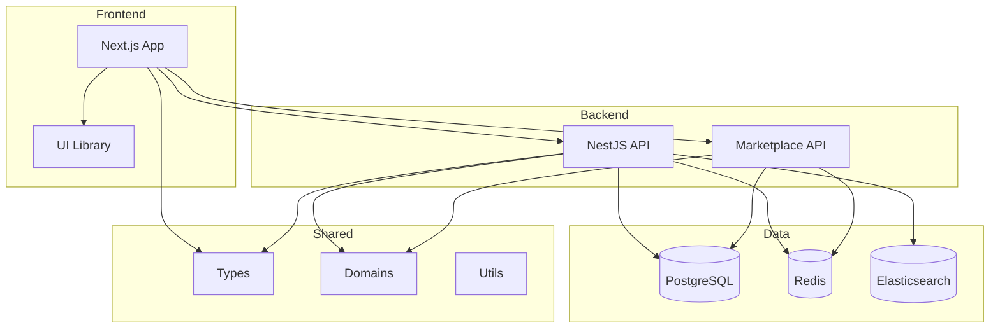
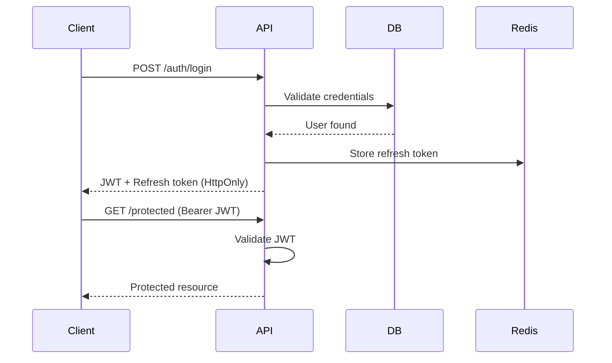

# 🏗️ Architecture Technique - TopSteel ERP

## 📐 Vue d'Ensemble

TopSteel ERP utilise une architecture moderne basée sur les principes DDD (Domain-Driven Design) et Clean Architecture, organisée en monorepo avec Turborepo.



## 🎯 Principes Architecturaux

### 1. Domain-Driven Design (DDD)

```typescript
// Structure d'un domaine
packages/domains/src/inventory/
├── entities/          # Entités métier
├── repositories/      # Interfaces de persistance
├── services/          # Logique métier
├── dto/              # Data Transfer Objects
├── events/           # Événements domaine
└── index.ts          # Exports publics
```

### 2. Clean Architecture

- **Separation of Concerns** : Chaque couche a une responsabilité unique
- **Dependency Inversion** : Les dépendances pointent vers l'intérieur
- **Testability** : Chaque composant est testable indépendamment
- **Flexibility** : Changement de technologie sans impact métier

### 3. Monorepo Structure

```
TopSteel/
├── apps/
│   ├── api/                 # Backend principal
│   ├── marketplace-api/      # Microservice marketplace
│   └── web/                 # Frontend Next.js
├── packages/
│   ├── api-client/          # Client API TypeScript
│   ├── config/              # Configuration partagée
│   ├── domains/             # Logique métier
│   ├── types/               # Types partagés
│   ├── ui/                  # Composants UI
│   └── utils/               # Utilitaires
├── turbo.json               # Configuration Turborepo
└── package.json             # Workspace root
```

## 🔧 Stack Technique Détaillée

### Frontend (apps/web)

#### Core Technologies
- **Framework**: Next.js 14 avec App Router
- **Language**: TypeScript 5.5 (strict mode)
- **Styling**: Tailwind CSS + CSS Modules
- **Components**: shadcn/ui + Radix UI

#### State Management
```typescript
// Zustand pour état global
const useAppStore = create<AppState>((set) => ({
  user: null,
  theme: 'light',
  setUser: (user) => set({ user }),
  setTheme: (theme) => set({ theme }),
}))

// React Query pour data fetching
const { data, error, isLoading } = useQuery({
  queryKey: ['articles'],
  queryFn: fetchArticles,
  staleTime: 5 * 60 * 1000, // 5 minutes
})
```

#### Routing & Navigation
```typescript
// App Router structure
app/
├── (auth)/              # Routes authentifiées
│   ├── dashboard/
│   └── inventory/
├── (public)/            # Routes publiques
│   ├── login/
│   └── register/
├── api/                 # API Routes
└── layout.tsx           # Root layout
```

### Backend (apps/api)

#### Architecture NestJS
```typescript
// Module structure
@Module({
  imports: [
    TypeOrmModule.forFeature([Article]),
    CacheModule,
  ],
  controllers: [ArticlesController],
  providers: [
    ArticlesService,
    ArticlesRepository,
    CacheService,
  ],
  exports: [ArticlesService],
})
export class ArticlesModule {}
```

#### Database Layer
```typescript
// TypeORM Entity
@Entity('articles')
export class Article {
  @PrimaryGeneratedColumn('uuid')
  id: string

  @Column({ unique: true })
  reference: string

  @Column()
  designation: string

  @ManyToOne(() => Category)
  @JoinColumn()
  category: Category

  @CreateDateColumn()
  createdAt: Date
}

// Repository Pattern
@Injectable()
export class ArticlesRepository {
  constructor(
    @InjectRepository(Article)
    private readonly repository: Repository<Article>,
  ) {}

  async findByReference(reference: string): Promise<Article> {
    return this.repository.findOne({
      where: { reference },
      relations: ['category'],
    })
  }
}
```

### Shared Packages

#### Types Package
```typescript
// Shared type definitions
export interface Article {
  id: string
  reference: string
  designation: string
  quantity: number
  unit: UnitType
  price: Money
  specifications: TechnicalSpecs
}

export type UnitType = 'KG' | 'M' | 'M2' | 'PIECE'

export interface Money {
  amount: number
  currency: 'EUR' | 'USD'
}
```

#### Domains Package
```typescript
// Business logic encapsulation
export class StockMovementService {
  async createMovement(data: CreateMovementDTO): Promise<Movement> {
    // Validation
    this.validateMovement(data)
    
    // Business rules
    await this.checkStockAvailability(data)
    
    // Transaction
    return this.db.transaction(async (tx) => {
      const movement = await tx.movements.create(data)
      await tx.stock.update(movement)
      await this.eventBus.publish(new MovementCreatedEvent(movement))
      return movement
    })
  }
}
```

## 🔐 Sécurité

### Authentication Flow


### Authorization (RBAC)
```typescript
// Guard implementation
@Injectable()
export class PermissionGuard implements CanActivate {
  async canActivate(context: ExecutionContext): Promise<boolean> {
    const request = context.switchToHttp().getRequest()
    const user = request.user
    const requiredPermission = this.reflector.get<string>('permission', context.getHandler())
    
    return this.permissionService.hasPermission(user.id, requiredPermission)
  }
}

// Usage
@UseGuards(JwtAuthGuard, PermissionGuard)
@RequirePermission('articles.write')
@Post()
async createArticle(@Body() dto: CreateArticleDTO) {
  return this.articlesService.create(dto)
}
```

## 🚀 Performance Optimizations

### Frontend Optimizations
- **Code Splitting**: Dynamic imports pour réduire le bundle
- **Image Optimization**: Next/Image avec lazy loading
- **Prefetching**: Link prefetch pour navigation instantanée
- **Memoization**: useMemo/useCallback pour éviter re-renders

### Backend Optimizations
- **Query Optimization**: Indexes et eager loading
- **Caching Strategy**: Redis pour cache distribué
- **Connection Pooling**: Pool de connexions DB
- **Rate Limiting**: Protection contre abus

### Caching Strategy
```typescript
// Multi-level caching
class CacheService {
  // L1: Memory cache (local)
  private memoryCache = new Map()
  
  // L2: Redis cache (distributed)
  constructor(private redis: Redis) {}
  
  async get<T>(key: string): Promise<T | null> {
    // Check L1
    if (this.memoryCache.has(key)) {
      return this.memoryCache.get(key)
    }
    
    // Check L2
    const cached = await this.redis.get(key)
    if (cached) {
      const value = JSON.parse(cached)
      this.memoryCache.set(key, value)
      return value
    }
    
    return null
  }
}
```

## 📊 Monitoring & Observability

### Logging
```typescript
// Structured logging with Winston
const logger = winston.createLogger({
  format: winston.format.json(),
  transports: [
    new winston.transports.File({ filename: 'error.log', level: 'error' }),
    new winston.transports.File({ filename: 'combined.log' }),
  ],
})

// Usage
logger.info('Article created', {
  articleId: article.id,
  userId: user.id,
  timestamp: new Date().toISOString(),
})
```

### Metrics
```typescript
// OpenTelemetry integration
const meter = metrics.getMeter('topsteel-api')
const requestCounter = meter.createCounter('http_requests_total')
const requestDuration = meter.createHistogram('http_request_duration_ms')

// Middleware
app.use((req, res, next) => {
  const start = Date.now()
  
  res.on('finish', () => {
    requestCounter.add(1, {
      method: req.method,
      route: req.route?.path,
      status: res.statusCode,
    })
    
    requestDuration.record(Date.now() - start, {
      method: req.method,
      route: req.route?.path,
    })
  })
  
  next()
})
```

## 🧪 Testing Strategy

### Unit Tests
```typescript
describe('ArticlesService', () => {
  let service: ArticlesService
  let repository: MockRepository<Article>

  beforeEach(() => {
    repository = createMockRepository()
    service = new ArticlesService(repository)
  })

  it('should create article with valid data', async () => {
    const dto = { reference: 'ART001', designation: 'Test Article' }
    const article = await service.create(dto)
    
    expect(article).toBeDefined()
    expect(article.reference).toBe(dto.reference)
    expect(repository.save).toHaveBeenCalledWith(dto)
  })
})
```

### Integration Tests
```typescript
describe('Articles API', () => {
  it('POST /articles should create article', async () => {
    const response = await request(app.getHttpServer())
      .post('/articles')
      .set('Authorization', `Bearer ${token}`)
      .send({
        reference: 'ART001',
        designation: 'Test Article',
      })
      
    expect(response.status).toBe(201)
    expect(response.body).toHaveProperty('id')
  })
})
```

### E2E Tests
```typescript
describe('Article Management Flow', () => {
  it('should complete article lifecycle', async () => {
    // Login
    await page.goto('/login')
    await page.fill('[name=email]', 'test@example.com')
    await page.fill('[name=password]', 'password')
    await page.click('button[type=submit]')
    
    // Create article
    await page.goto('/inventory/articles')
    await page.click('button:has-text("New Article")')
    await page.fill('[name=reference]', 'ART001')
    await page.fill('[name=designation]', 'Test Article')
    await page.click('button:has-text("Save")')
    
    // Verify creation
    await expect(page.locator('text=ART001')).toBeVisible()
  })
})
```

## 🚢 Deployment

### Docker Configuration
```dockerfile
# Multi-stage build
FROM node:18-alpine AS builder
WORKDIR /app
COPY package.json pnpm-lock.yaml ./
RUN npm install -g pnpm && pnpm install --frozen-lockfile
COPY . .
RUN pnpm build

FROM node:18-alpine AS runner
WORKDIR /app
COPY --from=builder /app/dist ./dist
COPY --from=builder /app/node_modules ./node_modules
EXPOSE 3000
CMD ["node", "dist/main.js"]
```

### Kubernetes Deployment
```yaml
apiVersion: apps/v1
kind: Deployment
metadata:
  name: topsteel-api
spec:
  replicas: 3
  selector:
    matchLabels:
      app: topsteel-api
  template:
    metadata:
      labels:
        app: topsteel-api
    spec:
      containers:
      - name: api
        image: topsteel/api:latest
        ports:
        - containerPort: 3000
        env:
        - name: DATABASE_URL
          valueFrom:
            secretKeyRef:
              name: db-secret
              key: url
        resources:
          requests:
            memory: "256Mi"
            cpu: "250m"
          limits:
            memory: "512Mi"
            cpu: "500m"
```

## 📈 Scalability

### Horizontal Scaling
- **Load Balancing**: NGINX/HAProxy pour distribution
- **Session Management**: Redis pour sessions partagées
- **Database Scaling**: Read replicas pour lectures
- **Caching Layer**: CDN pour assets statiques

### Vertical Scaling
- **Resource Optimization**: Profiling et optimization
- **Database Tuning**: Indexes et query optimization
- **Memory Management**: Garbage collection tuning
- **Connection Pooling**: Optimized pool sizes

## 🔄 CI/CD Pipeline

### GitHub Actions Workflow
```yaml
name: CI/CD Pipeline
on:
  push:
    branches: [main, develop]
  pull_request:
    branches: [main]

jobs:
  test:
    runs-on: ubuntu-latest
    steps:
      - uses: actions/checkout@v4
      - uses: actions/setup-node@v4
        with:
          node-version: '18'
      - run: pnpm install
      - run: pnpm test
      - run: pnpm build
      
  deploy:
    needs: test
    if: github.ref == 'refs/heads/main'
    runs-on: ubuntu-latest
    steps:
      - uses: actions/checkout@v4
      - run: docker build -t topsteel/api .
      - run: docker push topsteel/api
      - run: kubectl rollout restart deployment/topsteel-api
```

## 📋 Best Practices

### Code Organization
- **Single Responsibility**: Chaque module/composant a une seule responsabilité
- **DRY Principle**: Éviter la duplication de code
- **KISS Principle**: Garder les solutions simples
- **YAGNI**: Ne pas implémenter ce qui n'est pas nécessaire

### Naming Conventions
- **Files**: kebab-case (`user-service.ts`)
- **Classes**: PascalCase (`UserService`)
- **Interfaces**: PascalCase avec prefix I (`IUserService`)
- **Variables**: camelCase (`userName`)
- **Constants**: UPPER_SNAKE_CASE (`MAX_RETRY_COUNT`)

### Git Workflow
- **Branches**: `feature/`, `bugfix/`, `hotfix/`
- **Commits**: Conventional commits
- **PRs**: Template avec checklist
- **Reviews**: Minimum 2 approvals

## 🎯 Future Improvements

1. **GraphQL API**: Pour queries flexibles
2. **Event Sourcing**: Pour audit complet
3. **CQRS Pattern**: Séparation read/write
4. **Microservices**: Découpage plus fin
5. **Service Mesh**: Istio pour orchestration
6. **AI/ML Integration**: Prédictions et optimizations

---

**📚 Documentation complète disponible dans `/docs`**