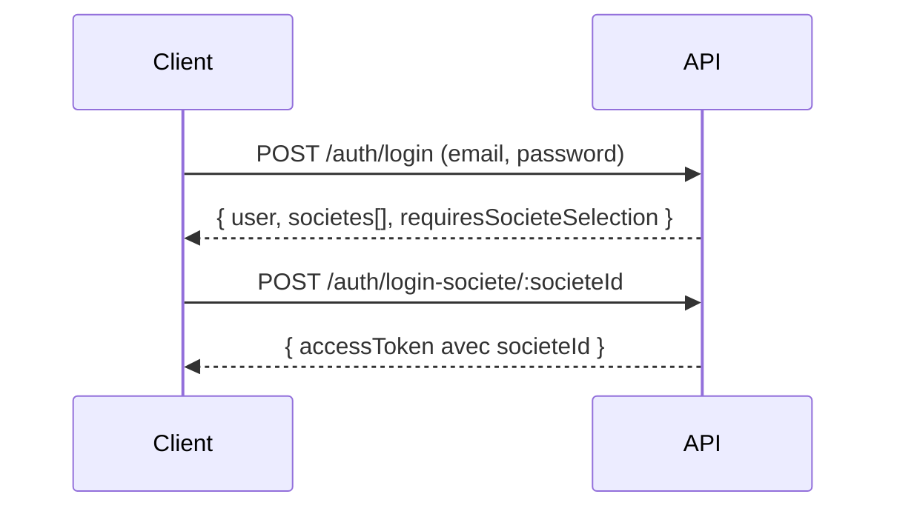

# 🤖 Guide Claude - Système d'Authentification TopSteel ERP

## 📋 Table des Matières
1. [Vue d'ensemble](#vue-densemble)
2. [Authentification Rapide](#authentification-rapide)
3. [Architecture Multi-Tenant](#architecture-multi-tenant)
4. [Scripts de Test](#scripts-de-test)
5. [Dépannage](#dépannage)

---

## 🎯 Vue d'Ensemble

TopSteel ERP utilise un système d'authentification **multi-tenant** avec JWT. Chaque requête API nécessite un token contenant le contexte de la société (tenant).

### Informations Essentielles

| Variable | Valeur |
|----------|--------|
| **API URL** | `http://localhost:3002` |
| **Base Auth** | `erp_topsteel_auth` |
| **Base Métier** | `erp_topsteel_topsteel` |
| **Société ID** | `73416fa9-f693-42f6-99d3-7c919cefe4d5` |
| **Société Code** | `TOPSTEEL` |

---

## 🚀 Authentification Rapide

### Méthode 1: Token de Test Direct (RECOMMANDÉ)

```bash
# Générer un token de test sans mot de passe
cd D:/GitHub/TopSteel/apps/api
npx ts-node src/scripts/generate-test-token.ts
```

Le token généré contient automatiquement :
- `societeId`: ID de la société TopSteel
- `role`: admin
- `permissions`: ['*']
- Durée de vie: 24h

### Méthode 2: Via Helper Programmatique

```typescript
import { TestAuthHelper } from './src/scripts/utils/test-auth-helper'

// Initialiser et générer un token
TestAuthHelper.initialize()
const token = TestAuthHelper.generateTestToken({
  email: 'admin@topsteel.com',
  societeId: '73416fa9-f693-42f6-99d3-7c919cefe4d5',
  role: 'admin'
})

// Utiliser le token
const headers = {
  'Authorization': `Bearer ${token}`,
  'Content-Type': 'application/json'
}
```

---

## 🏗️ Architecture Multi-Tenant

### Processus de Login (2 étapes)



### Structure du Token JWT

```json
{
  "sub": "user-id",
  "email": "admin@topsteel.com",
  "societeId": "73416fa9-f693-42f6-99d3-7c919cefe4d5",  // ⚠️ CRITIQUE
  "societeCode": "TOPSTEEL",
  "role": "admin",
  "permissions": ["*"]
}
```

**⚠️ IMPORTANT**: Le `societeId` dans le token détermine à quelles données l'utilisateur a accès.

---

## 🧪 Scripts de Test

### Scripts Disponibles

| Script | Description | Usage |
|--------|-------------|-------|
| `generate-test-token.ts` | Génère un token JWT valide | Tests API sans auth |
| `test-auth-helper.ts` | Helper pour générer des tokens | Import dans scripts |
| `test-realistic-auth.ts` | Test multi-tenant complet | Vérification système |
| `test-login-simulation.ts` | Simule le processus de login | Debug sans API |

### Exemple: Tester une Route Protégée

```bash
# 1. Générer un token
cd D:/GitHub/TopSteel/apps/api
TOKEN=$(npx ts-node src/scripts/generate-test-token.ts --silent)

# 2. Appeler l'API
curl -H "Authorization: Bearer $TOKEN" \
     http://localhost:3002/api/articles
```

### Exemple: Script de Test Complet

```typescript
// test-api-with-auth.ts
import { TestAuthHelper } from './utils/test-auth-helper'
import axios from 'axios'

async function testAPI() {
  // Générer le token
  TestAuthHelper.initialize()
  const token = TestAuthHelper.generateTestToken({
    societeId: '73416fa9-f693-42f6-99d3-7c919cefe4d5',
    role: 'admin'
  })

  // Configurer axios
  const api = axios.create({
    baseURL: 'http://localhost:3002',
    headers: {
      'Authorization': `Bearer ${token}`
    }
  })

  // Tester les endpoints
  const articles = await api.get('/articles')
  console.log(`✅ ${articles.data.length} articles trouvés`)
}
```

---

## 🔧 Dépannage

### L'API ne démarre pas

```bash
# Vérifier les dépendances de type
grep -r "import type.*Service" apps/api/src --include="*.ts"

# Les services NestJS ne doivent PAS utiliser "import type"
# ❌ INCORRECT: import type { MonService } from './mon.service'
# ✅ CORRECT:   import { MonService } from './mon.service'
```

### Token Invalide

```bash
# Vérifier les secrets JWT
echo "JWT_SECRET=development-secret-key-min-32-chars-long-topsteel-erp" >> apps/api/.env
echo "JWT_REFRESH_SECRET=refresh-secret-key-min-32-chars-long-topsteel-erp" >> apps/api/.env
```

### Société Non Trouvée

```sql
-- Vérifier que la société existe
PGPASSWORD=postgres psql -U postgres -d erp_topsteel_auth -c "
  SELECT id, code, nom, status 
  FROM societes 
  WHERE status = 'ACTIVE'
"
```

---

## 📚 Fichiers Importants

```
apps/api/src/
├── scripts/
│   ├── generate-test-token.ts      # Génération de tokens CLI
│   ├── utils/
│   │   ├── test-auth-helper.ts     # Helper principal
│   │   └── test-data-generator.ts  # Données de test
│   └── test-*.ts                   # Scripts de test variés
├── domains/auth/
│   ├── auth.service.ts             # Service d'authentification
│   └── auth.controller.ts          # Endpoints /auth/*
└── .env.example                    # Variables d'environnement
```

---

## 🎯 Check-list Rapide

Quand tu (Claude) dois tester une API protégée :

1. **Générer un token** :
   ```bash
   cd D:/GitHub/TopSteel/apps/api
   npx ts-node src/scripts/generate-test-token.ts
   ```

2. **Copier le token** et l'utiliser dans les headers :
   ```json
   { "Authorization": "Bearer TOKEN_ICI" }
   ```

3. **Le token contient automatiquement** :
   - ✅ societeId de TopSteel
   - ✅ Rôle admin
   - ✅ Toutes les permissions
   - ✅ Validité 24h

4. **Si l'API retourne 401** :
   - Vérifier que l'API est démarrée (`PORT=3002 pnpm dev`)
   - Régénérer un nouveau token
   - Vérifier les logs de l'API

---

## 💡 Conseils

1. **Toujours inclure le societeId** dans les tokens de test
2. **Utiliser le helper** plutôt que de créer des tokens manuellement
3. **Les tokens de test** ont `isTest: true` pour identification
4. **Le multi-tenant** filtre automatiquement par societeId

---

*Dernière mise à jour : 16/08/2025*
*Société en base : TopSteel (ID: 73416fa9-f693-42f6-99d3-7c919cefe4d5)*