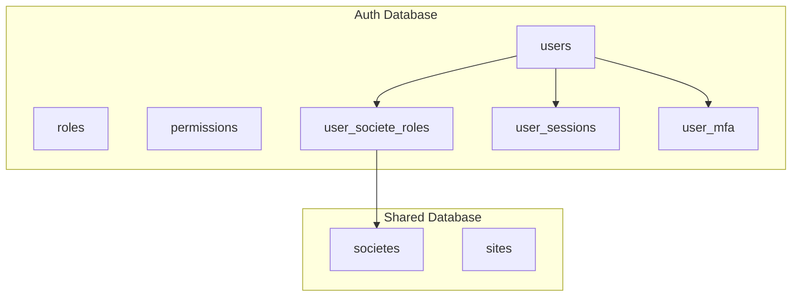
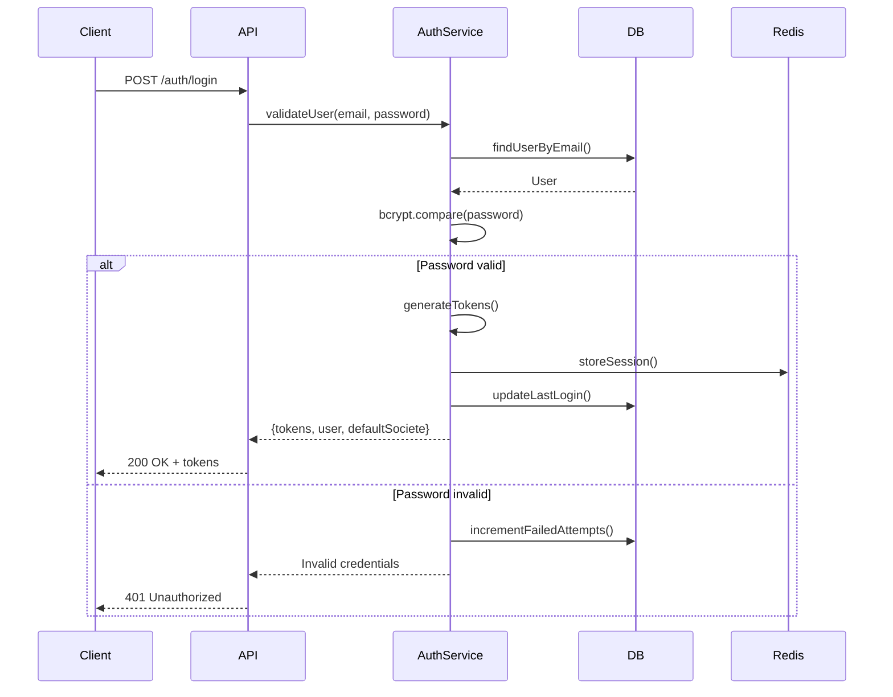

# Système d'Authentification TopSteel ERP

## Table des matières
1. [Vue d'ensemble](#vue-densemble)
2. [Architecture](#architecture)
3. [Flux d'authentification](#flux-dauthentification)
4. [Configuration](#configuration)
5. [API Endpoints](#api-endpoints)
6. [Gestion des sessions](#gestion-des-sessions)
7. [Multi-Factor Authentication (MFA)](#multi-factor-authentication-mfa)
8. [Rôles et permissions](#rôles-et-permissions)
9. [Sécurité](#sécurité)
10. [Troubleshooting](#troubleshooting)

## Vue d'ensemble

Le système d'authentification TopSteel est une solution complète et sécurisée qui gère :
- **Authentification JWT** avec refresh tokens
- **Multi-tenant** avec sélection de société
- **MFA** (TOTP, SMS, Email, WebAuthn)
- **RBAC** hiérarchique avec rôles globaux et par société
- **Sessions Redis** avec invalidation
- **Audit trail** complet

### État actuel
- **Status**: ✅ OPÉRATIONNEL
- **Version**: 2.0.0
- **Dernière mise à jour**: Janvier 2025

## Architecture

### Stack technique

```typescript
// Technologies utilisées
- Framework: NestJS 11 + Passport
- Tokens: JWT (jsonwebtoken)
- Sessions: Redis 7
- Base de données: PostgreSQL 15
- MFA: Speakeasy (TOTP) + WebAuthn
- Hashing: Bcrypt (rounds: 12)
```

### Structure des bases



### Tables principales

```sql
-- Table utilisateurs
CREATE TABLE users (
    id UUID PRIMARY KEY DEFAULT uuid_generate_v4(),
    email VARCHAR(255) UNIQUE NOT NULL,
    password_hash VARCHAR(255),
    first_name VARCHAR(100),
    last_name VARCHAR(100),
    phone VARCHAR(20),
    is_active BOOLEAN DEFAULT true,
    is_verified BOOLEAN DEFAULT false,
    email_verified_at TIMESTAMP,
    last_login_at TIMESTAMP,
    failed_login_attempts INTEGER DEFAULT 0,
    locked_until TIMESTAMP,
    password_changed_at TIMESTAMP,
    created_at TIMESTAMP DEFAULT NOW(),
    updated_at TIMESTAMP DEFAULT NOW()
);

-- Table sessions
CREATE TABLE user_sessions (
    id UUID PRIMARY KEY DEFAULT uuid_generate_v4(),
    user_id UUID NOT NULL REFERENCES users(id) ON DELETE CASCADE,
    session_token TEXT UNIQUE NOT NULL,
    access_token TEXT NOT NULL,
    refresh_token TEXT NOT NULL,
    ip_address INET,
    user_agent TEXT,
    device_info JSONB,
    is_active BOOLEAN DEFAULT true,
    expires_at TIMESTAMP NOT NULL,
    created_at TIMESTAMP DEFAULT NOW(),
    last_activity TIMESTAMP DEFAULT NOW()
);

-- Table MFA
CREATE TABLE user_mfa (
    id UUID PRIMARY KEY DEFAULT uuid_generate_v4(),
    user_id UUID NOT NULL REFERENCES users(id) ON DELETE CASCADE,
    type VARCHAR(50) NOT NULL, -- 'TOTP', 'SMS', 'EMAIL', 'WEBAUTHN'
    is_enabled BOOLEAN DEFAULT false,
    is_verified BOOLEAN DEFAULT false,
    secret TEXT,
    backup_codes TEXT[],
    phone_number VARCHAR(20),
    email VARCHAR(255),
    device_name VARCHAR(100),
    metadata JSONB,
    verified_at TIMESTAMP,
    created_at TIMESTAMP DEFAULT NOW(),
    updated_at TIMESTAMP DEFAULT NOW(),
    
    UNIQUE(user_id, type)
);

-- Table rôles société
CREATE TABLE user_societe_roles (
    id UUID PRIMARY KEY DEFAULT uuid_generate_v4(),
    user_id UUID NOT NULL REFERENCES users(id) ON DELETE CASCADE,
    societe_id UUID NOT NULL,
    role VARCHAR(50) NOT NULL,
    is_active BOOLEAN DEFAULT true,
    is_default BOOLEAN DEFAULT false,
    granted_by UUID REFERENCES users(id),
    granted_at TIMESTAMP DEFAULT NOW(),
    expires_at TIMESTAMP,
    metadata JSONB,
    
    UNIQUE(user_id, societe_id)
);
```

## Flux d'authentification

### 1. Login standard



### 2. Sélection de société

```typescript
// Flux de sélection de société
async selectSociete(userId: string, societeId: string): Promise<LoginResponse> {
  // 1. Vérifier les droits d'accès
  const userRole = await this.getUserSocieteRole(userId, societeId);
  if (!userRole || !userRole.is_active) {
    throw new ForbiddenException('Access denied to this société');
  }

  // 2. Générer nouveau contexte
  const tokens = this.generateTokens({
    sub: userId,
    societeId,
    role: userRole.role,
    permissions: await this.getPermissions(userId, societeId)
  });

  // 3. Mettre à jour la session
  await this.sessionService.updateSession(userId, {
    currentSocieteId: societeId,
    tokens
  });

  // 4. Logger l'action
  await this.auditService.log({
    userId,
    action: 'SOCIETE_SELECTED',
    societeId,
    timestamp: new Date()
  });

  return { tokens, societe: await this.getSocieteInfo(societeId) };
}
```

### 3. Refresh token

```typescript
@Injectable()
export class TokenRefreshService {
  async refreshTokens(refreshToken: string): Promise<TokenPair> {
    try {
      // 1. Valider le refresh token
      const payload = this.jwtService.verify(refreshToken, {
        secret: process.env.JWT_REFRESH_SECRET
      });

      // 2. Vérifier la session Redis
      const session = await this.redis.get(`session:${payload.sub}`);
      if (!session || session.refreshToken !== refreshToken) {
        throw new UnauthorizedException('Invalid session');
      }

      // 3. Vérifier que l'utilisateur est toujours actif
      const user = await this.userRepository.findById(payload.sub);
      if (!user.is_active) {
        throw new UnauthorizedException('User inactive');
      }

      // 4. Générer nouveaux tokens
      const newTokens = this.generateTokens({
        sub: user.id,
        email: user.email,
        societeId: payload.societeId
      });

      // 5. Mettre à jour la session
      await this.redis.setex(
        `session:${user.id}`,
        86400, // 24h
        JSON.stringify({
          ...session,
          ...newTokens,
          refreshedAt: new Date()
        })
      );

      return newTokens;
    } catch (error) {
      throw new UnauthorizedException('Token refresh failed');
    }
  }
}
```

## Configuration

### Variables d'environnement

```env
# JWT Configuration
JWT_SECRET=your_super_secret_key_min_32_chars
JWT_EXPIRES_IN=15m
JWT_REFRESH_SECRET=different_super_secret_key
JWT_REFRESH_EXPIRES_IN=7d

# Bcrypt
BCRYPT_ROUNDS=12

# Session
SESSION_TTL=86400  # 24 heures en secondes
SESSION_EXTEND_ON_ACTIVITY=true
MAX_CONCURRENT_SESSIONS=5

# MFA
MFA_ISSUER=TopSteel ERP
MFA_WINDOW=2  # Fenêtre de tolérance TOTP
MFA_BACKUP_CODES_COUNT=10

# Security
MAX_LOGIN_ATTEMPTS=5
LOCKOUT_DURATION=900  # 15 minutes en secondes
PASSWORD_MIN_LENGTH=8
PASSWORD_REQUIRE_UPPERCASE=true
PASSWORD_REQUIRE_LOWERCASE=true
PASSWORD_REQUIRE_NUMBER=true
PASSWORD_REQUIRE_SPECIAL=true
PASSWORD_HISTORY_COUNT=5  # Nombre de mots de passe à mémoriser

# Rate Limiting
AUTH_RATE_LIMIT_TTL=60
AUTH_RATE_LIMIT_MAX=10
```

### Configuration NestJS

```typescript
// auth.module.ts
@Module({
  imports: [
    JwtModule.registerAsync({
      imports: [ConfigModule],
      useFactory: (config: ConfigService) => ({
        secret: config.get('JWT_SECRET'),
        signOptions: {
          expiresIn: config.get('JWT_EXPIRES_IN'),
          issuer: 'TopSteel ERP',
          audience: 'topsteel-users'
        }
      }),
      inject: [ConfigService]
    }),
    PassportModule.register({ 
      defaultStrategy: 'jwt',
      session: false 
    }),
    ThrottlerModule.forRoot({
      ttl: 60,
      limit: 10
    })
  ],
  providers: [
    AuthService,
    JwtStrategy,
    LocalStrategy,
    SessionService,
    MfaService,
    RoleService
  ],
  controllers: [AuthController],
  exports: [AuthService, JwtModule]
})
export class AuthModule {}
```

## API Endpoints

### Authentification

```http
# Login
POST /api/auth/login
Content-Type: application/json
{
  "email": "user@example.com",
  "password": "SecurePassword123!"
}

Response 200:
{
  "accessToken": "eyJhbGc...",
  "refreshToken": "eyJhbGc...",
  "user": {
    "id": "uuid",
    "email": "user@example.com",
    "firstName": "John",
    "lastName": "Doe",
    "roles": ["USER"]
  },
  "defaultSociete": {
    "id": "uuid",
    "name": "TopSteel SA"
  }
}

# Refresh token
POST /api/auth/refresh
Content-Type: application/json
{
  "refreshToken": "eyJhbGc..."
}

# Logout
POST /api/auth/logout
Authorization: Bearer {accessToken}

# Verify token
GET /api/auth/verify
Authorization: Bearer {accessToken}
```

### Gestion des sociétés

```http
# Liste des sociétés accessibles
GET /api/auth/societes
Authorization: Bearer {accessToken}

Response 200:
{
  "societes": [
    {
      "id": "uuid",
      "name": "TopSteel SA",
      "role": "ADMIN",
      "isDefault": true
    }
  ]
}

# Sélectionner une société
POST /api/auth/societes/{societeId}/select
Authorization: Bearer {accessToken}

Response 200:
{
  "accessToken": "new_token_with_societe_context",
  "societe": {
    "id": "uuid",
    "name": "TopSteel SA"
  }
}
```

### Multi-Factor Authentication

```http
# Activer MFA
POST /api/auth/mfa/enable
Authorization: Bearer {accessToken}
{
  "type": "TOTP",
  "password": "current_password"
}

Response 200:
{
  "secret": "JBSWY3DPEHPK3PXP",
  "qrCode": "data:image/png;base64,...",
  "backupCodes": ["ABC123", "DEF456", ...]
}

# Vérifier MFA
POST /api/auth/mfa/verify
Authorization: Bearer {accessToken}
{
  "code": "123456"
}

# Désactiver MFA
POST /api/auth/mfa/disable
Authorization: Bearer {accessToken}
{
  "password": "current_password",
  "code": "123456"
}
```

### Gestion du mot de passe

```http
# Changer le mot de passe
POST /api/auth/password/change
Authorization: Bearer {accessToken}
{
  "currentPassword": "OldPassword123!",
  "newPassword": "NewPassword456!",
  "confirmPassword": "NewPassword456!"
}

# Demande de réinitialisation
POST /api/auth/password/forgot
{
  "email": "user@example.com"
}

# Réinitialiser avec token
POST /api/auth/password/reset
{
  "token": "reset_token_from_email",
  "newPassword": "NewPassword789!",
  "confirmPassword": "NewPassword789!"
}
```

## Gestion des sessions

### Service de sessions

```typescript
@Injectable()
export class SessionService {
  constructor(
    @InjectRedis() private redis: Redis,
    private configService: ConfigService
  ) {}

  async createSession(userId: string, tokens: TokenPair, metadata: SessionMetadata): Promise<string> {
    const sessionId = uuid();
    const ttl = this.configService.get('SESSION_TTL');
    
    const session: Session = {
      id: sessionId,
      userId,
      ...tokens,
      createdAt: new Date(),
      lastActivity: new Date(),
      metadata
    };

    // Stocker dans Redis
    await this.redis.setex(
      `session:${sessionId}`,
      ttl,
      JSON.stringify(session)
    );

    // Ajouter à la liste des sessions de l'utilisateur
    await this.redis.sadd(`user:${userId}:sessions`, sessionId);

    // Limiter le nombre de sessions concurrentes
    await this.enforceSessionLimit(userId);

    return sessionId;
  }

  async validateSession(sessionId: string): Promise<boolean> {
    const session = await this.redis.get(`session:${sessionId}`);
    if (!session) return false;

    const sessionData = JSON.parse(session);
    
    // Vérifier l'expiration
    if (new Date(sessionData.expiresAt) < new Date()) {
      await this.invalidateSession(sessionId);
      return false;
    }

    // Étendre la session si configuré
    if (this.configService.get('SESSION_EXTEND_ON_ACTIVITY')) {
      await this.extendSession(sessionId);
    }

    return true;
  }

  async invalidateSession(sessionId: string): Promise<void> {
    const session = await this.redis.get(`session:${sessionId}`);
    if (!session) return;

    const sessionData = JSON.parse(session);
    
    // Supprimer de Redis
    await this.redis.del(`session:${sessionId}`);
    await this.redis.srem(`user:${sessionData.userId}:sessions`, sessionId);

    // Logger la déconnexion
    await this.auditService.log({
      userId: sessionData.userId,
      action: 'SESSION_INVALIDATED',
      sessionId,
      timestamp: new Date()
    });
  }

  async invalidateAllUserSessions(userId: string): Promise<void> {
    const sessions = await this.redis.smembers(`user:${userId}:sessions`);
    
    for (const sessionId of sessions) {
      await this.invalidateSession(sessionId);
    }
  }

  private async enforceSessionLimit(userId: string): Promise<void> {
    const maxSessions = this.configService.get('MAX_CONCURRENT_SESSIONS');
    const sessions = await this.redis.smembers(`user:${userId}:sessions`);
    
    if (sessions.length > maxSessions) {
      // Trier par date de création et supprimer les plus anciennes
      const sessionData = await Promise.all(
        sessions.map(async (id) => {
          const data = await this.redis.get(`session:${id}`);
          return data ? { id, ...JSON.parse(data) } : null;
        })
      );

      const validSessions = sessionData
        .filter(s => s !== null)
        .sort((a, b) => new Date(a.createdAt).getTime() - new Date(b.createdAt).getTime());

      // Supprimer les sessions excédentaires
      const toRemove = validSessions.slice(0, validSessions.length - maxSessions);
      for (const session of toRemove) {
        await this.invalidateSession(session.id);
      }
    }
  }
}
```

## Multi-Factor Authentication (MFA)

### Types supportés

1. **TOTP (Time-based One-Time Password)**
   - Compatible avec Google Authenticator, Authy, etc.
   - Génération via Speakeasy
   - QR Code pour faciliter l'ajout

2. **SMS**
   - Via Twilio ou autre provider
   - Codes à 6 chiffres
   - Expiration après 5 minutes

3. **Email**
   - Codes à 6 chiffres
   - Template email personnalisé
   - Lien de validation optionnel

4. **WebAuthn**
   - Clés de sécurité (YubiKey, etc.)
   - Biométrie (empreinte, Face ID)
   - Sans mot de passe

### Implémentation TOTP

```typescript
@Injectable()
export class TotpService {
  async generateSecret(userId: string): Promise<TotpSetup> {
    // Générer le secret
    const secret = speakeasy.generateSecret({
      name: `TopSteel ERP (${user.email})`,
      issuer: 'TopSteel',
      length: 32
    });

    // Sauvegarder temporairement (non activé)
    await this.redis.setex(
      `mfa:setup:${userId}`,
      600, // 10 minutes
      JSON.stringify({
        secret: secret.base32,
        type: 'TOTP'
      })
    );

    // Générer QR Code
    const qrCode = await QRCode.toDataURL(secret.otpauth_url);

    // Générer codes de backup
    const backupCodes = this.generateBackupCodes(10);

    return {
      secret: secret.base32,
      qrCode,
      backupCodes,
      manualEntry: secret.otpauth_url
    };
  }

  async verifyToken(userId: string, token: string): Promise<boolean> {
    const mfa = await this.mfaRepository.findOne({
      where: { userId, type: 'TOTP', is_enabled: true }
    });

    if (!mfa) return false;

    const verified = speakeasy.totp.verify({
      secret: mfa.secret,
      encoding: 'base32',
      token,
      window: 2 // Tolérance de ±2 intervalles (±60 secondes)
    });

    if (verified) {
      // Logger la vérification réussie
      await this.auditService.log({
        userId,
        action: 'MFA_VERIFIED',
        method: 'TOTP',
        timestamp: new Date()
      });
    }

    return verified;
  }

  private generateBackupCodes(count: number): string[] {
    const codes = [];
    for (let i = 0; i < count; i++) {
      codes.push(
        crypto.randomBytes(4).toString('hex').toUpperCase()
      );
    }
    return codes;
  }
}
```

## Rôles et permissions

### Hiérarchie des rôles

```typescript
// Rôles globaux
enum GlobalUserRole {
  SUPER_ADMIN = 'SUPER_ADMIN',  // Accès total système
  ADMIN = 'ADMIN',              // Administration multi-société
  USER = 'USER'                 // Utilisateur standard
}

// Rôles société
enum SocieteRoleType {
  OWNER = 'OWNER',           // Propriétaire
  ADMIN = 'ADMIN',           // Administrateur
  MANAGER = 'MANAGER',       // Gestionnaire
  EMPLOYEE = 'EMPLOYEE',     // Employé
  VIEWER = 'VIEWER'          // Lecture seule
}

// Hiérarchie
const ROLE_HIERARCHY = {
  SUPER_ADMIN: ['ADMIN', 'USER'],
  ADMIN: ['USER'],
  USER: [],
  
  // Société
  OWNER: ['ADMIN', 'MANAGER', 'EMPLOYEE', 'VIEWER'],
  ADMIN: ['MANAGER', 'EMPLOYEE', 'VIEWER'],
  MANAGER: ['EMPLOYEE', 'VIEWER'],
  EMPLOYEE: ['VIEWER'],
  VIEWER: []
};
```

### Guards personnalisés

```typescript
// Enhanced roles guard
@Injectable()
export class EnhancedRolesGuard implements CanActivate {
  async canActivate(context: ExecutionContext): Promise<boolean> {
    const request = context.switchToHttp().getRequest();
    const user = request.user;
    const requiredRoles = this.reflector.get<RoleRequirement>('roles', context.getHandler());

    if (!requiredRoles) return true;

    // Super admin bypass
    if (user.roles.includes(GlobalUserRole.SUPER_ADMIN) && 
        requiredRoles.allowSuperAdminBypass !== false) {
      return true;
    }

    // Vérifier les rôles globaux
    if (requiredRoles.globalRoles) {
      const hasRole = requiredRoles.globalRoles.some(role =>
        this.hasRole(user, role)
      );
      if (!hasRole) throw new ForbiddenException();
    }

    // Vérifier les rôles société
    if (requiredRoles.societeRoles && request.societeId) {
      const societeRole = await this.getUserSocieteRole(user.id, request.societeId);
      const hasRole = requiredRoles.societeRoles.some(role =>
        this.hasSocieteRole(societeRole, role)
      );
      if (!hasRole) throw new ForbiddenException();
    }

    // Vérifier les permissions spécifiques
    if (requiredRoles.permissions) {
      const hasPermissions = requiredRoles.permissions.every(perm =>
        user.permissions.includes(perm)
      );
      if (!hasPermissions) throw new ForbiddenException();
    }

    return true;
  }
}

// Utilisation
@Post()
@RequireRoles({
  societeRoles: [SocieteRoleType.ADMIN, SocieteRoleType.MANAGER],
  permissions: ['articles.create']
})
async createArticle(@Body() dto: CreateArticleDto) {
  // ...
}
```

## Sécurité

### Bonnes pratiques implémentées

1. **Hachage des mots de passe**
   ```typescript
   const salt = await bcrypt.genSalt(12);
   const hash = await bcrypt.hash(password, salt);
   ```

2. **Protection contre le brute force**
   ```typescript
   if (user.failed_login_attempts >= MAX_ATTEMPTS) {
     user.locked_until = new Date(Date.now() + LOCKOUT_DURATION);
     throw new TooManyRequestsException('Account locked');
   }
   ```

3. **Validation des mots de passe**
   ```typescript
   const passwordRules = {
     minLength: 8,
     requireUppercase: true,
     requireLowercase: true,
     requireNumbers: true,
     requireSpecialChars: true,
     prohibitedWords: ['password', 'topsteel', user.email]
   };
   ```

4. **Rate limiting**
   ```typescript
   @Throttle(10, 60) // 10 requêtes par minute
   @Post('login')
   async login() {}
   ```

5. **Audit logging**
   ```typescript
   await this.auditService.log({
     userId,
     action: 'LOGIN_ATTEMPT',
     success: true,
     ip: request.ip,
     userAgent: request.headers['user-agent'],
     timestamp: new Date()
   });
   ```

### Headers de sécurité

```typescript
app.use(helmet({
  contentSecurityPolicy: {
    directives: {
      defaultSrc: ["'self'"],
      scriptSrc: ["'self'", "'unsafe-inline'"]
    }
  },
  hsts: {
    maxAge: 31536000,
    includeSubDomains: true,
    preload: true
  }
}));
```

## Troubleshooting

### Problèmes courants

#### 1. Token expiré
```bash
# Symptôme
401 Unauthorized: Token expired

# Solution
POST /api/auth/refresh avec le refresh token
```

#### 2. Session invalide
```bash
# Symptôme
401 Unauthorized: Invalid session

# Solution
1. Vérifier Redis : redis-cli KEYS "session:*"
2. Nettoyer les sessions : npm run auth:clean-sessions
3. Se reconnecter
```

#### 3. MFA ne fonctionne pas
```bash
# Vérifier l'heure du serveur
timedatectl status

# Synchroniser avec NTP
sudo ntpdate -s time.nist.gov
```

#### 4. Compte verrouillé
```sql
-- Débloquer manuellement
UPDATE users 
SET failed_login_attempts = 0, 
    locked_until = NULL 
WHERE email = 'user@example.com';
```

### Commandes utiles

```bash
# Créer un super admin
cd apps/api
npx ts-node src/scripts/create-admin-user.ts

# Réinitialiser un mot de passe
npx ts-node src/scripts/reset-password.ts --email user@example.com

# Nettoyer les sessions expirées
npx ts-node src/scripts/clean-expired-sessions.ts

# Vérifier la structure des tables
npx ts-node src/scripts/check-auth-tables.ts

# Tester le flux d'authentification
npx ts-node src/scripts/test-auth-flow.ts
```

### Logs de débogage

Activer les logs détaillés :

```env
# .env
AUTH_DEBUG=true
LOG_LEVEL=debug
```

Points de log importants :
- Login attempts
- Token generation
- Session creation/validation
- MFA verification
- Permission checks
- Rate limit hits

## Métriques et monitoring

### Métriques clés

```typescript
interface AuthMetrics {
  // Authentification
  loginAttempts: Counter;
  loginSuccess: Counter;
  loginFailure: Counter;
  avgLoginTime: Histogram;
  
  // Sessions
  activeSessions: Gauge;
  sessionCreated: Counter;
  sessionExpired: Counter;
  
  // MFA
  mfaEnabled: Gauge;
  mfaVerifications: Counter;
  mfaFailures: Counter;
  
  // Sécurité
  bruteForceAttempts: Counter;
  lockedAccounts: Gauge;
  passwordResets: Counter;
}
```

### Alertes recommandées

1. **Taux d'échec de connexion élevé** (> 20%)
2. **Tentatives de brute force** (> 50 en 5 min)
3. **Sessions Redis down**
4. **Temps de réponse auth** (> 500ms)
5. **Tokens invalides fréquents** (> 10%)

## Support

Pour toute question sur l'authentification :
- Documentation API : `/api/docs#auth`
- Email : security@topsteel.fr
- Urgence sécurité : security-emergency@topsteel.fr