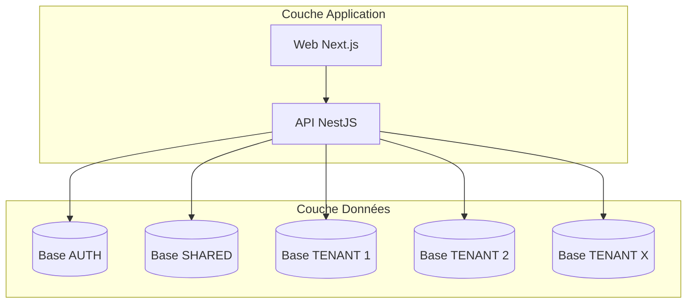
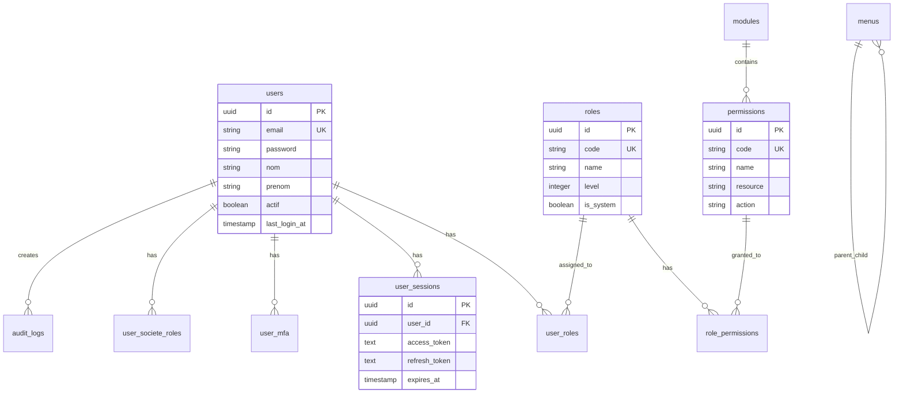
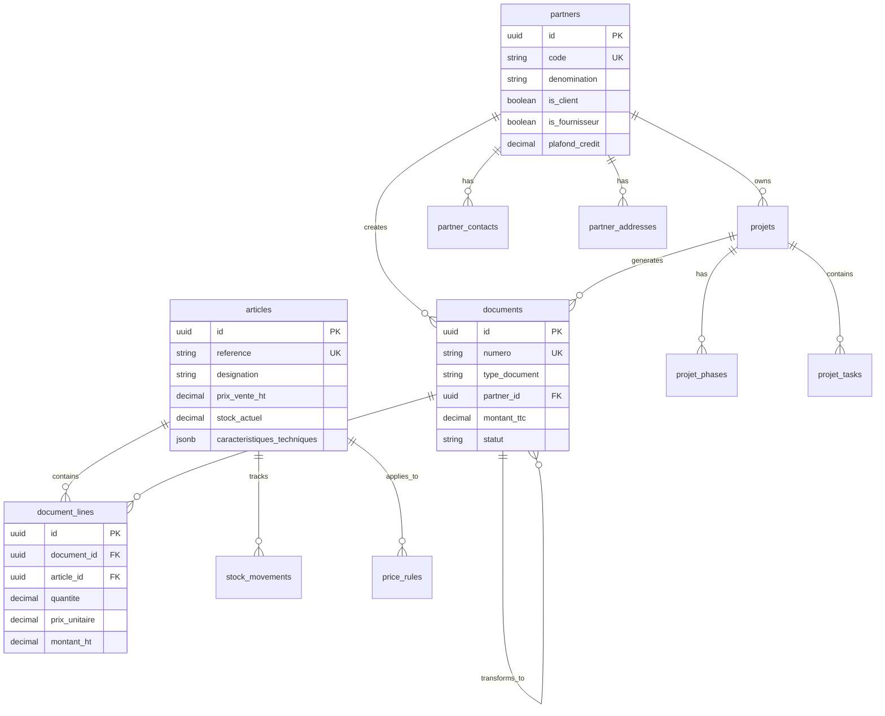

# Schéma Complet de Base de Données - TopSteel ERP

## Table des matières
1. [Vue d'ensemble](#vue-densemble)
2. [Architecture multi-base](#architecture-multi-base)
3. [Base AUTH - Authentification](#base-auth---authentification)
4. [Base SHARED - Données partagées](#base-shared---données-partagées)
5. [Base TENANT - Données métier](#base-tenant---données-métier)
6. [Relations et contraintes](#relations-et-contraintes)
7. [Index et optimisations](#index-et-optimisations)
8. [Types et énumérations](#types-et-énumérations)
9. [Triggers et fonctions](#triggers-et-fonctions)
10. [Diagrammes ERD](#diagrammes-erd)

## Vue d'ensemble

Le système TopSteel utilise une architecture **multi-tenant** avec 3 bases de données distinctes :

| Base de données | Nom | Description | Tables principales |
|----------------|-----|-------------|-------------------|
| **AUTH** | `erp_topsteel_auth` | Authentification et autorisation | users, roles, permissions, sessions |
| **SHARED** | `erp_topsteel_shared` | Données partagées entre tenants | societes, sites, parameters |
| **TENANT** | `erp_topsteel_{tenant}` | Données métier par société | articles, partners, documents, projets |

### Statistiques globales
- **Total tables** : 71+ tables
- **Base AUTH** : 25 tables
- **Base SHARED** : 12 tables
- **Base TENANT** : 34+ tables
- **Relations** : 150+ foreign keys
- **Index** : 200+ index

## Architecture multi-base



### Configuration TypeORM

```typescript
// Configuration multi-datasource
export const dataSources = {
  auth: {
    type: 'postgres',
    host: process.env.DB_AUTH_HOST,
    database: 'erp_topsteel_auth',
    entities: ['src/domains/auth/**/*.entity.ts']
  },
  shared: {
    type: 'postgres',
    host: process.env.DB_SHARED_HOST,
    database: 'erp_topsteel_shared',
    entities: ['src/domains/shared/**/*.entity.ts']
  },
  tenant: {
    type: 'postgres',
    host: process.env.DB_TENANT_HOST,
    database: 'erp_topsteel_${tenantId}',
    entities: ['src/domains/**/*.entity.ts']
  }
};
```

## Base AUTH - Authentification

### 🔐 Table `users`
Utilisateurs du système

```sql
CREATE TABLE users (
    id UUID PRIMARY KEY DEFAULT uuid_generate_v4(),
    email VARCHAR(255) UNIQUE NOT NULL,
    password VARCHAR(255),
    nom VARCHAR(100),
    prenom VARCHAR(100),
    phone VARCHAR(20),
    acronyme VARCHAR(10),
    avatar_url TEXT,
    
    -- Statut
    actif BOOLEAN DEFAULT true,
    is_verified BOOLEAN DEFAULT false,
    email_verified_at TIMESTAMP,
    last_login_at TIMESTAMP,
    
    -- Sécurité
    failed_login_attempts INTEGER DEFAULT 0,
    locked_until TIMESTAMP,
    password_changed_at TIMESTAMP,
    must_change_password BOOLEAN DEFAULT false,
    
    -- Préférences
    language VARCHAR(5) DEFAULT 'fr',
    timezone VARCHAR(50) DEFAULT 'Europe/Paris',
    theme VARCHAR(20) DEFAULT 'light',
    
    -- Métadonnées
    metadata JSONB DEFAULT '{}',
    
    -- Audit
    created_at TIMESTAMP DEFAULT NOW(),
    updated_at TIMESTAMP DEFAULT NOW(),
    deleted_at TIMESTAMP,
    created_by UUID,
    updated_by UUID,
    version INTEGER DEFAULT 1
);

-- Index
CREATE INDEX idx_users_email ON users(email);
CREATE INDEX idx_users_actif ON users(actif) WHERE actif = true;
CREATE INDEX idx_users_deleted ON users(deleted_at) WHERE deleted_at IS NULL;
```

### 👥 Table `roles`
Rôles système et permissions

```sql
CREATE TABLE roles (
    id UUID PRIMARY KEY DEFAULT uuid_generate_v4(),
    code VARCHAR(100) UNIQUE NOT NULL,
    name VARCHAR(255) NOT NULL,
    description TEXT,
    
    -- Hiérarchie
    level INTEGER DEFAULT 1,
    parent_role_id UUID REFERENCES roles(id),
    
    -- Configuration
    is_system BOOLEAN DEFAULT false,  -- Rôle système non modifiable
    is_default BOOLEAN DEFAULT false,  -- Rôle par défaut
    max_users INTEGER,                 -- Limite d'utilisateurs
    
    -- Permissions JSON
    permissions JSONB DEFAULT '[]',
    
    -- Statut
    active BOOLEAN DEFAULT true,
    
    -- Audit
    created_at TIMESTAMP DEFAULT NOW(),
    updated_at TIMESTAMP DEFAULT NOW(),
    deleted_at TIMESTAMP,
    version INTEGER DEFAULT 1
);

-- Rôles par défaut
INSERT INTO roles (code, name, level, is_system) VALUES
('SUPER_ADMIN', 'Super Administrateur', 100, true),
('ADMIN', 'Administrateur', 90, true),
('MANAGER', 'Manager', 50, false),
('USER', 'Utilisateur', 10, false),
('VIEWER', 'Observateur', 5, false);
```

### 🔑 Table `permissions`
Permissions granulaires

```sql
CREATE TABLE permissions (
    id UUID PRIMARY KEY DEFAULT uuid_generate_v4(),
    code VARCHAR(100) UNIQUE NOT NULL,
    name VARCHAR(255) NOT NULL,
    description TEXT,
    
    -- Catégorisation
    module_id UUID REFERENCES modules(id),
    category VARCHAR(50),
    resource VARCHAR(50),
    action VARCHAR(50),  -- create, read, update, delete, execute
    
    -- Configuration
    is_system BOOLEAN DEFAULT false,
    requires_mfa BOOLEAN DEFAULT false,
    
    -- Métadonnées
    metadata JSONB DEFAULT '{}',
    
    -- Statut
    active BOOLEAN DEFAULT true,
    
    -- Audit
    created_at TIMESTAMP DEFAULT NOW(),
    updated_at TIMESTAMP DEFAULT NOW(),
    version INTEGER DEFAULT 1
);

-- Permissions standards
INSERT INTO permissions (code, resource, action) VALUES
('articles.create', 'articles', 'create'),
('articles.read', 'articles', 'read'),
('articles.update', 'articles', 'update'),
('articles.delete', 'articles', 'delete'),
('articles.export', 'articles', 'export');
```

### 🔗 Table `user_roles`
Attribution des rôles aux utilisateurs

```sql
CREATE TABLE user_roles (
    id UUID PRIMARY KEY DEFAULT uuid_generate_v4(),
    user_id UUID NOT NULL REFERENCES users(id) ON DELETE CASCADE,
    role_id UUID NOT NULL REFERENCES roles(id) ON DELETE CASCADE,
    
    -- Attribution
    granted_by UUID REFERENCES users(id),
    granted_at TIMESTAMP DEFAULT NOW(),
    expires_at TIMESTAMP,
    reason TEXT,
    
    -- Statut
    is_active BOOLEAN DEFAULT true,
    
    -- Audit
    created_at TIMESTAMP DEFAULT NOW(),
    updated_at TIMESTAMP DEFAULT NOW(),
    
    CONSTRAINT uq_user_roles UNIQUE(user_id, role_id)
);
```

### 🏢 Table `user_societe_roles`
Rôles par société (multi-tenant)

```sql
CREATE TABLE user_societe_roles (
    id UUID PRIMARY KEY DEFAULT uuid_generate_v4(),
    user_id UUID NOT NULL REFERENCES users(id) ON DELETE CASCADE,
    societe_id UUID NOT NULL,
    role VARCHAR(50) NOT NULL,
    
    -- Configuration
    is_default BOOLEAN DEFAULT false,
    is_active BOOLEAN DEFAULT true,
    
    -- Attribution
    granted_by UUID REFERENCES users(id),
    granted_at TIMESTAMP DEFAULT NOW(),
    expires_at TIMESTAMP,
    
    -- Permissions spécifiques
    additional_permissions JSONB DEFAULT '[]',
    restricted_permissions JSONB DEFAULT '[]',
    
    -- Métadonnées
    metadata JSONB DEFAULT '{}',
    
    -- Audit
    created_at TIMESTAMP DEFAULT NOW(),
    updated_at TIMESTAMP DEFAULT NOW(),
    
    CONSTRAINT uq_user_societe UNIQUE(user_id, societe_id)
);
```

### 🔐 Table `user_sessions`
Sessions utilisateur

```sql
CREATE TABLE user_sessions (
    id UUID PRIMARY KEY DEFAULT uuid_generate_v4(),
    user_id UUID NOT NULL REFERENCES users(id) ON DELETE CASCADE,
    
    -- Tokens
    session_token TEXT UNIQUE NOT NULL,
    access_token TEXT NOT NULL,
    refresh_token TEXT NOT NULL,
    
    -- Contexte
    ip_address INET,
    user_agent TEXT,
    device_info JSONB,
    location JSONB,
    
    -- Société active
    current_societe_id UUID,
    
    -- Statut
    is_active BOOLEAN DEFAULT true,
    last_activity TIMESTAMP DEFAULT NOW(),
    expires_at TIMESTAMP NOT NULL,
    
    -- Sécurité
    is_trusted BOOLEAN DEFAULT false,
    mfa_verified BOOLEAN DEFAULT false,
    
    -- Audit
    created_at TIMESTAMP DEFAULT NOW(),
    revoked_at TIMESTAMP,
    revoked_reason TEXT
);

-- Index pour performances
CREATE INDEX idx_sessions_user ON user_sessions(user_id);
CREATE INDEX idx_sessions_token ON user_sessions(session_token);
CREATE INDEX idx_sessions_expires ON user_sessions(expires_at);
CREATE INDEX idx_sessions_active ON user_sessions(is_active, expires_at);
```

### 🔒 Table `user_mfa`
Multi-Factor Authentication

```sql
CREATE TABLE user_mfa (
    id UUID PRIMARY KEY DEFAULT uuid_generate_v4(),
    user_id UUID NOT NULL REFERENCES users(id) ON DELETE CASCADE,
    
    -- Type MFA
    type VARCHAR(50) NOT NULL, -- TOTP, SMS, EMAIL, WEBAUTHN
    
    -- Configuration
    is_enabled BOOLEAN DEFAULT false,
    is_primary BOOLEAN DEFAULT false,
    is_verified BOOLEAN DEFAULT false,
    
    -- Données spécifiques
    secret TEXT,                    -- Secret TOTP
    backup_codes TEXT[],            -- Codes de secours
    phone_number VARCHAR(20),       -- Pour SMS
    email VARCHAR(255),            -- Pour Email
    credential_id TEXT,            -- WebAuthn
    public_key TEXT,               -- WebAuthn
    
    -- Dispositif
    device_name VARCHAR(100),
    device_fingerprint TEXT,
    trusted_until TIMESTAMP,
    
    -- Métadonnées
    metadata JSONB DEFAULT '{}',
    
    -- Statistiques
    usage_count INTEGER DEFAULT 0,
    last_used_at TIMESTAMP,
    
    -- Audit
    verified_at TIMESTAMP,
    created_at TIMESTAMP DEFAULT NOW(),
    updated_at TIMESTAMP DEFAULT NOW(),
    
    CONSTRAINT uq_user_mfa_type UNIQUE(user_id, type)
);
```

### 📊 Table `audit_logs`
Logs d'audit système

```sql
CREATE TABLE audit_logs (
    id UUID PRIMARY KEY DEFAULT uuid_generate_v4(),
    
    -- Contexte
    user_id UUID REFERENCES users(id),
    societe_id UUID,
    session_id UUID,
    
    -- Action
    action VARCHAR(100) NOT NULL,
    resource_type VARCHAR(50),
    resource_id UUID,
    
    -- Détails
    old_values JSONB,
    new_values JSONB,
    metadata JSONB,
    
    -- Résultat
    status VARCHAR(20), -- success, failure, error
    error_message TEXT,
    
    -- Contexte technique
    ip_address INET,
    user_agent TEXT,
    request_id UUID,
    duration_ms INTEGER,
    
    -- Timestamp
    created_at TIMESTAMP DEFAULT NOW()
);

-- Index pour recherche
CREATE INDEX idx_audit_user ON audit_logs(user_id);
CREATE INDEX idx_audit_action ON audit_logs(action);
CREATE INDEX idx_audit_resource ON audit_logs(resource_type, resource_id);
CREATE INDEX idx_audit_created ON audit_logs(created_at DESC);
```

### 🎛️ Table `menus`
Configuration des menus dynamiques

```sql
CREATE TABLE menus (
    id UUID PRIMARY KEY DEFAULT uuid_generate_v4(),
    
    -- Identification
    code VARCHAR(100) UNIQUE NOT NULL,
    title VARCHAR(255) NOT NULL,
    description TEXT,
    
    -- Navigation
    path VARCHAR(255),
    icon VARCHAR(50),
    badge_count INTEGER,
    
    -- Hiérarchie
    parent_id UUID REFERENCES menus(id),
    order_index INTEGER DEFAULT 0,
    level INTEGER DEFAULT 0,
    
    -- Permissions
    required_permission VARCHAR(100),
    required_roles TEXT[],
    
    -- Configuration
    is_visible BOOLEAN DEFAULT true,
    is_enabled BOOLEAN DEFAULT true,
    is_external BOOLEAN DEFAULT false,
    open_in_new_tab BOOLEAN DEFAULT false,
    
    -- Métadonnées
    metadata JSONB DEFAULT '{}',
    
    -- Audit
    created_at TIMESTAMP DEFAULT NOW(),
    updated_at TIMESTAMP DEFAULT NOW(),
    version INTEGER DEFAULT 1
);

-- Menus par défaut
INSERT INTO menus (code, title, path, icon, order_index) VALUES
('dashboard', 'Tableau de bord', '/dashboard', 'dashboard', 1),
('clients', 'Clients', '/clients', 'users', 2),
('articles', 'Articles', '/articles', 'package', 3),
('devis', 'Devis', '/devis', 'file-text', 4),
('factures', 'Factures', '/factures', 'invoice', 5);
```

## Base SHARED - Données partagées

### 🏢 Table `societes`
Sociétés clientes (tenants)

```sql
CREATE TABLE societes (
    id UUID PRIMARY KEY DEFAULT uuid_generate_v4(),
    
    -- Identification
    code VARCHAR(50) UNIQUE NOT NULL,
    raison_sociale VARCHAR(255) NOT NULL,
    nom_commercial VARCHAR(255),
    
    -- Informations légales
    siret VARCHAR(14),
    siren VARCHAR(9),
    tva_intracommunautaire VARCHAR(20),
    ape_code VARCHAR(10),
    rcs VARCHAR(100),
    capital_social DECIMAL(15,2),
    forme_juridique VARCHAR(50),
    
    -- Contact principal
    email VARCHAR(255),
    telephone VARCHAR(20),
    fax VARCHAR(20),
    website VARCHAR(255),
    
    -- Adresse siège
    adresse VARCHAR(255),
    adresse_complement VARCHAR(255),
    code_postal VARCHAR(10),
    ville VARCHAR(100),
    pays VARCHAR(100) DEFAULT 'France',
    
    -- Configuration
    database_name VARCHAR(100),
    storage_quota_gb INTEGER DEFAULT 10,
    user_limit INTEGER DEFAULT 10,
    
    -- Statut
    status VARCHAR(20) DEFAULT 'ACTIVE', -- ACTIVE, SUSPENDED, TRIAL, EXPIRED
    trial_ends_at TIMESTAMP,
    suspended_at TIMESTAMP,
    suspended_reason TEXT,
    
    -- Facturation
    billing_email VARCHAR(255),
    billing_address TEXT,
    payment_method VARCHAR(50),
    stripe_customer_id VARCHAR(100),
    
    -- Métadonnées
    logo_url TEXT,
    theme JSONB DEFAULT '{}',
    settings JSONB DEFAULT '{}',
    
    -- Audit
    created_at TIMESTAMP DEFAULT NOW(),
    updated_at TIMESTAMP DEFAULT NOW(),
    deleted_at TIMESTAMP,
    version INTEGER DEFAULT 1
);

-- Index
CREATE INDEX idx_societes_code ON societes(code);
CREATE INDEX idx_societes_status ON societes(status);
CREATE INDEX idx_societes_siret ON societes(siret);
```

### 🏭 Table `sites`
Sites/établissements par société

```sql
CREATE TABLE sites (
    id UUID PRIMARY KEY DEFAULT uuid_generate_v4(),
    societe_id UUID NOT NULL REFERENCES societes(id) ON DELETE CASCADE,
    
    -- Identification
    code VARCHAR(50) NOT NULL,
    nom VARCHAR(255) NOT NULL,
    type VARCHAR(50), -- SIEGE, USINE, DEPOT, AGENCE, CHANTIER
    
    -- Adresse
    adresse VARCHAR(255),
    code_postal VARCHAR(10),
    ville VARCHAR(100),
    pays VARCHAR(100) DEFAULT 'France',
    coordonnees_gps JSONB, -- {lat, lng}
    
    -- Contact
    telephone VARCHAR(20),
    email VARCHAR(255),
    responsable_nom VARCHAR(100),
    responsable_email VARCHAR(255),
    
    -- Configuration
    is_siege BOOLEAN DEFAULT false,
    is_facturation BOOLEAN DEFAULT false,
    is_livraison BOOLEAN DEFAULT true,
    
    -- Horaires
    horaires JSONB DEFAULT '{}', -- {lundi: {ouverture, fermeture}, ...}
    
    -- Capacités
    surface_m2 DECIMAL(10,2),
    capacite_stockage DECIMAL(10,2),
    effectif INTEGER,
    
    -- Statut
    actif BOOLEAN DEFAULT true,
    
    -- Audit
    created_at TIMESTAMP DEFAULT NOW(),
    updated_at TIMESTAMP DEFAULT NOW(),
    
    CONSTRAINT uq_site_code UNIQUE(societe_id, code)
);
```

### ⚙️ Table `system_parameters`
Paramètres système globaux

```sql
CREATE TABLE system_parameters (
    id UUID PRIMARY KEY DEFAULT uuid_generate_v4(),
    
    -- Identification
    key VARCHAR(255) UNIQUE NOT NULL,
    value TEXT,
    type VARCHAR(50), -- string, number, boolean, json, date
    
    -- Catégorisation
    category VARCHAR(100),
    subcategory VARCHAR(100),
    
    -- Description
    label VARCHAR(255),
    description TEXT,
    help_text TEXT,
    
    -- Validation
    is_required BOOLEAN DEFAULT false,
    is_readonly BOOLEAN DEFAULT false,
    validation_rules JSONB,
    default_value TEXT,
    possible_values JSONB, -- Pour les enums
    
    -- Visibilité
    is_public BOOLEAN DEFAULT false,
    required_role VARCHAR(50),
    
    -- Métadonnées
    metadata JSONB DEFAULT '{}',
    
    -- Audit
    created_at TIMESTAMP DEFAULT NOW(),
    updated_at TIMESTAMP DEFAULT NOW(),
    updated_by UUID
);

-- Paramètres par défaut
INSERT INTO system_parameters (key, value, type, category) VALUES
('app.name', 'TopSteel ERP', 'string', 'general'),
('app.version', '1.0.0', 'string', 'general'),
('app.maintenance_mode', 'false', 'boolean', 'system'),
('email.smtp_host', 'localhost', 'string', 'email'),
('email.smtp_port', '587', 'number', 'email');
```

### 📚 Table `modules`
Modules fonctionnels disponibles

```sql
CREATE TABLE modules (
    id UUID PRIMARY KEY DEFAULT uuid_generate_v4(),
    
    -- Identification
    code VARCHAR(100) UNIQUE NOT NULL,
    name VARCHAR(255) NOT NULL,
    description TEXT,
    
    -- Configuration
    version VARCHAR(20),
    icon VARCHAR(50),
    color VARCHAR(7),
    
    -- Activation
    is_core BOOLEAN DEFAULT false,    -- Module core obligatoire
    is_premium BOOLEAN DEFAULT false, -- Module premium
    is_beta BOOLEAN DEFAULT false,    -- En beta
    
    -- Dépendances
    dependencies JSONB DEFAULT '[]', -- ["module1", "module2"]
    
    -- Configuration par défaut
    default_config JSONB DEFAULT '{}',
    
    -- Permissions associées
    permissions JSONB DEFAULT '[]',
    
    -- Statut
    active BOOLEAN DEFAULT true,
    
    -- Audit
    created_at TIMESTAMP DEFAULT NOW(),
    updated_at TIMESTAMP DEFAULT NOW()
);

-- Modules standards
INSERT INTO modules (code, name, is_core) VALUES
('AUTH', 'Authentification', true),
('INVENTORY', 'Gestion des stocks', true),
('SALES', 'Ventes', true),
('PURCHASE', 'Achats', true),
('PRODUCTION', 'Production', false),
('ACCOUNTING', 'Comptabilité', false),
('HR', 'Ressources humaines', false);
```

## Base TENANT - Données métier

### 📦 Table `articles`
Catalogue produits

```sql
CREATE TABLE articles (
    id UUID PRIMARY KEY DEFAULT uuid_generate_v4(),
    
    -- Identification
    reference VARCHAR(100) UNIQUE NOT NULL,
    designation VARCHAR(500) NOT NULL,
    description TEXT,
    
    -- Classification
    famille VARCHAR(100),
    sous_famille VARCHAR(100),
    categorie VARCHAR(100),
    type_article VARCHAR(50), -- PRODUIT, SERVICE, COMPOSANT, MATIERE
    
    -- Unités
    unite_stock VARCHAR(20) DEFAULT 'U',
    unite_vente VARCHAR(20) DEFAULT 'U',
    unite_achat VARCHAR(20) DEFAULT 'U',
    coefficient_conversion DECIMAL(10,4) DEFAULT 1,
    
    -- Prix
    prix_achat_standard DECIMAL(15,4),
    prix_vente_ht DECIMAL(15,4),
    prix_vente_ttc DECIMAL(15,4),
    taux_tva DECIMAL(5,2) DEFAULT 20.00,
    taux_marge DECIMAL(5,2),
    
    -- Stock
    stock_actuel DECIMAL(15,4) DEFAULT 0,
    stock_minimum DECIMAL(15,4) DEFAULT 0,
    stock_maximum DECIMAL(15,4),
    stock_securite DECIMAL(15,4),
    stock_alerte DECIMAL(15,4),
    
    -- Approvisionnement
    delai_approvisionnement INTEGER, -- En jours
    quantite_economique DECIMAL(15,4),
    fournisseur_principal_id UUID,
    reference_fournisseur VARCHAR(100),
    
    -- Caractéristiques techniques
    caracteristiques_techniques JSONB DEFAULT '{}',
    /* Exemple pour profilé:
    {
        "hauteur": 200,
        "largeur": 100,
        "epaisseur_ame": 5.6,
        "epaisseur_aile": 8.5,
        "poids": 22.4,
        "moment_inertie_x": 1943,
        "module_resistance_x": 194,
        "nuance": "S235JR",
        "norme": "EN 10025-2"
    }
    */
    
    -- Dimensions et poids
    longueur DECIMAL(10,3),
    largeur DECIMAL(10,3),
    hauteur DECIMAL(10,3),
    epaisseur DECIMAL(10,3),
    diametre DECIMAL(10,3),
    poids_unitaire DECIMAL(10,4),
    volume DECIMAL(10,4),
    
    -- Codes additionnels
    code_barre VARCHAR(50),
    code_douanier VARCHAR(20),
    origine_pays VARCHAR(100),
    
    -- Images et documents
    image_principale TEXT,
    images JSONB DEFAULT '[]',
    documents JSONB DEFAULT '[]',
    
    -- Configuration
    is_stockable BOOLEAN DEFAULT true,
    is_vendable BOOLEAN DEFAULT true,
    is_achetable BOOLEAN DEFAULT true,
    is_fabrique BOOLEAN DEFAULT false,
    is_consommable BOOLEAN DEFAULT false,
    is_lot BOOLEAN DEFAULT false,
    is_serie BOOLEAN DEFAULT false,
    
    -- Marketplace
    is_marketplace_enabled BOOLEAN DEFAULT false,
    marketplace_price DECIMAL(15,2),
    marketplace_stock INTEGER,
    marketplace_description TEXT,
    
    -- SEO
    meta_title VARCHAR(255),
    meta_description TEXT,
    meta_keywords TEXT,
    slug VARCHAR(255),
    
    -- Statut
    statut VARCHAR(20) DEFAULT 'ACTIF', -- ACTIF, INACTIF, OBSOLETE
    
    -- Multi-tenant
    tenant_id UUID NOT NULL,
    
    -- Audit
    created_at TIMESTAMP DEFAULT NOW(),
    updated_at TIMESTAMP DEFAULT NOW(),
    created_by UUID,
    updated_by UUID,
    deleted_at TIMESTAMP,
    version INTEGER DEFAULT 1
);

-- Index pour performances
CREATE INDEX idx_articles_reference ON articles(reference);
CREATE INDEX idx_articles_famille ON articles(famille);
CREATE INDEX idx_articles_tenant ON articles(tenant_id);
CREATE INDEX idx_articles_statut ON articles(statut);
CREATE INDEX idx_articles_marketplace ON articles(is_marketplace_enabled) WHERE is_marketplace_enabled = true;

-- Index full-text pour recherche
CREATE INDEX idx_articles_search ON articles 
USING gin(to_tsvector('french', designation || ' ' || COALESCE(description, '')));
```

### 👥 Table `partners`
Clients et fournisseurs

```sql
CREATE TABLE partners (
    id UUID PRIMARY KEY DEFAULT uuid_generate_v4(),
    
    -- Identification
    code VARCHAR(50) UNIQUE NOT NULL,
    denomination VARCHAR(255) NOT NULL,
    nom_commercial VARCHAR(255),
    
    -- Type
    is_client BOOLEAN DEFAULT false,
    is_fournisseur BOOLEAN DEFAULT false,
    is_prospect BOOLEAN DEFAULT false,
    is_transporteur BOOLEAN DEFAULT false,
    
    -- Informations légales
    forme_juridique VARCHAR(50),
    siret VARCHAR(14),
    siren VARCHAR(9),
    tva_intracommunautaire VARCHAR(20),
    ape_code VARCHAR(10),
    rcs VARCHAR(100),
    capital_social DECIMAL(15,2),
    
    -- Contact principal
    email VARCHAR(255),
    telephone VARCHAR(20),
    telephone_mobile VARCHAR(20),
    fax VARCHAR(20),
    website VARCHAR(255),
    
    -- Adresse principale
    adresse VARCHAR(255),
    adresse_complement VARCHAR(255),
    code_postal VARCHAR(10),
    ville VARCHAR(100),
    pays VARCHAR(100) DEFAULT 'France',
    coordonnees_gps JSONB,
    
    -- Commercial
    commercial_id UUID,
    secteur_activite VARCHAR(100),
    effectif_tranche VARCHAR(50),
    chiffre_affaires_tranche VARCHAR(50),
    
    -- Conditions commerciales
    mode_reglement VARCHAR(50), -- COMPTANT, 30J, 45J, 60J
    condition_reglement TEXT,
    plafond_credit DECIMAL(15,2),
    encours_actuel DECIMAL(15,2),
    taux_remise_standard DECIMAL(5,2),
    taux_escompte DECIMAL(5,2),
    
    -- Comptabilité
    compte_comptable_client VARCHAR(20),
    compte_comptable_fournisseur VARCHAR(20),
    code_journal VARCHAR(10),
    
    -- Livraison
    adresse_livraison TEXT,
    instructions_livraison TEXT,
    transporteur_prefere VARCHAR(100),
    incoterm VARCHAR(10),
    
    -- Documents
    rib JSONB,
    kbis_url TEXT,
    attestation_tva_url TEXT,
    
    -- Scoring et risque
    score_credit INTEGER,
    niveau_risque VARCHAR(20), -- FAIBLE, MOYEN, ELEVE
    date_derniere_evaluation DATE,
    commentaire_risque TEXT,
    
    -- Statistiques
    ca_annuel DECIMAL(15,2),
    ca_ytd DECIMAL(15,2),
    nombre_commandes INTEGER DEFAULT 0,
    derniere_commande_date DATE,
    
    -- Préférences
    langue VARCHAR(5) DEFAULT 'fr',
    devise VARCHAR(3) DEFAULT 'EUR',
    
    -- Marketing
    accepte_marketing BOOLEAN DEFAULT false,
    accepte_newsletter BOOLEAN DEFAULT false,
    source_acquisition VARCHAR(100),
    date_premier_contact DATE,
    
    -- Notes
    notes TEXT,
    tags JSONB DEFAULT '[]',
    
    -- Multi-tenant
    tenant_id UUID NOT NULL,
    
    -- Statut
    statut VARCHAR(20) DEFAULT 'ACTIF',
    bloque BOOLEAN DEFAULT false,
    motif_blocage TEXT,
    
    -- Audit
    created_at TIMESTAMP DEFAULT NOW(),
    updated_at TIMESTAMP DEFAULT NOW(),
    created_by UUID,
    updated_by UUID,
    deleted_at TIMESTAMP,
    version INTEGER DEFAULT 1
);

-- Index
CREATE INDEX idx_partners_code ON partners(code);
CREATE INDEX idx_partners_type_client ON partners(is_client) WHERE is_client = true;
CREATE INDEX idx_partners_type_fournisseur ON partners(is_fournisseur) WHERE is_fournisseur = true;
CREATE INDEX idx_partners_tenant ON partners(tenant_id);
CREATE INDEX idx_partners_commercial ON partners(commercial_id);
```

### 📋 Table `documents`
Documents commerciaux (devis, commandes, factures)

```sql
CREATE TABLE documents (
    id UUID PRIMARY KEY DEFAULT uuid_generate_v4(),
    
    -- Type et numérotation
    type_document VARCHAR(50) NOT NULL, -- DEVIS, COMMANDE, BL, FACTURE, AVOIR
    numero VARCHAR(50) UNIQUE NOT NULL,
    reference_externe VARCHAR(100),
    
    -- Dates
    date_document DATE NOT NULL,
    date_validite DATE,
    date_echeance DATE,
    
    -- Tiers
    partner_id UUID REFERENCES partners(id),
    contact_id UUID,
    
    -- Adresses
    adresse_facturation JSONB,
    adresse_livraison JSONB,
    
    -- Commercial
    commercial_id UUID,
    affaire_id UUID,
    projet_id UUID,
    
    -- Montants
    montant_ht DECIMAL(15,2),
    montant_tva DECIMAL(15,2),
    montant_ttc DECIMAL(15,2),
    montant_remise DECIMAL(15,2),
    taux_remise_global DECIMAL(5,2),
    
    -- Détail TVA
    detail_tva JSONB DEFAULT '[]',
    /* [{
        "taux": 20.00,
        "base": 1000.00,
        "montant": 200.00
    }] */
    
    -- Conditions
    mode_reglement VARCHAR(50),
    condition_reglement TEXT,
    acompte DECIMAL(15,2),
    
    -- Textes
    objet TEXT,
    introduction TEXT,
    conclusion TEXT,
    notes_internes TEXT,
    
    -- Statut
    statut VARCHAR(50), -- BROUILLON, VALIDE, ENVOYE, ACCEPTE, REFUSE, ANNULE
    date_envoi TIMESTAMP,
    date_acceptation TIMESTAMP,
    date_refus TIMESTAMP,
    motif_refus TEXT,
    
    -- Transformation
    document_origine_id UUID,
    documents_lies JSONB DEFAULT '[]',
    
    -- PDF
    pdf_url TEXT,
    pdf_genere_le TIMESTAMP,
    
    -- Signature électronique
    signature_requise BOOLEAN DEFAULT false,
    signature_url TEXT,
    signe_le TIMESTAMP,
    signe_par VARCHAR(255),
    
    -- Multi-tenant
    tenant_id UUID NOT NULL,
    
    -- Audit
    created_at TIMESTAMP DEFAULT NOW(),
    updated_at TIMESTAMP DEFAULT NOW(),
    created_by UUID,
    updated_by UUID,
    deleted_at TIMESTAMP,
    version INTEGER DEFAULT 1
);

-- Index
CREATE INDEX idx_documents_type ON documents(type_document);
CREATE INDEX idx_documents_numero ON documents(numero);
CREATE INDEX idx_documents_partner ON documents(partner_id);
CREATE INDEX idx_documents_statut ON documents(statut);
CREATE INDEX idx_documents_date ON documents(date_document DESC);
CREATE INDEX idx_documents_tenant ON documents(tenant_id);
```

### 📝 Table `document_lines`
Lignes de documents

```sql
CREATE TABLE document_lines (
    id UUID PRIMARY KEY DEFAULT uuid_generate_v4(),
    document_id UUID NOT NULL REFERENCES documents(id) ON DELETE CASCADE,
    
    -- Position
    ordre INTEGER NOT NULL,
    niveau INTEGER DEFAULT 0, -- Pour lignes hiérarchiques
    parent_line_id UUID,
    
    -- Type de ligne
    type_ligne VARCHAR(50), -- ARTICLE, SERVICE, COMMENTAIRE, SOUS_TOTAL, TITRE
    
    -- Article
    article_id UUID,
    reference VARCHAR(100),
    designation TEXT NOT NULL,
    description_complementaire TEXT,
    
    -- Quantités
    quantite DECIMAL(15,4),
    unite VARCHAR(20),
    
    -- Prix
    prix_unitaire DECIMAL(15,4),
    montant_ht DECIMAL(15,2),
    taux_tva DECIMAL(5,2),
    montant_tva DECIMAL(15,2),
    montant_ttc DECIMAL(15,2),
    
    -- Remise
    taux_remise DECIMAL(5,2),
    montant_remise DECIMAL(15,2),
    
    -- Marge
    prix_revient DECIMAL(15,4),
    marge DECIMAL(15,2),
    taux_marge DECIMAL(5,2),
    
    -- Options
    is_optionnel BOOLEAN DEFAULT false,
    is_variante BOOLEAN DEFAULT false,
    is_inclus BOOLEAN DEFAULT true,
    
    -- Livraison
    quantite_livree DECIMAL(15,4),
    quantite_restante DECIMAL(15,4),
    
    -- Métadonnées
    metadata JSONB DEFAULT '{}',
    
    -- Audit
    created_at TIMESTAMP DEFAULT NOW(),
    updated_at TIMESTAMP DEFAULT NOW()
);

-- Index
CREATE INDEX idx_document_lines_document ON document_lines(document_id);
CREATE INDEX idx_document_lines_article ON document_lines(article_id);
CREATE INDEX idx_document_lines_ordre ON document_lines(document_id, ordre);
```

### 🏗️ Table `projets`
Projets et affaires

```sql
CREATE TABLE projets (
    id UUID PRIMARY KEY DEFAULT uuid_generate_v4(),
    
    -- Identification
    code VARCHAR(50) UNIQUE NOT NULL,
    nom VARCHAR(255) NOT NULL,
    description TEXT,
    
    -- Client
    client_id UUID REFERENCES partners(id),
    contact_client_id UUID,
    site_client_id UUID,
    
    -- Localisation
    adresse_chantier TEXT,
    code_postal_chantier VARCHAR(10),
    ville_chantier VARCHAR(100),
    coordonnees_gps JSONB,
    
    -- Dates
    date_debut_prevu DATE,
    date_fin_prevu DATE,
    date_debut_reel DATE,
    date_fin_reel DATE,
    
    -- Responsables
    chef_projet_id UUID,
    commercial_id UUID,
    conducteur_travaux_id UUID,
    
    -- Budget
    budget_total DECIMAL(15,2),
    budget_materiel DECIMAL(15,2),
    budget_main_oeuvre DECIMAL(15,2),
    budget_sous_traitance DECIMAL(15,2),
    
    -- Réalisé
    cout_total_reel DECIMAL(15,2),
    cout_materiel_reel DECIMAL(15,2),
    cout_main_oeuvre_reel DECIMAL(15,2),
    cout_sous_traitance_reel DECIMAL(15,2),
    
    -- Avancement
    pourcentage_avancement DECIMAL(5,2),
    statut VARCHAR(50), -- PROSPECT, DEVIS, COMMANDE, EN_COURS, TERMINE, ANNULE
    
    -- Documents
    devis_ids JSONB DEFAULT '[]',
    commande_ids JSONB DEFAULT '[]',
    facture_ids JSONB DEFAULT '[]',
    
    -- Planification
    phases JSONB DEFAULT '[]',
    /* [{
        "nom": "Phase 1",
        "date_debut": "2024-01-01",
        "date_fin": "2024-02-01",
        "avancement": 50,
        "budget": 10000
    }] */
    
    -- Risques
    niveau_risque VARCHAR(20),
    risques_identifies JSONB DEFAULT '[]',
    
    -- Notes et documents
    notes TEXT,
    documents JSONB DEFAULT '[]',
    photos JSONB DEFAULT '[]',
    
    -- Multi-tenant
    tenant_id UUID NOT NULL,
    
    -- Audit
    created_at TIMESTAMP DEFAULT NOW(),
    updated_at TIMESTAMP DEFAULT NOW(),
    created_by UUID,
    updated_by UUID,
    deleted_at TIMESTAMP,
    version INTEGER DEFAULT 1
);

-- Index
CREATE INDEX idx_projets_code ON projets(code);
CREATE INDEX idx_projets_client ON projets(client_id);
CREATE INDEX idx_projets_statut ON projets(statut);
CREATE INDEX idx_projets_dates ON projets(date_debut_prevu, date_fin_prevu);
CREATE INDEX idx_projets_tenant ON projets(tenant_id);
```

### 📊 Table `stocks`
Mouvements de stock

```sql
CREATE TABLE stock_movements (
    id UUID PRIMARY KEY DEFAULT uuid_generate_v4(),
    
    -- Article
    article_id UUID NOT NULL REFERENCES articles(id),
    
    -- Type de mouvement
    type_mouvement VARCHAR(50) NOT NULL, -- ENTREE, SORTIE, TRANSFERT, INVENTAIRE, AJUSTEMENT
    motif VARCHAR(100),
    
    -- Quantités
    quantite DECIMAL(15,4) NOT NULL,
    unite VARCHAR(20),
    
    -- Valeurs
    prix_unitaire DECIMAL(15,4),
    montant_total DECIMAL(15,2),
    
    -- Stock résultant
    stock_avant DECIMAL(15,4),
    stock_apres DECIMAL(15,4),
    
    -- Origine
    document_id UUID,
    document_type VARCHAR(50),
    ligne_document_id UUID,
    
    -- Localisation
    entrepot_id UUID,
    emplacement VARCHAR(100),
    lot_numero VARCHAR(100),
    numero_serie VARCHAR(100),
    
    -- Dates
    date_mouvement TIMESTAMP NOT NULL DEFAULT NOW(),
    date_peremption DATE,
    
    -- Validation
    valide_par UUID,
    valide_le TIMESTAMP,
    
    -- Notes
    commentaire TEXT,
    
    -- Multi-tenant
    tenant_id UUID NOT NULL,
    
    -- Audit
    created_at TIMESTAMP DEFAULT NOW(),
    created_by UUID
);

-- Index
CREATE INDEX idx_stock_movements_article ON stock_movements(article_id);
CREATE INDEX idx_stock_movements_date ON stock_movements(date_mouvement DESC);
CREATE INDEX idx_stock_movements_type ON stock_movements(type_mouvement);
CREATE INDEX idx_stock_movements_document ON stock_movements(document_id);
CREATE INDEX idx_stock_movements_tenant ON stock_movements(tenant_id);
```

### 💰 Table `price_rules`
Règles de tarification

```sql
CREATE TABLE price_rules (
    id UUID PRIMARY KEY DEFAULT uuid_generate_v4(),
    
    -- Identification
    code VARCHAR(50) UNIQUE NOT NULL,
    name VARCHAR(255) NOT NULL,
    description TEXT,
    
    -- Type de règle
    type VARCHAR(50) NOT NULL, -- PERCENTAGE, FIXED, FORMULA, TIERED, BUNDLE
    
    -- Priorité
    priority INTEGER DEFAULT 0,
    
    -- Conditions d'application
    conditions JSONB DEFAULT '{}',
    /* {
        "client_type": ["B2B"],
        "quantity_min": 100,
        "date_from": "2024-01-01",
        "date_to": "2024-12-31",
        "articles": ["famille:PROFILES_ACIER"],
        "sites": ["site1", "site2"]
    } */
    
    -- Action
    action JSONB NOT NULL,
    /* {
        "type": "discount",
        "value": 10,
        "max_discount": 500
    } */
    
    -- Formule personnalisée
    formula TEXT,
    
    -- Paliers (pour type TIERED)
    tiers JSONB,
    /* [{
        "min": 0,
        "max": 100,
        "value": 5
    }, {
        "min": 101,
        "max": 500,
        "value": 10
    }] */
    
    -- Cumul
    is_cumulative BOOLEAN DEFAULT false,
    can_combine BOOLEAN DEFAULT true,
    excluded_rules JSONB DEFAULT '[]',
    
    -- Validation
    requires_approval BOOLEAN DEFAULT false,
    approval_threshold DECIMAL(15,2),
    
    -- Période
    valid_from DATE,
    valid_until DATE,
    
    -- Statut
    is_active BOOLEAN DEFAULT true,
    
    -- Statistiques
    usage_count INTEGER DEFAULT 0,
    total_discount_given DECIMAL(15,2) DEFAULT 0,
    
    -- Multi-tenant
    tenant_id UUID NOT NULL,
    
    -- Audit
    created_at TIMESTAMP DEFAULT NOW(),
    updated_at TIMESTAMP DEFAULT NOW(),
    created_by UUID,
    updated_by UUID,
    version INTEGER DEFAULT 1
);

-- Index
CREATE INDEX idx_price_rules_code ON price_rules(code);
CREATE INDEX idx_price_rules_type ON price_rules(type);
CREATE INDEX idx_price_rules_active ON price_rules(is_active);
CREATE INDEX idx_price_rules_priority ON price_rules(priority DESC);
CREATE INDEX idx_price_rules_dates ON price_rules(valid_from, valid_until);
CREATE INDEX idx_price_rules_tenant ON price_rules(tenant_id);
```

### 🔔 Table `notifications`
Système de notifications

```sql
CREATE TABLE notifications (
    id UUID PRIMARY KEY DEFAULT uuid_generate_v4(),
    
    -- Destinataire
    user_id UUID,
    role_id UUID,
    broadcast BOOLEAN DEFAULT false, -- Pour tous
    
    -- Type et contenu
    type VARCHAR(50) NOT NULL, -- INFO, WARNING, ERROR, SUCCESS
    category VARCHAR(50), -- SYSTEM, STOCK, COMMERCIAL, PRODUCTION
    
    -- Message
    title VARCHAR(255) NOT NULL,
    message TEXT NOT NULL,
    
    -- Données associées
    entity_type VARCHAR(50),
    entity_id UUID,
    action_url TEXT,
    
    -- Priorité
    priority VARCHAR(20) DEFAULT 'NORMAL', -- LOW, NORMAL, HIGH, URGENT
    
    -- État
    is_read BOOLEAN DEFAULT false,
    read_at TIMESTAMP,
    is_archived BOOLEAN DEFAULT false,
    archived_at TIMESTAMP,
    
    -- Programmation
    scheduled_for TIMESTAMP,
    sent_at TIMESTAMP,
    
    -- Canaux
    channels JSONB DEFAULT '["app"]', -- ["app", "email", "sms", "push"]
    email_sent BOOLEAN DEFAULT false,
    sms_sent BOOLEAN DEFAULT false,
    push_sent BOOLEAN DEFAULT false,
    
    -- Expiration
    expires_at TIMESTAMP,
    
    -- Actions
    actions JSONB DEFAULT '[]',
    /* [{
        "label": "Voir",
        "url": "/path/to/resource",
        "type": "primary"
    }] */
    
    -- Métadonnées
    metadata JSONB DEFAULT '{}',
    
    -- Multi-tenant
    tenant_id UUID,
    
    -- Audit
    created_at TIMESTAMP DEFAULT NOW(),
    created_by UUID
);

-- Index
CREATE INDEX idx_notifications_user ON notifications(user_id);
CREATE INDEX idx_notifications_unread ON notifications(user_id, is_read) WHERE is_read = false;
CREATE INDEX idx_notifications_priority ON notifications(priority, created_at DESC);
CREATE INDEX idx_notifications_scheduled ON notifications(scheduled_for) WHERE scheduled_for IS NOT NULL;
CREATE INDEX idx_notifications_expires ON notifications(expires_at) WHERE expires_at IS NOT NULL;
```

### 🔍 Table `saved_queries`
Requêtes sauvegardées (Query Builder)

```sql
CREATE TABLE saved_queries (
    id UUID PRIMARY KEY DEFAULT uuid_generate_v4(),
    
    -- Identification
    name VARCHAR(255) NOT NULL,
    description TEXT,
    
    -- Configuration
    table_name VARCHAR(100) NOT NULL,
    query_config JSONB NOT NULL,
    /* {
        "select": ["id", "nom", "email"],
        "where": [{
            "field": "actif",
            "operator": "=",
            "value": true
        }],
        "orderBy": [{
            "field": "created_at",
            "direction": "DESC"
        }],
        "limit": 100
    } */
    
    -- Colonnes affichées
    display_columns JSONB DEFAULT '[]',
    
    -- Filtres sauvegardés
    saved_filters JSONB DEFAULT '{}',
    
    -- Type
    type VARCHAR(50), -- QUERY, REPORT, DASHBOARD, EXPORT
    
    -- Partage
    is_public BOOLEAN DEFAULT false,
    is_system BOOLEAN DEFAULT false,
    shared_with JSONB DEFAULT '[]', -- User IDs ou Role IDs
    
    -- Exécution
    last_executed_at TIMESTAMP,
    execution_count INTEGER DEFAULT 0,
    average_execution_time_ms INTEGER,
    
    -- Export
    export_format VARCHAR(20), -- CSV, XLSX, PDF, JSON
    export_schedule JSONB, -- Configuration CRON
    
    -- Favoris
    is_favorite BOOLEAN DEFAULT false,
    
    -- Tags
    tags JSONB DEFAULT '[]',
    
    -- Multi-tenant
    tenant_id UUID,
    
    -- Propriétaire
    owner_id UUID NOT NULL,
    
    -- Audit
    created_at TIMESTAMP DEFAULT NOW(),
    updated_at TIMESTAMP DEFAULT NOW(),
    version INTEGER DEFAULT 1
);

-- Index
CREATE INDEX idx_saved_queries_owner ON saved_queries(owner_id);
CREATE INDEX idx_saved_queries_public ON saved_queries(is_public) WHERE is_public = true;
CREATE INDEX idx_saved_queries_favorite ON saved_queries(owner_id, is_favorite) WHERE is_favorite = true;
CREATE INDEX idx_saved_queries_table ON saved_queries(table_name);
```

## Relations et contraintes

### Foreign Keys principales

```sql
-- Auth Database
ALTER TABLE role_permissions 
    ADD CONSTRAINT fk_role_permissions_role 
    FOREIGN KEY (role_id) REFERENCES roles(id) ON DELETE CASCADE;

ALTER TABLE role_permissions 
    ADD CONSTRAINT fk_role_permissions_permission 
    FOREIGN KEY (permission_id) REFERENCES permissions(id) ON DELETE CASCADE;

ALTER TABLE user_roles 
    ADD CONSTRAINT fk_user_roles_user 
    FOREIGN KEY (user_id) REFERENCES users(id) ON DELETE CASCADE;

ALTER TABLE user_roles 
    ADD CONSTRAINT fk_user_roles_role 
    FOREIGN KEY (role_id) REFERENCES roles(id) ON DELETE CASCADE;

-- Shared Database
ALTER TABLE sites 
    ADD CONSTRAINT fk_sites_societe 
    FOREIGN KEY (societe_id) REFERENCES societes(id) ON DELETE CASCADE;

-- Tenant Database
ALTER TABLE document_lines 
    ADD CONSTRAINT fk_document_lines_document 
    FOREIGN KEY (document_id) REFERENCES documents(id) ON DELETE CASCADE;

ALTER TABLE document_lines 
    ADD CONSTRAINT fk_document_lines_article 
    FOREIGN KEY (article_id) REFERENCES articles(id) ON DELETE SET NULL;

ALTER TABLE documents 
    ADD CONSTRAINT fk_documents_partner 
    FOREIGN KEY (partner_id) REFERENCES partners(id) ON DELETE SET NULL;

ALTER TABLE stock_movements 
    ADD CONSTRAINT fk_stock_movements_article 
    FOREIGN KEY (article_id) REFERENCES articles(id) ON DELETE CASCADE;

ALTER TABLE projets 
    ADD CONSTRAINT fk_projets_client 
    FOREIGN KEY (client_id) REFERENCES partners(id) ON DELETE SET NULL;
```

### Contraintes de validation

```sql
-- Contraintes CHECK
ALTER TABLE articles 
    ADD CONSTRAINT chk_articles_prix 
    CHECK (prix_vente_ht >= 0 AND prix_achat_standard >= 0);

ALTER TABLE documents 
    ADD CONSTRAINT chk_documents_montants 
    CHECK (montant_ttc >= 0 AND montant_ht >= 0);

ALTER TABLE stock_movements 
    ADD CONSTRAINT chk_stock_movements_quantite 
    CHECK (quantite != 0);

ALTER TABLE partners 
    ADD CONSTRAINT chk_partners_plafond 
    CHECK (plafond_credit >= 0);

-- Contraintes d'unicité composées
ALTER TABLE user_societe_roles 
    ADD CONSTRAINT uq_user_societe_role 
    UNIQUE (user_id, societe_id);

ALTER TABLE document_lines 
    ADD CONSTRAINT uq_document_line_ordre 
    UNIQUE (document_id, ordre);

ALTER TABLE saved_queries 
    ADD CONSTRAINT uq_query_name_owner 
    UNIQUE (name, owner_id);
```

## Index et optimisations

### Index de performance

```sql
-- Index composés pour requêtes fréquentes
CREATE INDEX idx_documents_partner_date 
    ON documents(partner_id, date_document DESC);

CREATE INDEX idx_articles_famille_statut 
    ON articles(famille, statut) 
    WHERE statut = 'ACTIF';

CREATE INDEX idx_stock_movements_article_date 
    ON stock_movements(article_id, date_mouvement DESC);

CREATE INDEX idx_notifications_user_unread_priority 
    ON notifications(user_id, priority DESC) 
    WHERE is_read = false;

-- Index partiels
CREATE INDEX idx_partners_active_clients 
    ON partners(tenant_id, code) 
    WHERE is_client = true AND statut = 'ACTIF';

CREATE INDEX idx_documents_pending 
    ON documents(tenant_id, type_document, date_document) 
    WHERE statut IN ('BROUILLON', 'ENVOYE');

-- Index GIN pour JSONB
CREATE INDEX idx_articles_caracteristiques 
    ON articles USING gin(caracteristiques_techniques);

CREATE INDEX idx_documents_detail_tva 
    ON documents USING gin(detail_tva);

CREATE INDEX idx_saved_queries_config 
    ON saved_queries USING gin(query_config);

-- Index GiST pour géospatial
CREATE INDEX idx_partners_gps 
    ON partners USING gist(coordonnees_gps);

CREATE INDEX idx_projets_gps 
    ON projets USING gist(coordonnees_gps);
```

### Vues matérialisées

```sql
-- Vue matérialisée pour dashboard
CREATE MATERIALIZED VIEW mv_dashboard_stats AS
SELECT 
    tenant_id,
    DATE_TRUNC('month', date_document) as mois,
    type_document,
    COUNT(*) as nombre,
    SUM(montant_ht) as total_ht,
    SUM(montant_ttc) as total_ttc
FROM documents
WHERE statut NOT IN ('ANNULE', 'BROUILLON')
GROUP BY tenant_id, DATE_TRUNC('month', date_document), type_document;

CREATE INDEX idx_mv_dashboard ON mv_dashboard_stats(tenant_id, mois);

-- Refresh automatique
CREATE OR REPLACE FUNCTION refresh_dashboard_stats()
RETURNS trigger AS $$
BEGIN
    REFRESH MATERIALIZED VIEW CONCURRENTLY mv_dashboard_stats;
    RETURN NULL;
END;
$$ LANGUAGE plpgsql;

CREATE TRIGGER trigger_refresh_dashboard
AFTER INSERT OR UPDATE OR DELETE ON documents
FOR EACH STATEMENT
EXECUTE FUNCTION refresh_dashboard_stats();
```

## Types et énumérations

### Types ENUM personnalisés

```sql
-- Types de documents
CREATE TYPE document_type AS ENUM (
    'DEVIS',
    'COMMANDE',
    'BON_LIVRAISON',
    'FACTURE',
    'AVOIR'
);

-- Statuts de documents
CREATE TYPE document_status AS ENUM (
    'BROUILLON',
    'VALIDE',
    'ENVOYE',
    'ACCEPTE',
    'REFUSE',
    'ANNULE',
    'ARCHIVE'
);

-- Types de mouvements stock
CREATE TYPE stock_movement_type AS ENUM (
    'ENTREE',
    'SORTIE',
    'TRANSFERT',
    'INVENTAIRE',
    'AJUSTEMENT',
    'RETOUR',
    'DESTRUCTION'
);

-- Rôles société
CREATE TYPE societe_role_type AS ENUM (
    'OWNER',
    'ADMIN',
    'MANAGER',
    'EMPLOYEE',
    'VIEWER',
    'GUEST'
);

-- Priorités
CREATE TYPE priority_level AS ENUM (
    'LOW',
    'NORMAL',
    'HIGH',
    'URGENT',
    'CRITICAL'
);
```

### Types composites

```sql
-- Type adresse
CREATE TYPE address_type AS (
    ligne1 VARCHAR(255),
    ligne2 VARCHAR(255),
    code_postal VARCHAR(10),
    ville VARCHAR(100),
    pays VARCHAR(100),
    coordonnees JSONB
);

-- Type contact
CREATE TYPE contact_type AS (
    nom VARCHAR(100),
    prenom VARCHAR(100),
    fonction VARCHAR(100),
    email VARCHAR(255),
    telephone VARCHAR(20),
    mobile VARCHAR(20)
);

-- Type période
CREATE TYPE period_type AS (
    date_debut DATE,
    date_fin DATE,
    is_active BOOLEAN
);
```

## Triggers et fonctions

### Triggers d'audit

```sql
-- Fonction générique d'audit
CREATE OR REPLACE FUNCTION audit_trigger_function()
RETURNS trigger AS $$
BEGIN
    IF TG_OP = 'INSERT' THEN
        NEW.created_at = NOW();
        NEW.updated_at = NOW();
        NEW.version = 1;
    ELSIF TG_OP = 'UPDATE' THEN
        NEW.updated_at = NOW();
        NEW.version = OLD.version + 1;
        
        -- Log dans audit_logs
        INSERT INTO audit_logs (
            user_id,
            action,
            resource_type,
            resource_id,
            old_values,
            new_values,
            created_at
        ) VALUES (
            current_setting('app.current_user_id', true)::uuid,
            TG_OP,
            TG_TABLE_NAME,
            NEW.id,
            to_jsonb(OLD),
            to_jsonb(NEW),
            NOW()
        );
    END IF;
    RETURN NEW;
END;
$$ LANGUAGE plpgsql;

-- Application aux tables principales
CREATE TRIGGER audit_trigger_articles
BEFORE INSERT OR UPDATE ON articles
FOR EACH ROW EXECUTE FUNCTION audit_trigger_function();

CREATE TRIGGER audit_trigger_partners
BEFORE INSERT OR UPDATE ON partners
FOR EACH ROW EXECUTE FUNCTION audit_trigger_function();

CREATE TRIGGER audit_trigger_documents
BEFORE INSERT OR UPDATE ON documents
FOR EACH ROW EXECUTE FUNCTION audit_trigger_function();
```

### Triggers métier

```sql
-- Mise à jour automatique du stock
CREATE OR REPLACE FUNCTION update_stock_on_movement()
RETURNS trigger AS $$
BEGIN
    IF TG_OP = 'INSERT' THEN
        -- Récupérer le stock actuel
        SELECT stock_actuel INTO NEW.stock_avant
        FROM articles
        WHERE id = NEW.article_id;
        
        -- Calculer le nouveau stock
        IF NEW.type_mouvement IN ('ENTREE', 'RETOUR') THEN
            NEW.stock_apres = NEW.stock_avant + NEW.quantite;
        ELSE
            NEW.stock_apres = NEW.stock_avant - NEW.quantite;
        END IF;
        
        -- Mettre à jour l'article
        UPDATE articles
        SET stock_actuel = NEW.stock_apres,
            updated_at = NOW()
        WHERE id = NEW.article_id;
    END IF;
    RETURN NEW;
END;
$$ LANGUAGE plpgsql;

CREATE TRIGGER trigger_update_stock
BEFORE INSERT ON stock_movements
FOR EACH ROW EXECUTE FUNCTION update_stock_on_movement();

-- Calcul automatique des montants
CREATE OR REPLACE FUNCTION calculate_document_amounts()
RETURNS trigger AS $$
DECLARE
    v_montant_ht DECIMAL(15,2);
    v_montant_tva DECIMAL(15,2);
    v_detail_tva JSONB;
BEGIN
    -- Calculer les totaux depuis les lignes
    SELECT 
        SUM(montant_ht),
        SUM(montant_tva)
    INTO v_montant_ht, v_montant_tva
    FROM document_lines
    WHERE document_id = NEW.id;
    
    -- Calculer le détail TVA
    SELECT jsonb_agg(tva_detail)
    INTO v_detail_tva
    FROM (
        SELECT jsonb_build_object(
            'taux', taux_tva,
            'base', SUM(montant_ht),
            'montant', SUM(montant_tva)
        ) as tva_detail
        FROM document_lines
        WHERE document_id = NEW.id
        GROUP BY taux_tva
    ) t;
    
    -- Mettre à jour le document
    UPDATE documents
    SET montant_ht = COALESCE(v_montant_ht, 0),
        montant_tva = COALESCE(v_montant_tva, 0),
        montant_ttc = COALESCE(v_montant_ht + v_montant_tva, 0),
        detail_tva = COALESCE(v_detail_tva, '[]'::jsonb),
        updated_at = NOW()
    WHERE id = NEW.id;
    
    RETURN NEW;
END;
$$ LANGUAGE plpgsql;

CREATE TRIGGER trigger_calculate_amounts
AFTER INSERT OR UPDATE OR DELETE ON document_lines
FOR EACH ROW EXECUTE FUNCTION calculate_document_amounts();
```

### Fonctions utilitaires

```sql
-- Génération de références
CREATE OR REPLACE FUNCTION generate_reference(
    p_prefix VARCHAR,
    p_table VARCHAR,
    p_column VARCHAR DEFAULT 'reference'
)
RETURNS VARCHAR AS $$
DECLARE
    v_year VARCHAR(4);
    v_sequence INTEGER;
    v_reference VARCHAR(50);
BEGIN
    v_year = TO_CHAR(NOW(), 'YYYY');
    
    -- Obtenir le prochain numéro
    EXECUTE format('
        SELECT COALESCE(MAX(
            CAST(
                SUBSTRING(%I FROM %L) AS INTEGER
            )
        ), 0) + 1
        FROM %I
        WHERE %I LIKE %L',
        p_column,
        LENGTH(p_prefix) + 6,
        p_table,
        p_column,
        p_prefix || v_year || '%'
    ) INTO v_sequence;
    
    -- Formater la référence
    v_reference = p_prefix || v_year || LPAD(v_sequence::TEXT, 5, '0');
    
    RETURN v_reference;
END;
$$ LANGUAGE plpgsql;

-- Calcul de marge
CREATE OR REPLACE FUNCTION calculate_margin(
    p_prix_vente DECIMAL,
    p_prix_achat DECIMAL
)
RETURNS TABLE(
    marge_brute DECIMAL,
    taux_marge DECIMAL,
    taux_marque DECIMAL
) AS $$
BEGIN
    RETURN QUERY
    SELECT 
        p_prix_vente - p_prix_achat as marge_brute,
        CASE 
            WHEN p_prix_achat > 0 
            THEN ((p_prix_vente - p_prix_achat) / p_prix_achat * 100)
            ELSE 0 
        END as taux_marge,
        CASE 
            WHEN p_prix_vente > 0 
            THEN ((p_prix_vente - p_prix_achat) / p_prix_vente * 100)
            ELSE 0 
        END as taux_marque;
END;
$$ LANGUAGE plpgsql;

-- Recherche full-text
CREATE OR REPLACE FUNCTION search_articles(
    p_query TEXT,
    p_limit INTEGER DEFAULT 50
)
RETURNS TABLE(
    id UUID,
    reference VARCHAR,
    designation VARCHAR,
    score REAL
) AS $$
BEGIN
    RETURN QUERY
    SELECT 
        a.id,
        a.reference,
        a.designation,
        ts_rank(
            to_tsvector('french', a.designation || ' ' || COALESCE(a.description, '')),
            plainto_tsquery('french', p_query)
        ) as score
    FROM articles a
    WHERE to_tsvector('french', a.designation || ' ' || COALESCE(a.description, ''))
        @@ plainto_tsquery('french', p_query)
    ORDER BY score DESC
    LIMIT p_limit;
END;
$$ LANGUAGE plpgsql;
```

## Diagrammes ERD

### ERD Base AUTH



### ERD Base TENANT (Principal)



## Maintenance et monitoring

### Requêtes de maintenance

```sql
-- Vérification de l'intégrité
SELECT 
    schemaname,
    tablename,
    pg_size_pretty(pg_total_relation_size(schemaname||'.'||tablename)) AS size
FROM pg_tables
WHERE schemaname NOT IN ('pg_catalog', 'information_schema')
ORDER BY pg_total_relation_size(schemaname||'.'||tablename) DESC;

-- Statistiques d'utilisation
SELECT 
    schemaname,
    tablename,
    n_live_tup as live_rows,
    n_dead_tup as dead_rows,
    last_vacuum,
    last_autovacuum
FROM pg_stat_user_tables
ORDER BY n_live_tup DESC;

-- Index non utilisés
SELECT 
    schemaname,
    tablename,
    indexname,
    idx_scan,
    pg_size_pretty(pg_relation_size(indexrelid)) as size
FROM pg_stat_user_indexes
WHERE idx_scan = 0
AND indexrelname NOT LIKE 'pg_%'
ORDER BY pg_relation_size(indexrelid) DESC;

-- Requêtes lentes
SELECT 
    query,
    calls,
    mean_exec_time,
    total_exec_time
FROM pg_stat_statements
WHERE query NOT LIKE '%pg_%'
ORDER BY mean_exec_time DESC
LIMIT 20;
```

### Backup et restauration

```bash
# Backup complet
pg_dump -h localhost -U postgres -d erp_topsteel_auth -F c -f auth_backup.dump
pg_dump -h localhost -U postgres -d erp_topsteel_shared -F c -f shared_backup.dump
pg_dump -h localhost -U postgres -d erp_topsteel_tenant -F c -f tenant_backup.dump

# Restauration
pg_restore -h localhost -U postgres -d erp_topsteel_auth -c auth_backup.dump
pg_restore -h localhost -U postgres -d erp_topsteel_shared -c shared_backup.dump
pg_restore -h localhost -U postgres -d erp_topsteel_tenant -c tenant_backup.dump

# Backup avec compression
pg_dump -h localhost -U postgres -d erp_topsteel_tenant \
    -F c -Z 9 -f tenant_backup_$(date +%Y%m%d).dump
```

## Support

Pour toute question sur le schéma de base de données :
- Documentation : `/docs/architecture/database-schema.md`
- Email : database@topsteel.fr
- Slack : #topsteel-database

---

*Schéma de base de données TopSteel ERP*
*71+ tables organisées en architecture multi-tenant*
*Version 1.0.0 - Janvier 2025*