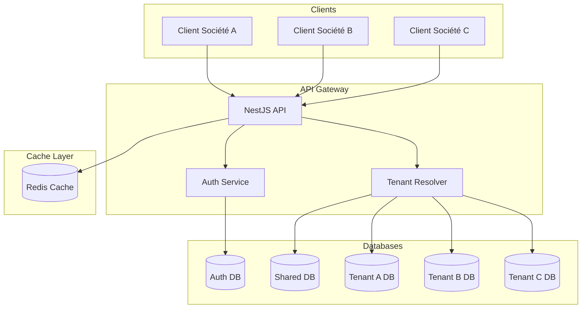
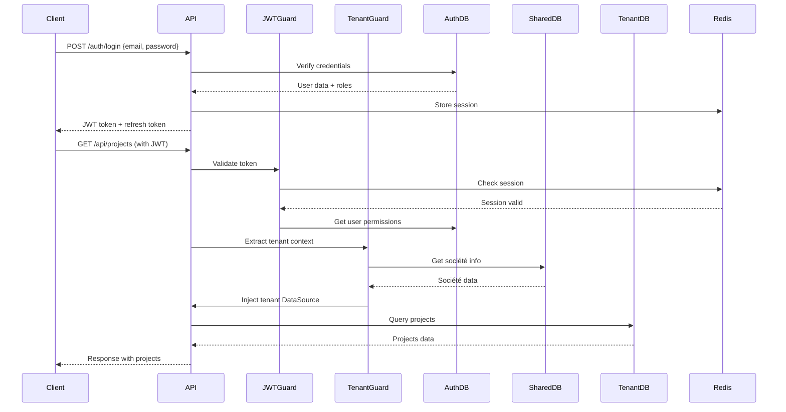

# Architecture Multi-Tenant TopSteel ERP

## Table des matières
1. [Vue d'ensemble](#vue-densemble)
2. [Modèle d'isolation](#modèle-disolation)
3. [Structure des bases de données](#structure-des-bases-de-données)
4. [Gestion des connexions](#gestion-des-connexions)
5. [Flux d'authentification](#flux-dauthentification)
6. [Sécurité et isolation](#sécurité-et-isolation)
7. [Performance et scalabilité](#performance-et-scalabilité)
8. [Gestion des tenants](#gestion-des-tenants)
9. [Monitoring et audit](#monitoring-et-audit)
10. [Disaster Recovery](#disaster-recovery)

## Vue d'ensemble

TopSteel ERP implémente une architecture multi-tenant hybride combinant:
- **Isolation par base de données** pour les données métier
- **Base partagée** pour l'authentification et configuration
- **Pool de connexions optimisé** par tenant
- **Cache Redis multi-niveau** avec isolation par préfixe

### Principes architecturaux



## Modèle d'isolation

### Stratégie hybride

Notre architecture utilise trois niveaux d'isolation:

1. **Niveau Auth (Centralisé)**
   - Base unique pour tous les utilisateurs
   - Gestion centralisée des identités
   - SSO et authentification unifiée

2. **Niveau Shared (Mutualisé)**
   - Configuration système globale
   - Données de référence communes
   - Gestion des licences

3. **Niveau Tenant (Isolé)**
   - Une base par société
   - Isolation complète des données métier
   - Backup et restore indépendants

### Avantages de cette approche

| Aspect | Bénéfice |
|--------|----------|
| **Sécurité** | Isolation physique des données sensibles |
| **Performance** | Pas de filtrage par tenant_id |
| **Compliance** | Facilite RGPD et audits |
| **Scalabilité** | Sharding naturel par société |
| **Maintenance** | Migration indépendante par tenant |

## Structure des bases de données

### Base Auth (`erp_topsteel_auth`)

```sql
-- Tables principales
CREATE TABLE users (
    id UUID PRIMARY KEY,
    email VARCHAR(255) UNIQUE NOT NULL,
    password_hash VARCHAR(255),
    first_name VARCHAR(100),
    last_name VARCHAR(100),
    is_active BOOLEAN DEFAULT true,
    created_at TIMESTAMP DEFAULT NOW(),
    updated_at TIMESTAMP DEFAULT NOW()
);

CREATE TABLE roles (
    id UUID PRIMARY KEY,
    name VARCHAR(50) UNIQUE NOT NULL,
    description TEXT,
    is_system BOOLEAN DEFAULT false,
    permissions JSONB DEFAULT '[]'
);

CREATE TABLE user_societe_roles (
    id UUID PRIMARY KEY,
    user_id UUID REFERENCES users(id),
    societe_id UUID NOT NULL,
    role VARCHAR(50) NOT NULL,
    is_active BOOLEAN DEFAULT true,
    granted_at TIMESTAMP DEFAULT NOW(),
    granted_by UUID REFERENCES users(id),
    expires_at TIMESTAMP,
    
    UNIQUE(user_id, societe_id)
);

CREATE TABLE user_sessions (
    id UUID PRIMARY KEY,
    user_id UUID REFERENCES users(id),
    token_hash VARCHAR(255) UNIQUE,
    ip_address INET,
    user_agent TEXT,
    expires_at TIMESTAMP,
    created_at TIMESTAMP DEFAULT NOW()
);

CREATE TABLE user_mfa (
    id UUID PRIMARY KEY,
    user_id UUID REFERENCES users(id),
    method VARCHAR(20), -- 'totp', 'webauthn', 'sms'
    secret TEXT,
    backup_codes TEXT[],
    is_enabled BOOLEAN DEFAULT false,
    verified_at TIMESTAMP
);

CREATE TABLE audit_logs (
    id UUID PRIMARY KEY,
    user_id UUID,
    societe_id UUID,
    action VARCHAR(100),
    resource_type VARCHAR(50),
    resource_id UUID,
    details JSONB,
    ip_address INET,
    user_agent TEXT,
    created_at TIMESTAMP DEFAULT NOW()
);

-- Index pour performances
CREATE INDEX idx_users_email ON users(email);
CREATE INDEX idx_user_sessions_token ON user_sessions(token_hash);
CREATE INDEX idx_user_societe_roles_user ON user_societe_roles(user_id);
CREATE INDEX idx_user_societe_roles_societe ON user_societe_roles(societe_id);
CREATE INDEX idx_audit_logs_user ON audit_logs(user_id, created_at DESC);
CREATE INDEX idx_audit_logs_societe ON audit_logs(societe_id, created_at DESC);
```

### Base Shared (`erp_topsteel_shared`)

```sql
-- Tables de configuration
CREATE TABLE societes (
    id UUID PRIMARY KEY,
    code VARCHAR(20) UNIQUE NOT NULL,
    name VARCHAR(255) NOT NULL,
    legal_name VARCHAR(255),
    siret VARCHAR(14),
    vat_number VARCHAR(20),
    address JSONB,
    contact JSONB,
    settings JSONB DEFAULT '{}',
    is_active BOOLEAN DEFAULT true,
    created_at TIMESTAMP DEFAULT NOW()
);

CREATE TABLE sites (
    id UUID PRIMARY KEY,
    societe_id UUID REFERENCES societes(id),
    code VARCHAR(20) NOT NULL,
    name VARCHAR(255) NOT NULL,
    address JSONB,
    is_primary BOOLEAN DEFAULT false,
    is_active BOOLEAN DEFAULT true,
    
    UNIQUE(societe_id, code)
);

CREATE TABLE licenses (
    id UUID PRIMARY KEY,
    societe_id UUID REFERENCES societes(id),
    license_key VARCHAR(255) UNIQUE NOT NULL,
    type VARCHAR(50), -- 'trial', 'standard', 'premium', 'enterprise'
    features JSONB DEFAULT '{}',
    max_users INTEGER DEFAULT 5,
    max_sites INTEGER DEFAULT 1,
    valid_from DATE NOT NULL,
    valid_until DATE,
    is_active BOOLEAN DEFAULT true
);

CREATE TABLE system_parameters (
    id UUID PRIMARY KEY,
    category VARCHAR(50) NOT NULL,
    key VARCHAR(100) NOT NULL,
    value JSONB,
    description TEXT,
    is_editable BOOLEAN DEFAULT true,
    
    UNIQUE(category, key)
);

CREATE TABLE menus (
    id UUID PRIMARY KEY,
    parent_id UUID REFERENCES menus(id),
    code VARCHAR(50) UNIQUE NOT NULL,
    label VARCHAR(100),
    icon VARCHAR(50),
    path VARCHAR(255),
    component VARCHAR(255),
    permissions JSONB DEFAULT '[]',
    order_index INTEGER DEFAULT 0,
    is_visible BOOLEAN DEFAULT true
);

-- Index pour performances
CREATE INDEX idx_societes_code ON societes(code);
CREATE INDEX idx_sites_societe ON sites(societe_id);
CREATE INDEX idx_licenses_societe ON licenses(societe_id);
CREATE INDEX idx_menus_parent ON menus(parent_id);
```

### Base Tenant (`erp_topsteel_[tenant_code]`)

```sql
-- Tables métier
CREATE TABLE articles (
    id UUID PRIMARY KEY,
    code VARCHAR(50) UNIQUE NOT NULL,
    designation VARCHAR(255) NOT NULL,
    category VARCHAR(100),
    family VARCHAR(100),
    unit VARCHAR(20),
    weight_per_unit DECIMAL(10,3),
    purchase_price DECIMAL(12,2),
    sale_price DECIMAL(12,2),
    stock_min DECIMAL(10,2),
    stock_max DECIMAL(10,2),
    is_active BOOLEAN DEFAULT true,
    metadata JSONB DEFAULT '{}',
    created_at TIMESTAMP DEFAULT NOW(),
    updated_at TIMESTAMP DEFAULT NOW()
);

CREATE TABLE partners (
    id UUID PRIMARY KEY,
    code VARCHAR(50) UNIQUE NOT NULL,
    type VARCHAR(20), -- 'client', 'supplier', 'both'
    name VARCHAR(255) NOT NULL,
    legal_name VARCHAR(255),
    siret VARCHAR(14),
    vat_number VARCHAR(20),
    payment_terms INTEGER DEFAULT 30,
    credit_limit DECIMAL(12,2),
    rating INTEGER CHECK (rating BETWEEN 1 AND 5),
    is_active BOOLEAN DEFAULT true,
    created_at TIMESTAMP DEFAULT NOW()
);

CREATE TABLE projects (
    id UUID PRIMARY KEY,
    code VARCHAR(50) UNIQUE NOT NULL,
    name VARCHAR(255) NOT NULL,
    client_id UUID REFERENCES partners(id),
    site_id UUID,
    status VARCHAR(30) DEFAULT 'draft',
    start_date DATE,
    end_date DATE,
    budget DECIMAL(12,2),
    actual_cost DECIMAL(12,2),
    progress INTEGER DEFAULT 0,
    metadata JSONB DEFAULT '{}'
);

CREATE TABLE stocks (
    id UUID PRIMARY KEY,
    article_id UUID REFERENCES articles(id),
    site_id UUID NOT NULL,
    quantity DECIMAL(12,3) DEFAULT 0,
    reserved_quantity DECIMAL(12,3) DEFAULT 0,
    location VARCHAR(100),
    last_movement_date TIMESTAMP,
    
    UNIQUE(article_id, site_id)
);

CREATE TABLE stock_movements (
    id UUID PRIMARY KEY,
    article_id UUID REFERENCES articles(id),
    site_id UUID NOT NULL,
    type VARCHAR(30), -- 'in', 'out', 'transfer', 'adjustment'
    quantity DECIMAL(12,3) NOT NULL,
    unit_price DECIMAL(12,2),
    reference_type VARCHAR(50),
    reference_id UUID,
    reason TEXT,
    created_by UUID NOT NULL,
    created_at TIMESTAMP DEFAULT NOW()
);

-- Index métier
CREATE INDEX idx_articles_code ON articles(code);
CREATE INDEX idx_articles_category ON articles(category);
CREATE INDEX idx_partners_type ON partners(type);
CREATE INDEX idx_projects_client ON projects(client_id);
CREATE INDEX idx_projects_status ON projects(status);
CREATE INDEX idx_stocks_article ON stocks(article_id);
CREATE INDEX idx_stock_movements_article ON stock_movements(article_id, created_at DESC);
```

## Gestion des connexions

### Pool de connexions dynamique

```typescript
// multi-tenant-database.config.ts
import { Injectable, OnModuleDestroy } from '@nestjs/common';
import { DataSource, DataSourceOptions } from 'typeorm';

@Injectable()
export class MultiTenantDatabaseConfig implements OnModuleDestroy {
  private dataSources = new Map<string, DataSource>();
  private connectionStats = new Map<string, ConnectionStats>();
  
  // Configuration par défaut du pool
  private readonly poolConfig = {
    min: parseInt(process.env.DB_POOL_MIN || '2'),
    max: parseInt(process.env.DB_POOL_MAX || '10'),
    idleTimeoutMillis: 30000,
    connectionTimeoutMillis: 5000,
    maxUses: 7500, // Recycler après N utilisations
  };

  async getDataSource(tenantId: string): Promise<DataSource> {
    // Vérifier si la connexion existe et est active
    if (this.dataSources.has(tenantId)) {
      const dataSource = this.dataSources.get(tenantId)!;
      
      if (dataSource.isInitialized) {
        this.updateConnectionStats(tenantId, 'reuse');
        return dataSource;
      }
      
      // Connexion fermée, la retirer
      this.dataSources.delete(tenantId);
    }

    // Créer nouvelle connexion
    const dataSource = await this.createTenantDataSource(tenantId);
    this.dataSources.set(tenantId, dataSource);
    this.updateConnectionStats(tenantId, 'create');
    
    // Programmer le nettoyage si inactif
    this.scheduleCleanup(tenantId);
    
    return dataSource;
  }

  private async createTenantDataSource(tenantId: string): Promise<DataSource> {
    // Récupérer les infos du tenant depuis la base shared
    const tenantInfo = await this.getTenantInfo(tenantId);
    
    if (!tenantInfo || !tenantInfo.is_active) {
      throw new Error(`Tenant ${tenantId} not found or inactive`);
    }

    const config: DataSourceOptions = {
      type: 'postgres',
      host: process.env.TENANT_DB_HOST || 'localhost',
      port: parseInt(process.env.TENANT_DB_PORT || '5432'),
      username: process.env.TENANT_DB_USERNAME || 'postgres',
      password: process.env.TENANT_DB_PASSWORD,
      database: `erp_topsteel_${tenantInfo.code.toLowerCase()}`,
      
      // Pool configuration
      extra: {
        ...this.poolConfig,
        statement_timeout: 30000,
        application_name: `topsteel_${tenantInfo.code}`,
      },
      
      // TypeORM options
      entities: [/* Entities tenant */],
      synchronize: false,
      logging: process.env.NODE_ENV === 'development',
      
      // Cache queries
      cache: {
        type: 'redis',
        options: {
          host: process.env.REDIS_HOST,
          port: parseInt(process.env.REDIS_PORT || '6379'),
          prefix: `tenant_${tenantId}_`,
        },
        duration: 60000, // 1 minute
      },
    };

    const dataSource = new DataSource(config);
    await dataSource.initialize();
    
    // Configurer les event listeners
    this.setupDataSourceListeners(dataSource, tenantId);
    
    return dataSource;
  }

  private setupDataSourceListeners(dataSource: DataSource, tenantId: string) {
    // Logger les requêtes lentes
    dataSource.driver.afterQueryRunner = (query, parameters, queryRunner) => {
      const executionTime = queryRunner.executionTime;
      if (executionTime > 1000) {
        this.logger.warn(`Slow query for tenant ${tenantId}: ${executionTime}ms`, {
          query: query.substring(0, 200),
          tenant: tenantId,
        });
      }
    };
  }

  private scheduleCleanup(tenantId: string) {
    // Nettoyer les connexions inactives après 5 minutes
    setTimeout(async () => {
      const stats = this.connectionStats.get(tenantId);
      if (stats && Date.now() - stats.lastUsed > 300000) {
        await this.closeConnection(tenantId);
      }
    }, 300000);
  }

  async closeConnection(tenantId: string): Promise<void> {
    const dataSource = this.dataSources.get(tenantId);
    if (dataSource?.isInitialized) {
      await dataSource.destroy();
      this.dataSources.delete(tenantId);
      this.connectionStats.delete(tenantId);
      this.logger.log(`Closed connection for tenant ${tenantId}`);
    }
  }

  async onModuleDestroy() {
    // Fermer toutes les connexions
    const promises = Array.from(this.dataSources.keys()).map(
      tenantId => this.closeConnection(tenantId)
    );
    await Promise.all(promises);
  }

  // Métriques de connexion
  getConnectionMetrics(): ConnectionMetrics {
    return {
      activeConnections: this.dataSources.size,
      totalCreated: Array.from(this.connectionStats.values())
        .reduce((sum, stats) => sum + stats.created, 0),
      totalReused: Array.from(this.connectionStats.values())
        .reduce((sum, stats) => sum + stats.reused, 0),
      byTenant: Object.fromEntries(this.connectionStats),
    };
  }
}
```

## Flux d'authentification

### Séquence complète



### Guards et Middleware

```typescript
// jwt-auth.guard.ts
@Injectable()
export class JwtAuthGuard extends AuthGuard('jwt') {
  constructor(
    private reflector: Reflector,
    private sessionService: SessionRedisService,
  ) {
    super();
  }

  async canActivate(context: ExecutionContext): Promise<boolean> {
    // Vérifier si la route est publique
    const isPublic = this.reflector.getAllAndOverride<boolean>('isPublic', [
      context.getHandler(),
      context.getClass(),
    ]);
    
    if (isPublic) return true;

    // Valider JWT
    const canActivate = await super.canActivate(context);
    if (!canActivate) return false;

    // Vérifier la session Redis
    const request = context.switchToHttp().getRequest();
    const token = this.extractToken(request);
    
    const isValidSession = await this.sessionService.validateSession(
      request.user.id,
      token
    );
    
    if (!isValidSession) {
      throw new UnauthorizedException('Session expired or invalid');
    }

    // Rafraîchir TTL session
    await this.sessionService.refreshSession(request.user.id, token);
    
    return true;
  }
}

// tenant.guard.ts
@Injectable()
export class TenantGuard implements CanActivate {
  constructor(
    private tenantService: TenantResolverService,
    private dbConfig: MultiTenantDatabaseConfig,
  ) {}

  async canActivate(context: ExecutionContext): Promise<boolean> {
    const request = context.switchToHttp().getRequest();
    const user = request.user;
    
    if (!user) {
      throw new UnauthorizedException('User not authenticated');
    }

    // Résoudre le tenant depuis différentes sources
    const tenantId = await this.resolveTenant(request, user);
    
    if (!tenantId) {
      throw new BadRequestException('Tenant context required');
    }

    // Vérifier les droits d'accès au tenant
    const hasAccess = await this.checkTenantAccess(user.id, tenantId);
    
    if (!hasAccess) {
      throw new ForbiddenException('Access denied to this tenant');
    }

    // Injecter le DataSource du tenant
    const dataSource = await this.dbConfig.getDataSource(tenantId);
    request.tenantDataSource = dataSource;
    request.tenantId = tenantId;

    // Ajouter les permissions du contexte
    const permissions = await this.getUserTenantPermissions(user.id, tenantId);
    request.tenantPermissions = permissions;

    return true;
  }

  private async resolveTenant(request: any, user: any): Promise<string | null> {
    // 1. Header X-Tenant-ID
    if (request.headers['x-tenant-id']) {
      return request.headers['x-tenant-id'];
    }

    // 2. Query parameter
    if (request.query?.tenantId) {
      return request.query.tenantId;
    }

    // 3. Sous-domaine
    const host = request.get('host');
    const subdomain = host.split('.')[0];
    if (subdomain && subdomain !== 'www') {
      const tenant = await this.tenantService.findBySubdomain(subdomain);
      if (tenant) return tenant.id;
    }

    // 4. Tenant par défaut de l'utilisateur
    if (user.defaultTenantId) {
      return user.defaultTenantId;
    }

    // 5. Premier tenant accessible
    const tenants = await this.tenantService.getUserTenants(user.id);
    if (tenants.length === 1) {
      return tenants[0].id;
    }

    return null;
  }
}
```

## Sécurité et isolation

### Principes de sécurité

1. **Isolation stricte des données**
   - Aucun accès cross-tenant possible
   - Connexions DB séparées par tenant
   - Validation systématique du contexte

2. **Authentification renforcée**
   - JWT avec rotation automatique
   - MFA optionnel (TOTP, WebAuthn)
   - Sessions Redis avec TTL

3. **Autorisation granulaire**
   - RBAC hiérarchique
   - Permissions par contexte
   - Audit trail complet

### Implémentation de la sécurité

```typescript
// security.service.ts
@Injectable()
export class SecurityService {
  constructor(
    private cryptoService: CryptoService,
    private auditService: AuditService,
  ) {}

  // Chiffrement des données sensibles
  async encryptSensitiveData(data: any, tenantId: string): Promise<string> {
    const key = await this.getTenantEncryptionKey(tenantId);
    return this.cryptoService.encrypt(JSON.stringify(data), key);
  }

  // Validation des entrées
  validateInput<T>(data: unknown, schema: ZodSchema<T>): T {
    try {
      return schema.parse(data);
    } catch (error) {
      throw new BadRequestException('Invalid input data', error.errors);
    }
  }

  // Sanitization SQL
  sanitizeSqlIdentifier(identifier: string): string {
    // Autoriser uniquement alphanumériques et underscore
    if (!/^[a-zA-Z0-9_]+$/.test(identifier)) {
      throw new BadRequestException('Invalid identifier');
    }
    return identifier;
  }

  // Rate limiting par tenant
  async checkRateLimit(tenantId: string, userId: string, action: string): Promise<void> {
    const key = `rate_limit:${tenantId}:${userId}:${action}`;
    const limit = this.getRateLimitForAction(action);
    
    const count = await this.redis.incr(key);
    if (count === 1) {
      await this.redis.expire(key, limit.window);
    }
    
    if (count > limit.max) {
      throw new TooManyRequestsException(
        `Rate limit exceeded for ${action}. Try again in ${limit.window}s`
      );
    }
  }

  // Audit logging
  async logSecurityEvent(event: SecurityEvent): Promise<void> {
    await this.auditService.log({
      type: 'SECURITY',
      severity: event.severity,
      userId: event.userId,
      tenantId: event.tenantId,
      action: event.action,
      details: event.details,
      ip: event.ip,
      userAgent: event.userAgent,
      timestamp: new Date(),
    });

    // Alertes pour événements critiques
    if (event.severity === 'CRITICAL') {
      await this.sendSecurityAlert(event);
    }
  }
}
```

### Conformité RGPD

```typescript
// gdpr.service.ts
@Injectable()
export class GdprService {
  // Anonymisation des données
  async anonymizeUserData(userId: string, tenantId: string): Promise<void> {
    const dataSource = await this.getDataSource(tenantId);
    
    await dataSource.transaction(async manager => {
      // Anonymiser les données personnelles
      await manager.update(User, userId, {
        email: `deleted_${userId}@anonymous.local`,
        firstName: 'ANONYMIZED',
        lastName: 'USER',
        phone: null,
        address: null,
      });

      // Conserver les métadonnées pour l'audit
      await manager.insert(DataDeletion, {
        userId,
        tenantId,
        deletedAt: new Date(),
        reason: 'GDPR_REQUEST',
      });
    });
  }

  // Export des données personnelles
  async exportUserData(userId: string, tenantId: string): Promise<Buffer> {
    const data = await this.collectUserData(userId, tenantId);
    
    // Formater en JSON ou CSV selon la demande
    const formatted = this.formatDataExport(data);
    
    // Chiffrer l'export
    const encrypted = await this.encryptExport(formatted, userId);
    
    // Logger l'export
    await this.logDataExport(userId, tenantId);
    
    return encrypted;
  }

  // Droit à l'oubli
  async executeRightToErasure(userId: string, tenantId: string): Promise<void> {
    // Vérifier les contraintes légales
    const canDelete = await this.checkLegalConstraints(userId, tenantId);
    
    if (!canDelete.allowed) {
      throw new BadRequestException(
        `Cannot delete: ${canDelete.reason}. Retention until: ${canDelete.until}`
      );
    }

    // Anonymiser au lieu de supprimer
    await this.anonymizeUserData(userId, tenantId);
    
    // Notifier les systèmes tiers
    await this.notifyThirdParties(userId, 'DATA_DELETION');
  }
}
```

## Performance et scalabilité

### Optimisations mises en place

1. **Cache multi-niveau**
   ```typescript
   // Redis L1 - Cache chaud (TTL: 5min)
   // PostgreSQL L2 - Cache queries (TTL: 1h)
   // CDN L3 - Assets statiques
   ```

2. **Connection pooling intelligent**
   - Pool adaptatif par charge
   - Recyclage des connexions
   - Timeout et retry automatiques

3. **Query optimization**
   - Index stratégiques
   - Pagination cursor-based
   - Projection des colonnes

### Métriques de performance

```typescript
// performance-monitor.service.ts
@Injectable()
export class PerformanceMonitor {
  private metrics = new Map<string, PerformanceMetric>();

  async trackDatabaseQuery(
    tenantId: string,
    query: string,
    duration: number
  ): Promise<void> {
    const key = `db_query:${tenantId}`;
    
    this.updateMetric(key, {
      count: 1,
      totalDuration: duration,
      maxDuration: duration,
      minDuration: duration,
    });

    // Alerter si requête lente
    if (duration > 1000) {
      await this.alertSlowQuery(tenantId, query, duration);
    }
  }

  async getPerformanceReport(tenantId: string): Promise<PerformanceReport> {
    const metrics = this.getMetricsForTenant(tenantId);
    
    return {
      database: {
        avgQueryTime: metrics.db.totalDuration / metrics.db.count,
        slowQueries: metrics.db.slowQueries,
        connectionPoolUsage: await this.getPoolUsage(tenantId),
      },
      api: {
        avgResponseTime: metrics.api.avgResponseTime,
        requestsPerSecond: metrics.api.rps,
        errorRate: metrics.api.errors / metrics.api.total,
      },
      cache: {
        hitRate: metrics.cache.hits / (metrics.cache.hits + metrics.cache.misses),
        avgLatency: metrics.cache.avgLatency,
      },
    };
  }
}
```

### Stratégie de scaling

```yaml
# docker-compose.scaling.yml
version: '3.8'

services:
  api:
    image: topsteel/api:latest
    deploy:
      replicas: 3
      resources:
        limits:
          cpus: '2'
          memory: 2G
        reservations:
          cpus: '1'
          memory: 1G
      update_config:
        parallelism: 1
        delay: 10s
        order: start-first
    environment:
      - NODE_ENV=production
      - CLUSTER_MODE=true
    
  postgres-primary:
    image: postgres:15-alpine
    environment:
      - POSTGRES_REPLICATION_MODE=master
      - POSTGRES_MAX_CONNECTIONS=200
    volumes:
      - postgres-primary:/var/lib/postgresql/data
    
  postgres-replica:
    image: postgres:15-alpine
    deploy:
      replicas: 2
    environment:
      - POSTGRES_REPLICATION_MODE=slave
      - POSTGRES_MASTER_HOST=postgres-primary
    
  redis-cluster:
    image: redis:7-alpine
    deploy:
      replicas: 3
    command: redis-server --cluster-enabled yes
    
  nginx:
    image: nginx:alpine
    volumes:
      - ./nginx.conf:/etc/nginx/nginx.conf:ro
    ports:
      - "80:80"
      - "443:443"
    depends_on:
      - api
```

## Gestion des tenants

### Cycle de vie d'un tenant

```typescript
// tenant-lifecycle.service.ts
@Injectable()
export class TenantLifecycleService {
  // Création d'un nouveau tenant
  async createTenant(data: CreateTenantDto): Promise<Tenant> {
    const tenant = await this.db.transaction(async manager => {
      // 1. Créer la société dans shared DB
      const societe = await manager.save(Societe, {
        code: data.code,
        name: data.name,
        settings: this.getDefaultSettings(),
      });

      // 2. Créer la base de données tenant
      await this.createTenantDatabase(societe.code);

      // 3. Exécuter les migrations
      await this.runTenantMigrations(societe.code);

      // 4. Insérer les données de base
      await this.seedTenantData(societe.code);

      // 5. Créer la licence
      const license = await manager.save(License, {
        societeId: societe.id,
        type: data.licenseType || 'trial',
        validFrom: new Date(),
        validUntil: this.calculateExpiryDate(data.licenseType),
      });

      // 6. Assigner l'admin
      await manager.save(UserSocieteRole, {
        userId: data.adminUserId,
        societeId: societe.id,
        role: 'OWNER',
      });

      return societe;
    });

    // 7. Notifier les systèmes
    await this.notifyTenantCreation(tenant);

    return tenant;
  }

  // Suspension d'un tenant
  async suspendTenant(tenantId: string, reason: string): Promise<void> {
    await this.db.transaction(async manager => {
      // Désactiver la société
      await manager.update(Societe, tenantId, {
        isActive: false,
        suspendedAt: new Date(),
        suspensionReason: reason,
      });

      // Révoquer les sessions actives
      await this.revokeAllSessions(tenantId);

      // Fermer les connexions DB
      await this.dbConfig.closeConnection(tenantId);
    });

    // Notifier
    await this.notifyTenantSuspension(tenantId, reason);
  }

  // Suppression d'un tenant
  async deleteTenant(tenantId: string, options: DeleteOptions): Promise<void> {
    // Backup avant suppression
    if (options.createBackup) {
      await this.backupTenantData(tenantId);
    }

    await this.db.transaction(async manager => {
      // Soft delete ou hard delete
      if (options.hardDelete) {
        // Supprimer la base de données
        await this.dropTenantDatabase(tenantId);
        
        // Supprimer de shared DB
        await manager.delete(Societe, tenantId);
      } else {
        // Soft delete
        await manager.update(Societe, tenantId, {
          deletedAt: new Date(),
          deletedBy: options.deletedBy,
        });
      }
    });

    // Archiver les logs
    await this.archiveTenantLogs(tenantId);
  }

  // Migration d'un tenant
  async migrateTenant(
    tenantId: string,
    targetVersion: string
  ): Promise<MigrationResult> {
    const result: MigrationResult = {
      success: false,
      migrationsRun: [],
      errors: [],
    };

    try {
      // 1. Mettre en maintenance
      await this.setMaintenanceMode(tenantId, true);

      // 2. Backup
      const backupId = await this.backupTenantData(tenantId);

      // 3. Exécuter les migrations
      const migrations = await this.getTenantMigrations(tenantId, targetVersion);
      
      for (const migration of migrations) {
        try {
          await this.runMigration(tenantId, migration);
          result.migrationsRun.push(migration.name);
        } catch (error) {
          result.errors.push({
            migration: migration.name,
            error: error.message,
          });
          
          // Rollback si erreur
          if (options.rollbackOnError) {
            await this.restoreFromBackup(tenantId, backupId);
            throw error;
          }
        }
      }

      result.success = result.errors.length === 0;
    } finally {
      // 4. Sortir de maintenance
      await this.setMaintenanceMode(tenantId, false);
    }

    return result;
  }
}
```

### Provisioning automatique

```typescript
// tenant-provisioning.service.ts
@Injectable()
export class TenantProvisioningService {
  async provision(request: ProvisioningRequest): Promise<ProvisioningResult> {
    const steps: ProvisioningStep[] = [
      { name: 'validate', handler: this.validateRequest },
      { name: 'createDatabase', handler: this.createDatabase },
      { name: 'runMigrations', handler: this.runMigrations },
      { name: 'configureSettings', handler: this.configureSettings },
      { name: 'setupIntegrations', handler: this.setupIntegrations },
      { name: 'createAdminUser', handler: this.createAdminUser },
      { name: 'sendWelcomeEmail', handler: this.sendWelcomeEmail },
    ];

    const result: ProvisioningResult = {
      success: false,
      completedSteps: [],
      tenant: null,
    };

    for (const step of steps) {
      try {
        await step.handler.call(this, request);
        result.completedSteps.push(step.name);
      } catch (error) {
        result.error = {
          step: step.name,
          message: error.message,
        };
        
        // Rollback
        await this.rollbackProvisioning(result.completedSteps, request);
        throw error;
      }
    }

    result.success = true;
    result.tenant = await this.getTenantInfo(request.code);
    
    return result;
  }
}
```

## Monitoring et audit

### Dashboard de monitoring

```typescript
// monitoring.controller.ts
@Controller('monitoring')
@UseGuards(JwtAuthGuard, SuperAdminGuard)
export class MonitoringController {
  @Get('tenants')
  async getTenantMetrics(): Promise<TenantMetrics[]> {
    return this.monitoringService.getAllTenantMetrics();
  }

  @Get('tenants/:id')
  async getTenantDetails(@Param('id') tenantId: string): Promise<TenantDetails> {
    return {
      info: await this.getTenantInfo(tenantId),
      metrics: {
        storage: await this.getStorageMetrics(tenantId),
        performance: await this.getPerformanceMetrics(tenantId),
        usage: await this.getUsageMetrics(tenantId),
      },
      health: await this.getHealthStatus(tenantId),
      alerts: await this.getActiveAlerts(tenantId),
    };
  }

  @Get('system')
  async getSystemMetrics(): Promise<SystemMetrics> {
    return {
      database: {
        connections: await this.getConnectionPoolMetrics(),
        slowQueries: await this.getSlowQueries(),
        replicationLag: await this.getReplicationLag(),
      },
      api: {
        requestRate: await this.getRequestRate(),
        errorRate: await this.getErrorRate(),
        responseTime: await this.getAverageResponseTime(),
      },
      infrastructure: {
        cpu: await this.getCpuUsage(),
        memory: await this.getMemoryUsage(),
        disk: await this.getDiskUsage(),
      },
    };
  }
}
```

### Audit trail complet

```typescript
// audit.service.ts
@Injectable()
export class AuditService {
  async logAction(action: AuditAction): Promise<void> {
    const entry: AuditEntry = {
      id: uuid(),
      timestamp: new Date(),
      userId: action.userId,
      tenantId: action.tenantId,
      action: action.type,
      resource: action.resource,
      resourceId: action.resourceId,
      changes: action.changes,
      metadata: {
        ip: action.ip,
        userAgent: action.userAgent,
        sessionId: action.sessionId,
      },
    };

    // Stocker dans la base
    await this.auditRepository.save(entry);

    // Indexer dans ElasticSearch pour recherche
    await this.elasticsearch.index({
      index: 'audit-logs',
      body: entry,
    });

    // Déclencher des alertes si nécessaire
    if (this.isHighRiskAction(action)) {
      await this.triggerSecurityAlert(entry);
    }
  }

  async searchAuditLogs(criteria: SearchCriteria): Promise<AuditSearchResult> {
    const query = this.buildElasticQuery(criteria);
    
    const result = await this.elasticsearch.search({
      index: 'audit-logs',
      body: query,
    });

    return this.formatSearchResult(result);
  }
}
```

## Disaster Recovery

### Stratégie de backup

```bash
#!/bin/bash
# backup-tenant.sh

TENANT_ID=$1
BACKUP_TYPE=$2 # full | incremental | differential

# Configuration
BACKUP_DIR="/backups/tenants/${TENANT_ID}"
S3_BUCKET="topsteel-backups"
RETENTION_DAYS=30

# Créer le répertoire de backup
mkdir -p ${BACKUP_DIR}

# Timestamp
TIMESTAMP=$(date +%Y%m%d_%H%M%S)
BACKUP_NAME="backup_${TENANT_ID}_${TIMESTAMP}"

# Backup de la base de données
pg_dump \
  -h ${DB_HOST} \
  -U ${DB_USER} \
  -d "erp_topsteel_${TENANT_ID}" \
  --format=custom \
  --compress=9 \
  --file="${BACKUP_DIR}/${BACKUP_NAME}.dump"

# Backup des fichiers
tar -czf "${BACKUP_DIR}/${BACKUP_NAME}_files.tar.gz" \
  "/data/tenants/${TENANT_ID}/"

# Créer un manifest
cat > "${BACKUP_DIR}/${BACKUP_NAME}.manifest" <<EOF
{
  "tenant_id": "${TENANT_ID}",
  "timestamp": "${TIMESTAMP}",
  "type": "${BACKUP_TYPE}",
  "database": "${BACKUP_NAME}.dump",
  "files": "${BACKUP_NAME}_files.tar.gz",
  "size": $(du -sb ${BACKUP_DIR}/${BACKUP_NAME}* | awk '{sum+=$1} END {print sum}'),
  "checksum": $(sha256sum ${BACKUP_DIR}/${BACKUP_NAME}.dump | cut -d' ' -f1)
}
EOF

# Upload vers S3
aws s3 sync ${BACKUP_DIR} "s3://${S3_BUCKET}/tenants/${TENANT_ID}/" \
  --storage-class GLACIER_IR

# Nettoyer les anciens backups
find ${BACKUP_DIR} -name "*.dump" -mtime +${RETENTION_DAYS} -delete

# Notifier
curl -X POST ${WEBHOOK_URL} \
  -H "Content-Type: application/json" \
  -d "{\"event\": \"backup_completed\", \"tenant\": \"${TENANT_ID}\"}"
```

### Plan de restauration

```typescript
// disaster-recovery.service.ts
@Injectable()
export class DisasterRecoveryService {
  async restoreTenant(
    tenantId: string,
    backupId: string,
    options: RestoreOptions
  ): Promise<RestoreResult> {
    const result: RestoreResult = {
      success: false,
      steps: [],
      duration: 0,
    };

    const startTime = Date.now();

    try {
      // 1. Valider le backup
      const backup = await this.validateBackup(backupId);
      result.steps.push({ name: 'validate', success: true });

      // 2. Mettre en maintenance
      await this.setMaintenanceMode(tenantId, true);
      result.steps.push({ name: 'maintenance', success: true });

      // 3. Télécharger le backup
      const backupFiles = await this.downloadBackup(backup);
      result.steps.push({ name: 'download', success: true });

      // 4. Restaurer la base de données
      if (options.restoreDatabase) {
        await this.restoreDatabase(tenantId, backupFiles.database);
        result.steps.push({ name: 'database', success: true });
      }

      // 5. Restaurer les fichiers
      if (options.restoreFiles) {
        await this.restoreFiles(tenantId, backupFiles.files);
        result.steps.push({ name: 'files', success: true });
      }

      // 6. Vérifier l'intégrité
      const integrity = await this.verifyIntegrity(tenantId);
      if (!integrity.valid) {
        throw new Error(`Integrity check failed: ${integrity.errors}`);
      }
      result.steps.push({ name: 'integrity', success: true });

      // 7. Réindexer si nécessaire
      if (options.reindex) {
        await this.reindexTenant(tenantId);
        result.steps.push({ name: 'reindex', success: true });
      }

      result.success = true;
    } catch (error) {
      result.error = error.message;
      
      // Rollback si possible
      if (options.rollbackOnError) {
        await this.rollbackRestore(tenantId, result.steps);
      }
    } finally {
      // 8. Sortir de maintenance
      await this.setMaintenanceMode(tenantId, false);
      result.duration = Date.now() - startTime;
    }

    // Notifier
    await this.notifyRestoreComplete(tenantId, result);

    return result;
  }

  // Test de restauration automatique
  async testDisasterRecovery(tenantId: string): Promise<TestResult> {
    // Créer un environnement de test
    const testTenantId = `${tenantId}_dr_test`;
    
    try {
      // 1. Créer un backup
      const backupId = await this.createBackup(tenantId);
      
      // 2. Créer un tenant de test
      await this.createTestTenant(testTenantId);
      
      // 3. Restaurer dans le tenant de test
      const restoreResult = await this.restoreTenant(
        testTenantId,
        backupId,
        { restoreDatabase: true, restoreFiles: true }
      );
      
      // 4. Valider les données
      const validation = await this.validateRestoredData(
        tenantId,
        testTenantId
      );
      
      return {
        success: restoreResult.success && validation.valid,
        backupTime: restoreResult.steps.find(s => s.name === 'download').duration,
        restoreTime: restoreResult.duration,
        dataIntegrity: validation.score,
        report: this.generateDRReport(restoreResult, validation),
      };
    } finally {
      // Nettoyer l'environnement de test
      await this.deleteTenant(testTenantId, { hardDelete: true });
    }
  }
}
```

## Bonnes pratiques

### Checklist de développement

- [ ] Toujours vérifier le contexte tenant avant les requêtes
- [ ] Utiliser les transactions pour les opérations critiques
- [ ] Implémenter le cache avec invalidation appropriée
- [ ] Logger tous les accès aux données sensibles
- [ ] Tester les migrations sur un tenant de test
- [ ] Monitorer les performances par tenant
- [ ] Documenter les dépendances cross-tenant
- [ ] Implémenter les health checks par service

### Anti-patterns à éviter

1. ❌ **Requêtes cross-tenant**
   ```typescript
   // MAUVAIS
   const data = await this.repository
     .createQueryBuilder()
     .where('tenant_id = :tenantId', { tenantId })
     .getMany();
   ```

2. ❌ **Cache partagé sans isolation**
   ```typescript
   // MAUVAIS
   const key = `user_${userId}`;
   ```

3. ❌ **Connexions DB en dur**
   ```typescript
   // MAUVAIS
   const connection = new DataSource({
     database: 'erp_topsteel_client1'
   });
   ```

### Patterns recommandés

1. ✅ **Utiliser le contexte injecté**
   ```typescript
   // BON
   const dataSource = request.tenantDataSource;
   const data = await dataSource
     .getRepository(Entity)
     .find();
   ```

2. ✅ **Cache avec préfixe tenant**
   ```typescript
   // BON
   const key = `tenant:${tenantId}:user:${userId}`;
   ```

3. ✅ **Configuration dynamique**
   ```typescript
   // BON
   const dataSource = await this.dbConfig.getDataSource(tenantId);
   ```

## Conclusion

Cette architecture multi-tenant offre:
- **Sécurité maximale** avec isolation physique
- **Performance optimale** sans overhead de filtrage
- **Scalabilité horizontale** naturelle
- **Maintenance simplifiée** par tenant
- **Conformité** aux standards RGPD et SOC2

Pour toute question ou amélioration, contacter l'équipe architecture.