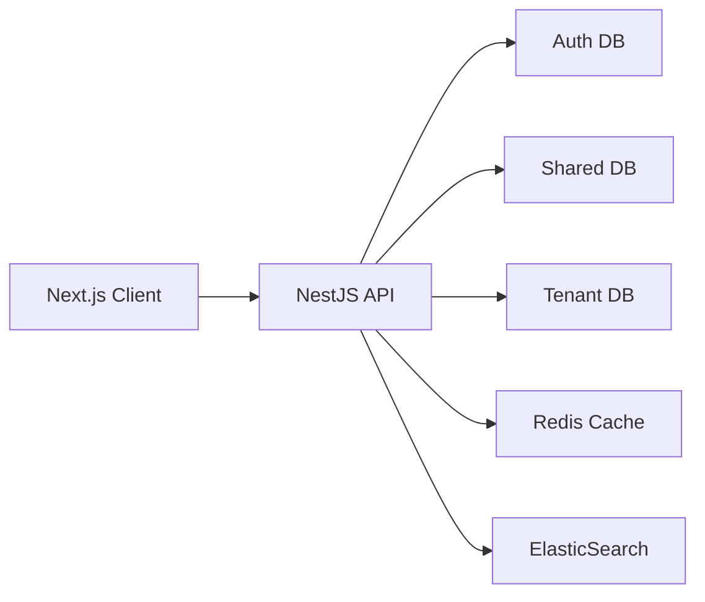

# Guide de Démarrage Rapide - TopSteel ERP

## Table des matières
1. [Introduction](#introduction)
2. [Prérequis](#prérequis)
3. [Installation](#installation)
4. [Configuration](#configuration)
5. [Démarrage](#démarrage)
6. [Première connexion](#première-connexion)
7. [Architecture du projet](#architecture-du-projet)
8. [Développement](#développement)
9. [Tests](#tests)
10. [Déploiement](#déploiement)
11. [Ressources](#ressources)

## Introduction

TopSteel ERP est une solution complète de gestion d'entreprise pour l'industrie métallurgique, développée avec les technologies modernes du web.

### Stack technique
- **Frontend** : Next.js 15, React 18, TypeScript, TailwindCSS
- **Backend** : NestJS 11, TypeORM, PostgreSQL 15
- **Cache** : Redis 7
- **Recherche** : ElasticSearch 8 (optionnel)
- **Monorepo** : Turbo, pnpm workspaces

### Fonctionnalités principales
- 🏗️ Multi-tenant avec isolation des données
- 🔐 Authentification JWT avec MFA
- 🔍 Recherche globale intelligente
- 💰 Système de tarification avancé
- 📦 Gestion des stocks et inventaire
- 🛒 Module e-commerce B2B
- 📊 Analytics et reporting

## Prérequis

### Environnement système

```bash
# Node.js (version 18 ou supérieure)
node --version  # >= 18.0.0

# pnpm (gestionnaire de paquets)
npm install -g pnpm
pnpm --version  # >= 8.0.0

# Git
git --version  # >= 2.0.0
```

### Services requis

```bash
# PostgreSQL 15
psql --version  # >= 15.0

# Redis 7
redis-server --version  # >= 7.0

# ElasticSearch 8 (optionnel)
curl -X GET "localhost:9200"  # >= 8.0
```

### Outils de développement recommandés

- **IDE** : VS Code avec extensions TypeScript, ESLint, Prettier
- **Client DB** : pgAdmin, DBeaver ou TablePlus
- **Client API** : Postman ou Insomnia
- **Client Redis** : RedisInsight

## Installation

### 1. Cloner le projet

```bash
# Clone du repository
git clone https://github.com/topsteel/erp-topsteel.git
cd erp-topsteel

# Ou avec SSH
git clone git@github.com:topsteel/erp-topsteel.git
cd erp-topsteel
```

### 2. Installation des dépendances

```bash
# Installation avec pnpm (recommandé)
pnpm install

# Build des packages partagés
pnpm build:packages
```

### 3. Configuration des bases de données

```bash
# Créer les bases de données
createdb erp_topsteel_auth
createdb erp_topsteel_shared
createdb erp_topsteel_topsteel

# Ou via psql
psql -U postgres << EOF
CREATE DATABASE erp_topsteel_auth;
CREATE DATABASE erp_topsteel_shared;
CREATE DATABASE erp_topsteel_topsteel;
EOF
```

### 4. Configuration Redis

```bash
# Démarrer Redis
redis-server

# Vérifier la connexion
redis-cli ping  # Doit retourner PONG
```

### 5. Configuration ElasticSearch (optionnel)

```bash
# Via Docker
docker run -d \
  --name elasticsearch \
  -p 9200:9200 \
  -p 9300:9300 \
  -e "discovery.type=single-node" \
  -e "xpack.security.enabled=false" \
  elasticsearch:8.11.0

# Vérifier l'installation
curl -X GET "localhost:9200/_cluster/health?pretty"
```

## Configuration

### 1. Variables d'environnement

Copier et configurer les fichiers `.env` :

```bash
# Copier les exemples
cp .env.example .env
cp apps/api/.env.example apps/api/.env
cp apps/web/.env.example apps/web/.env
```

### 2. Configuration principale (.env racine)

```env
# Environment
NODE_ENV=development
APP_NAME=TopSteel ERP

# Database - Auth
DB_AUTH_HOST=localhost
DB_AUTH_PORT=5432
DB_AUTH_USERNAME=postgres
DB_AUTH_PASSWORD=your_password
DB_AUTH_DATABASE=erp_topsteel_auth

# Database - Shared
DB_SHARED_HOST=localhost
DB_SHARED_PORT=5432
DB_SHARED_USERNAME=postgres
DB_SHARED_PASSWORD=your_password
DB_SHARED_DATABASE=erp_topsteel_shared

# Database - Tenant
DB_TENANT_HOST=localhost
DB_TENANT_PORT=5432
DB_TENANT_USERNAME=postgres
DB_TENANT_PASSWORD=your_password
DB_TENANT_DATABASE=erp_topsteel_topsteel

# Redis
REDIS_HOST=localhost
REDIS_PORT=6379
REDIS_PASSWORD=
REDIS_DB=0

# JWT
JWT_SECRET=your-super-secret-key-min-32-chars-long
JWT_EXPIRES_IN=15m
JWT_REFRESH_SECRET=different-super-secret-key-min-32-chars
JWT_REFRESH_EXPIRES_IN=7d

# ElasticSearch (optionnel)
ELASTICSEARCH_ENABLED=false
ELASTICSEARCH_NODE=http://localhost:9200
ELASTICSEARCH_USERNAME=
ELASTICSEARCH_PASSWORD=
```

### 3. Configuration API (apps/api/.env)

```env
# API Configuration
API_PORT=3000
API_PREFIX=api
API_CORS_ORIGIN=http://localhost:3001

# Logging
LOG_LEVEL=debug
LOG_FORMAT=json

# Rate Limiting
THROTTLE_TTL=60
THROTTLE_LIMIT=100

# File Upload
UPLOAD_MAX_FILE_SIZE=10485760  # 10MB
UPLOAD_ALLOWED_EXTENSIONS=pdf,jpg,png,xlsx,docx
```

### 4. Configuration Web (apps/web/.env)

```env
# Next.js Configuration
NEXT_PUBLIC_API_URL=http://localhost:3000/api
NEXT_PUBLIC_APP_URL=http://localhost:3001
NEXT_PUBLIC_APP_NAME=TopSteel ERP

# Features Flags
NEXT_PUBLIC_ENABLE_MFA=true
NEXT_PUBLIC_ENABLE_MARKETPLACE=true
NEXT_PUBLIC_ENABLE_ANALYTICS=true
```

## Démarrage

### 1. Migrations de base de données

```bash
# Exécuter les migrations
cd apps/api
pnpm migration:run

# Ou pour chaque base
pnpm migration:run:auth
pnpm migration:run:shared
pnpm migration:run:tenant
```

### 2. Injection des données initiales

```bash
# Créer un super admin
cd apps/api
npx ts-node src/scripts/create-admin-user.ts

# Injecter le catalogue métallurgie (550+ articles)
npx ts-node src/scripts/inject-metallurgy-data.ts

# Seed des données de test (optionnel)
pnpm seed
```

### 3. Démarrage des services

```bash
# Depuis la racine du projet

# Mode développement (tous les services)
pnpm dev

# Ou séparément
pnpm dev:api   # Backend uniquement
pnpm dev:web   # Frontend uniquement

# Mode production
pnpm build
pnpm start
```

### 4. Vérification

Les services sont maintenant accessibles :
- **Frontend** : http://localhost:3001
- **Backend API** : http://localhost:3000/api
- **Documentation API** : http://localhost:3000/api/docs

## Première connexion

### 1. Compte administrateur

Utilisez les identifiants créés lors de l'installation :
- **Email** : admin@topsteel.fr
- **Mot de passe** : admin123

### 2. Configuration initiale

Après la première connexion :

1. **Créer une société**
   - Aller dans Admin > Sociétés
   - Créer votre première société
   - Configurer les paramètres

2. **Créer des utilisateurs**
   - Admin > Utilisateurs
   - Inviter les membres de l'équipe
   - Attribuer les rôles

3. **Configurer les modules**
   - Activer les modules nécessaires
   - Configurer les paramètres métier
   - Importer vos données

### 3. Import du catalogue

```bash
# Via l'interface
Admin > Données > Import > Catalogue métallurgie

# Ou via script
cd apps/api
npx ts-node src/scripts/inject-metallurgy-data.ts
```

## Architecture du projet

### Structure du monorepo

```
erp-topsteel/
├── apps/
│   ├── api/                 # Backend NestJS
│   │   ├── src/
│   │   │   ├── core/        # Core modules
│   │   │   ├── domains/     # Domain logic
│   │   │   ├── features/    # Feature modules
│   │   │   └── scripts/     # Utility scripts
│   │   └── test/            # Tests
│   │
│   └── web/                 # Frontend Next.js
│       ├── src/
│       │   ├── app/         # App router pages
│       │   ├── components/  # React components
│       │   ├── hooks/       # Custom hooks
│       │   └── lib/         # Utilities
│       └── public/          # Static assets
│
├── packages/                # Shared packages
│   ├── domains/            # Shared domain models
│   ├── types/              # TypeScript types
│   └── utils/              # Shared utilities
│
├── docs/                   # Documentation
│   ├── architecture/       # Architecture docs
│   ├── api/               # API documentation
│   ├── deployment/        # Deployment guides
│   └── modules/           # Module docs
│
└── docker/                 # Docker configurations
    ├── development/        # Dev environment
    └── production/         # Prod environment
```

### Flux de données



## Développement

### Commandes utiles

```bash
# Développement
pnpm dev              # Démarrer tous les services
pnpm dev:api          # API uniquement
pnpm dev:web          # Web uniquement

# Build
pnpm build            # Build complet
pnpm build:api        # Build API
pnpm build:web        # Build Web

# Tests
pnpm test             # Tous les tests
pnpm test:api         # Tests API
pnpm test:web         # Tests Web
pnpm test:e2e         # Tests E2E

# Linting
pnpm lint             # Lint tout
pnpm lint:fix         # Fix automatique

# TypeScript
pnpm typecheck        # Vérification des types

# Base de données
pnpm migration:create # Créer une migration
pnpm migration:run    # Exécuter les migrations
pnpm migration:revert # Rollback

# Scripts utiles
pnpm clean            # Nettoyer les builds
pnpm fresh            # Clean + install + build
```

### Ajout d'une fonctionnalité

1. **Créer la branche**
   ```bash
   git checkout -b feature/ma-fonctionnalite
   ```

2. **Développer la fonctionnalité**
   - Backend : Créer le module dans `apps/api/src/features/`
   - Frontend : Créer les composants dans `apps/web/src/`
   - Types : Ajouter dans `packages/types/`

3. **Tester**
   ```bash
   pnpm test
   pnpm test:e2e
   ```

4. **Commit et PR**
   ```bash
   git add .
   git commit -m "feat: description de la fonctionnalité"
   git push origin feature/ma-fonctionnalite
   ```

### Standards de code

- **Linting** : ESLint + Prettier configurés
- **Commits** : Convention Conventional Commits
- **Types** : TypeScript strict mode
- **Tests** : Minimum 80% de couverture

## Tests

### Tests unitaires

```bash
# Lancer tous les tests
pnpm test

# Tests avec coverage
pnpm test:cov

# Tests en mode watch
pnpm test:watch

# Tests d'un module spécifique
pnpm test -- --testPathPattern=auth
```

### Tests E2E

```bash
# Préparer l'environnement de test
pnpm test:e2e:prepare

# Lancer les tests E2E
pnpm test:e2e

# Tests E2E en mode UI (Playwright)
pnpm test:e2e:ui
```

### Tests de charge

```bash
# Installer Artillery
npm install -g artillery

# Lancer les tests de charge
artillery run tests/load/scenarios.yml
```

## Déploiement

### Production avec Docker

```bash
# Build des images
docker-compose -f docker-compose.prod.yml build

# Démarrer les services
docker-compose -f docker-compose.prod.yml up -d

# Vérifier les logs
docker-compose -f docker-compose.prod.yml logs -f
```

### Déploiement manuel

```bash
# Build de production
pnpm build

# Variables d'environnement production
cp .env.production .env

# Migrations de production
NODE_ENV=production pnpm migration:run

# Démarrer avec PM2
pm2 start ecosystem.config.js
```

### CI/CD avec GitHub Actions

Le projet inclut des workflows GitHub Actions pour :
- Tests automatiques sur chaque PR
- Build et déploiement sur merge vers main
- Analyses de sécurité quotidiennes

## Ressources

### Documentation

- [Architecture Multi-Tenant](./docs/architecture/multi-tenant.md)
- [Système d'Authentification](./docs/api/authentication.md)
- [Module de Recherche](./docs/modules/search.md)
- [Système de Tarification](./docs/modules/pricing.md)
- [Guide de Déploiement](./docs/deployment/guide.md)

### API

- **Documentation Swagger** : http://localhost:3000/api/docs
- **Collection Postman** : `docs/api/postman-collection.json`
- **GraphQL Playground** : http://localhost:3000/graphql (si activé)

### Support

- **Email** : support@topsteel.fr
- **Documentation** : https://docs.topsteel.fr
- **GitHub Issues** : https://github.com/topsteel/erp-topsteel/issues
- **Slack** : #topsteel-dev

### Liens utiles

- [Next.js Documentation](https://nextjs.org/docs)
- [NestJS Documentation](https://docs.nestjs.com)
- [TypeORM Documentation](https://typeorm.io)
- [PostgreSQL Documentation](https://www.postgresql.org/docs)
- [Redis Documentation](https://redis.io/documentation)
- [ElasticSearch Guide](https://www.elastic.co/guide)

## Troubleshooting

### Problèmes courants

#### Port déjà utilisé
```bash
# Identifier le processus
lsof -i :3000  # ou :3001

# Tuer le processus
kill -9 <PID>
```

#### Erreur de connexion PostgreSQL
```bash
# Vérifier que PostgreSQL est démarré
sudo systemctl status postgresql

# Vérifier les permissions
psql -U postgres -c "\du"
```

#### Erreur de permissions pnpm
```bash
# Nettoyer le cache
pnpm store prune

# Réinstaller
rm -rf node_modules pnpm-lock.yaml
pnpm install
```

#### Build qui échoue
```bash
# Nettoyer et rebuild
pnpm clean
pnpm install
pnpm build:packages
pnpm build
```

### Debug

```bash
# Activer les logs détaillés
export DEBUG=*
export LOG_LEVEL=debug

# Inspecter le processus Node
node --inspect apps/api/dist/main.js

# Profiler de performance
node --prof apps/api/dist/main.js
```

---

**Bienvenue dans TopSteel ERP !** 🚀

Pour toute question, consultez la documentation ou contactez l'équipe de développement.

*Version 1.0.0 - Janvier 2025*