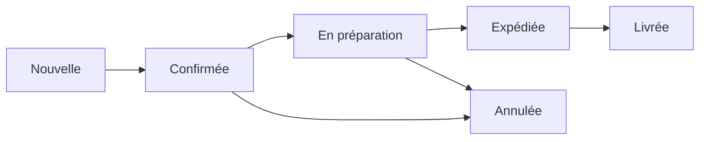

# TopSteel Marketplace - Guide Administration

## Table des matières
1. [Vue d'ensemble](#vue-densemble)
2. [Accès administrateur](#accès-administrateur)
3. [Gestion du catalogue](#gestion-du-catalogue)
4. [Gestion des commandes](#gestion-des-commandes)
5. [Configuration boutique](#configuration-boutique)
6. [Promotions et coupons](#promotions-et-coupons)
7. [Analytics et rapports](#analytics-et-rapports)
8. [Maintenance et monitoring](#maintenance-et-monitoring)

## Vue d'ensemble

Le panneau d'administration du marketplace TopSteel permet de gérer l'ensemble des opérations e-commerce B2B pour les matériaux de construction et l'acier.

### Architecture multi-tenant
- Chaque client dispose de son propre espace isolé
- Configuration indépendante par tenant
- Données strictement séparées

## Accès administrateur

### Connexion
```
URL: https://admin.topsteel.com/marketplace
Identifiant: votre-email@entreprise.com
Mot de passe: [Fourni par l'équipe IT]
```

### Rôles et permissions

| Rôle | Permissions |
|------|------------|
| Super Admin | Accès total, gestion multi-tenant |
| Admin Marketplace | Gestion complète du marketplace |
| Manager Produits | Catalogue, stock, prix |
| Manager Commandes | Commandes, livraisons, remboursements |
| Support Client | Consultation commandes, assistance |
| Analyste | Rapports et analytics en lecture seule |

## Gestion du catalogue

### Ajouter un produit

1. **Navigation**: Catalogue → Produits → Nouveau produit
2. **Informations requises**:
   - Nom du produit
   - SKU unique
   - Catégorie
   - Description détaillée
   - Prix (HT et TTC)
   - Unité de vente (kg, m, pièce, etc.)
   - Stock disponible

3. **Images**:
   - Image principale (obligatoire)
   - Images additionnelles (max 10)
   - Format: JPG, PNG (max 5MB)
   - Résolution recommandée: 1200x1200px

4. **Spécifications techniques**:
   ```json
   {
     "dimensions": {
       "longueur": "10m",
       "largeur": "200mm",
       "épaisseur": "10mm"
     },
     "poids": "150kg",
     "matériau": "Acier S235JR",
     "normes": ["EN 10025", "CE"],
     "résistance": "235 MPa"
   }
   ```

### Gestion des stocks

#### Mise à jour manuelle
1. Catalogue → Stocks
2. Rechercher le produit
3. Modifier la quantité disponible
4. Ajouter une note de traçabilité

#### Import en masse
```csv
SKU,Quantité,Entrepôt,Date_réception
BEAM-001,500,Paris-Nord,2024-01-15
PLATE-002,1200,Lyon-Sud,2024-01-15
```

#### Alertes stock
- Seuil critique: < 10% du stock moyen
- Seuil bas: < 25% du stock moyen
- Notifications email automatiques

### Gestion des prix

#### Règles de tarification
1. **Prix de base**: Prix catalogue standard
2. **Prix volume**: Remises quantitatives
   ```
   1-99 unités: Prix standard
   100-499 unités: -5%
   500-999 unités: -10%
   1000+ unités: -15%
   ```
3. **Prix client**: Tarifs négociés spécifiques
4. **Prix promotionnels**: Temporaires avec dates

## Gestion des commandes

### Workflow de commande



### Actions sur commande

#### Validation
1. Vérifier la disponibilité stock
2. Confirmer le paiement
3. Valider l'adresse de livraison
4. Approuver ou rejeter

#### Modification
- Possible jusqu'au statut "En préparation"
- Changements autorisés:
  - Adresse de livraison
  - Mode de transport
  - Date de livraison souhaitée

#### Annulation et remboursement
1. Commandes → Détail commande
2. Actions → Annuler commande
3. Sélectionner motif:
   - Demande client
   - Stock insuffisant
   - Problème paiement
   - Erreur de prix
4. Traiter le remboursement:
   - Remboursement total
   - Remboursement partiel
   - Avoir commercial

### Gestion des litiges

1. **Ouverture d'un litige**:
   - Client signale un problème
   - Création automatique d'un ticket
   - Assignation au support

2. **Résolution**:
   - Investigation du problème
   - Communication avec le client
   - Proposition de solution
   - Clôture avec satisfaction client

## Configuration boutique

### Paramètres généraux

```yaml
boutique:
  nom: "TopSteel Marketplace"
  url: "https://marketplace.topsteel.com"
  email_contact: "contact@topsteel.com"
  telephone: "+33 1 23 45 67 89"
  
horaires:
  lundi-vendredi: "8h00-18h00"
  samedi: "9h00-12h00"
  dimanche: "Fermé"
  
devise: "EUR"
langue_defaut: "fr"
langues_disponibles: ["fr", "en", "de", "es"]
```

### Zones de livraison

| Zone | Pays | Délai | Frais |
|------|------|-------|-------|
| Zone 1 | France métropolitaine | 24-48h | Gratuit >1000€ |
| Zone 2 | Benelux, Allemagne | 48-72h | 50€ |
| Zone 3 | Europe du Sud | 3-5j | 100€ |
| Zone 4 | Europe de l'Est | 5-7j | 150€ |

### Modes de paiement

- **Carte bancaire** (Stripe)
  - Visa, Mastercard, Amex
  - 3D Secure obligatoire
  
- **Virement bancaire**
  - Délai: 2-3 jours
  - Validation manuelle
  
- **Prélèvement SEPA**
  - Clients B2B uniquement
  - Mandat requis

- **Paiement différé**
  - 30/60/90 jours
  - Sous conditions (limite crédit)

## Promotions et coupons

### Création d'une promotion

1. **Type de promotion**:
   - Pourcentage de réduction
   - Montant fixe
   - Livraison gratuite
   - Produit offert

2. **Conditions**:
   ```javascript
   {
     montant_minimum: 500,
     categories: ["acier", "aluminium"],
     clients: ["VIP", "GOLD"],
     periode: {
       debut: "2024-01-01",
       fin: "2024-01-31"
     },
     usage_max: 100,
     usage_par_client: 1
   }
   ```

3. **Code promo**:
   - Format: PROMO2024
   - Génération automatique possible
   - Distribution par email

### Campagnes marketing

#### Email promotionnel
1. Marketing → Nouvelle campagne
2. Sélectionner segment clients
3. Choisir template
4. Personnaliser contenu
5. Programmer envoi

#### Bannières site
- Homepage: 1920x400px
- Catégories: 1200x200px
- Produits: 300x250px

## Analytics et rapports

### Tableaux de bord

#### KPIs principaux
- Chiffre d'affaires (jour/semaine/mois/année)
- Nombre de commandes
- Panier moyen
- Taux de conversion
- Produits les plus vendus
- Clients actifs

#### Graphiques temps réel
```javascript
// Exemple de données
{
  ventes_aujourdhui: 45230,
  commandes_en_cours: 23,
  visiteurs_actifs: 156,
  stock_critique: 5,
  tickets_ouverts: 3
}
```

### Rapports personnalisés

#### Export des données
1. Analytics → Rapports → Nouveau
2. Sélectionner:
   - Période
   - Métriques
   - Dimensions
   - Filtres
3. Format export:
   - CSV
   - Excel
   - PDF
   - API JSON

#### Rapports automatiques
- Fréquence: Quotidien, Hebdomadaire, Mensuel
- Destinataires: Emails multiples
- Contenu: Personnalisable

### Analyses avancées

#### Analyse cohorte
- Rétention clients par mois d'acquisition
- Valeur vie client (CLV)
- Comportement d'achat

#### Analyse produits
- Performance par catégorie
- Corrélations d'achats
- Saisonnalité
- Élasticité prix

## Maintenance et monitoring

### Surveillance système

#### Health checks
```bash
# Endpoints de monitoring
GET /health          # Status général
GET /health/db       # Base de données
GET /health/redis    # Cache Redis
GET /health/storage  # Stockage
GET /health/payment  # Services paiement
```

#### Métriques Prometheus
- Latence API: p95 < 200ms
- Taux d'erreur: < 0.1%
- Disponibilité: > 99.9%
- Queue jobs: < 1000

### Maintenance planifiée

#### Procédure
1. Notification clients (J-7)
2. Activation mode maintenance
3. Backup base de données
4. Déploiement updates
5. Tests de validation
6. Réouverture service

#### Mode maintenance
```javascript
// Configuration
{
  maintenance_mode: true,
  message: "Maintenance en cours. Retour prévu à 14h00.",
  allowed_ips: ["192.168.1.1", "10.0.0.1"],
  bypass_token: "maintenance-2024"
}
```

### Sauvegardes

#### Stratégie
- **Base de données**: Toutes les 4h
- **Fichiers**: Quotidien
- **Configuration**: À chaque modification
- **Rétention**: 30 jours

#### Restauration
1. Identifier backup à restaurer
2. Créer environnement test
3. Restaurer données
4. Valider intégrité
5. Basculer production

### Logs et audit

#### Types de logs
- **Application**: Erreurs, warnings, info
- **Accès**: Requêtes HTTP
- **Sécurité**: Authentification, autorisations
- **Business**: Transactions, modifications

#### Consultation
```bash
# Via Kibana
https://logs.topsteel.com

# Filtres utiles
level:ERROR AND service:marketplace
user.email:"admin@topsteel.com"
action:ORDER_CREATED AND timestamp:[now-1h TO now]
```

### Support et escalade

#### Niveaux de support
1. **N1 - Support client**: Tickets simples, FAQ
2. **N2 - Support technique**: Bugs, configuration
3. **N3 - Ingénierie**: Incidents critiques

#### Procédure d'escalade
```
Client → N1 (15min) → N2 (1h) → N3 (2h) → CTO
```

#### Contacts urgents
- Hotline: +33 1 XX XX XX XX
- Email urgence: urgent@topsteel.com
- Slack: #marketplace-incidents
- PagerDuty: marketplace-oncall

## Annexes

### Codes d'erreur fréquents

| Code | Description | Solution |
|------|------------|----------|
| STOCK_001 | Stock insuffisant | Vérifier disponibilité, commander |
| PAY_002 | Paiement échoué | Vérifier carte, limite |
| SHIP_003 | Adresse invalide | Corriger avec client |
| AUTH_004 | Token expiré | Se reconnecter |
| RATE_005 | Limite dépassée | Attendre ou augmenter limite |

### Raccourcis clavier

- `Ctrl + K`: Recherche rapide
- `Ctrl + N`: Nouvelle commande
- `Ctrl + P`: Nouveau produit
- `Ctrl + /`: Aide contextuelle
- `Esc`: Fermer modal

### Glossaire

- **SKU**: Stock Keeping Unit (référence produit)
- **CLV**: Customer Lifetime Value
- **B2B**: Business to Business
- **SLA**: Service Level Agreement
- **KPI**: Key Performance Indicator
- **API**: Application Programming Interface
- **PIM**: Product Information Management
- **ERP**: Enterprise Resource Planning