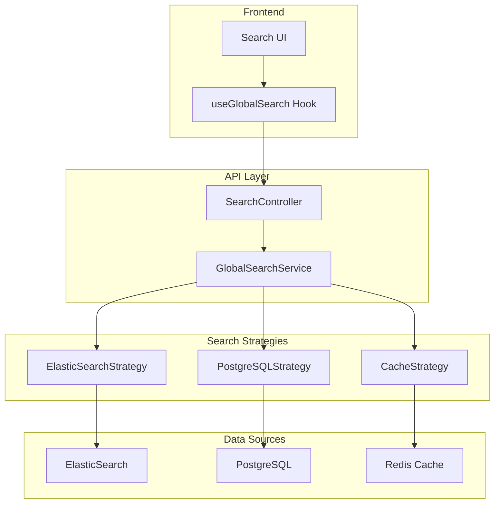

# Module de Recherche Globale TopSteel

## Table des matières
1. [Vue d'ensemble](#vue-densemble)
2. [Architecture](#architecture)
3. [Configuration](#configuration)
4. [API Endpoints](#api-endpoints)
5. [Entités recherchables](#entités-recherchables)
6. [Sécurité](#sécurité)
7. [Indexation](#indexation)
8. [Stratégies de recherche](#stratégies-de-recherche)
9. [Performance](#performance)
10. [Monitoring](#monitoring)
11. [Migration](#migration)
12. [Troubleshooting](#troubleshooting)

## Vue d'ensemble

Le module de recherche globale TopSteel fournit un système de recherche unifié, performant et sécurisé pour l'ensemble de l'application ERP.

### Fonctionnalités principales
- **Recherche unifiée** : Un point d'entrée unique pour toutes les entités
- **Multi-moteur** : ElasticSearch pour la performance, PostgreSQL en fallback
- **Multi-tenant** : Isolation complète des données par société
- **Sécurité intégrée** : Filtrage automatique par permissions et rôles
- **Indexation temps réel** : Synchronisation via événements
- **Suggestions intelligentes** : Auto-complétion et corrections orthographiques
- **Recherche typée** : Filtrage par type d'entité
- **Analytics** : Métriques et monitoring des recherches

### État actuel
- **Status** : ✅ OPÉRATIONNEL
- **Version** : 1.0.0
- **Dernière mise à jour** : Janvier 2025

## Architecture

### Stack technique



### Services principaux

```typescript
// Structure du module
search-module/
├── controllers/
│   └── search.controller.ts      // API endpoints
├── services/
│   ├── global-search.service.ts  // Service principal
│   ├── search-indexing.service.ts // Indexation automatique
│   └── search-cache.service.ts   // Gestion du cache
├── strategies/
│   ├── elasticsearch.strategy.ts // Moteur ElasticSearch
│   └── postgresql.strategy.ts    // Moteur PostgreSQL
├── config/
│   └── searchable-entities.config.ts // Configuration entités
├── dto/
│   ├── search-query.dto.ts      // DTO requête
│   └── search-result.dto.ts     // DTO résultat
└── interfaces/
    └── search.interface.ts       // Interfaces TypeScript
```

## Configuration

### Variables d'environnement

```env
# ElasticSearch (optionnel)
ELASTICSEARCH_ENABLED=true
ELASTICSEARCH_NODE=http://localhost:9200
ELASTICSEARCH_USERNAME=elastic
ELASTICSEARCH_PASSWORD=changeme
ELASTICSEARCH_INDEX_PREFIX=topsteel_
ELASTICSEARCH_MAX_RETRIES=3
ELASTICSEARCH_REQUEST_TIMEOUT=30000

# PostgreSQL Search
POSTGRES_SEARCH_MIN_SCORE=0.1
POSTGRES_SEARCH_MAX_RESULTS=100

# Cache Redis
REDIS_SEARCH_CACHE_TTL=300  # 5 minutes
REDIS_SEARCH_CACHE_PREFIX=search:

# Configuration recherche
SEARCH_MAX_RESULTS=100
SEARCH_MIN_QUERY_LENGTH=2
SEARCH_DEBOUNCE_MS=300
SEARCH_SUGGESTION_LIMIT=10
SEARCH_HIGHLIGHT_ENABLED=true
SEARCH_FUZZY_ENABLED=true
SEARCH_FUZZY_DISTANCE=2
```

### Configuration des entités

```typescript
// searchable-entities.config.ts
export const SEARCHABLE_ENTITIES: SearchableEntity[] = [
  {
    type: 'client',
    tableName: 'partners',
    entityName: 'Partner',
    displayName: 'Client',
    searchableFields: {
      primary: [
        { name: 'code', weight: 10, type: 'keyword' },
        { name: 'denomination', weight: 9, type: 'text' }
      ],
      secondary: [
        { name: 'email', weight: 7, type: 'keyword' },
        { name: 'telephone', weight: 6, type: 'keyword' }
      ],
      metadata: [
        { name: 'ville', weight: 4, type: 'text' },
        { name: 'adresse', weight: 3, type: 'text' }
      ]
    },
    database: 'tenant',
    requiresPermission: 'clients.read',
    indexSettings: {
      refreshInterval: '1s',
      numberOfShards: 2,
      numberOfReplicas: 1
    }
  },
  // ... autres entités
];
```

## API Endpoints

### Recherche globale

```http
# Recherche simple
GET /api/search/global?q=terme
Authorization: Bearer {token}

Response 200:
{
  "results": [
    {
      "type": "client",
      "id": "uuid",
      "title": "DUPONT SARL",
      "subtitle": "Code: CL-0001",
      "description": "Email: contact@dupont.fr",
      "url": "/clients/uuid",
      "score": 0.95,
      "highlights": {
        "title": "<mark>DUPONT</mark> SARL"
      }
    }
  ],
  "totalCount": 42,
  "searchTime": 125,
  "engine": "elasticsearch"
}

# Recherche avec filtres
GET /api/search/global?q=acier&types=article,material&limit=20&offset=0

# Recherche avec tri
GET /api/search/global?q=*&sort=createdAt:desc&dateFrom=2024-01-01
```

### Suggestions et auto-complétion

```http
# Suggestions
GET /api/search/suggestions?q=dupe
Authorization: Bearer {token}

Response 200:
{
  "suggestions": [
    {
      "text": "dupont",
      "type": "client",
      "count": 5
    },
    {
      "text": "duplex",
      "type": "material",
      "count": 2
    }
  ],
  "corrections": [
    {
      "original": "dupe",
      "suggestion": "dupont",
      "confidence": 0.85
    }
  ]
}
```

### Recherche par type

```http
# Recherche clients uniquement
GET /api/search/type/client?q=dupont&ville=Paris

# Recherche articles avec filtres
GET /api/search/type/article?q=IPE&famille=PROFILES_ACIER
```

### Recherche dans les menus

```http
# Recherche de fonctionnalités
GET /api/search/menus?q=facture
Authorization: Bearer {token}

Response 200:
{
  "menus": [
    {
      "id": "uuid",
      "title": "Factures",
      "path": "/factures",
      "breadcrumb": "Ventes > Factures",
      "permissions": ["factures.read"]
    }
  ]
}
```

### Administration

```http
# Réindexation complète (Admin)
POST /api/search/reindex
Authorization: Bearer {admin-token}
{
  "entities": ["client", "article"],  // Optionnel, tous si vide
  "force": false  // Force même si index existe
}

# Statistiques de recherche
GET /api/search/stats
Authorization: Bearer {admin-token}

Response 200:
{
  "totalSearches": 15234,
  "averageResponseTime": 145,
  "topQueries": [
    { "query": "acier", "count": 234 },
    { "query": "dupont", "count": 189 }
  ],
  "engineUsage": {
    "elasticsearch": 0.85,
    "postgresql": 0.15
  },
  "cacheHitRate": 0.42
}

# Status des moteurs
GET /api/search/status
Authorization: Bearer {admin-token}
```

## Entités recherchables

### Entités métier

| Type | Table | Permissions | Description |
|------|-------|-------------|-------------|
| `menu` | `menus` | - | Navigation et fonctionnalités |
| `client` | `partners` | `clients.read` | Clients |
| `fournisseur` | `partners` | `fournisseurs.read` | Fournisseurs |
| `article` | `articles` | `articles.read` | Produits et références |
| `material` | `materials` | `materials.read` | Matériaux et nuances |
| `projet` | `projets` | `projets.read` | Dossiers et affaires |
| `devis` | `documents` | `devis.read` | Devis |
| `commande` | `documents` | `commandes.read` | Commandes |
| `facture` | `documents` | `factures.read` | Factures |

### Entités système (Admin)

| Type | Table | Rôles requis | Description |
|------|-------|--------------|-------------|
| `user` | `users` | `ADMIN` | Utilisateurs |
| `societe` | `societes` | `SUPER_ADMIN` | Sociétés clientes |
| `pricing` | `price_rules` | `ADMIN` | Règles tarifaires |
| `notification` | `notifications` | - | Alertes système |
| `query` | `saved_queries` | - | Requêtes sauvegardées |

## Sécurité

### Filtrage des résultats

```typescript
@Injectable()
export class SearchSecurityService {
  async filterResults(
    results: SearchResult[],
    user: User,
    context: RequestContext
  ): Promise<SearchResult[]> {
    // 1. Filtrage par tenant
    const tenantFiltered = results.filter(r => 
      r.tenantId === context.tenantId || r.isGlobal
    );
    
    // 2. Filtrage par permissions
    const permissionFiltered = [];
    for (const result of tenantFiltered) {
      const entity = SEARCHABLE_ENTITIES.find(e => e.type === result.type);
      if (!entity.requiresPermission || 
          await this.hasPermission(user, entity.requiresPermission)) {
        permissionFiltered.push(result);
      }
    }
    
    // 3. Filtrage par rôles
    return this.filterByRoles(permissionFiltered, user.roles);
  }
}
```

### Permissions par entité

```typescript
// Configuration des permissions
const ENTITY_PERMISSIONS = {
  // Lecture standard
  client: 'clients.read',
  article: 'articles.read',
  projet: 'projets.read',
  
  // Permissions spéciales
  pricing: ['pricing.read', 'ROLE:ADMIN'],
  user: ['users.read', 'ROLE:ADMIN'],
  
  // Super admin uniquement
  societe: 'ROLE:SUPER_ADMIN',
  system: 'ROLE:SUPER_ADMIN'
};
```

### Audit des recherches

```typescript
interface SearchAuditLog {
  userId: string;
  query: string;
  filters: any;
  resultCount: number;
  responseTime: number;
  engine: 'elasticsearch' | 'postgresql';
  timestamp: Date;
  ip: string;
  userAgent: string;
}
```

## Indexation

### Indexation automatique

```typescript
@Injectable()
export class SearchIndexingService {
  constructor(
    private eventEmitter: EventEmitter2,
    private elasticClient: ElasticsearchClient,
    private searchService: GlobalSearchService
  ) {
    this.setupEventListeners();
  }

  private setupEventListeners() {
    // Création
    this.eventEmitter.on('*.created', async (event) => {
      await this.indexEntity(event.entityType, event.data);
    });
    
    // Mise à jour
    this.eventEmitter.on('*.updated', async (event) => {
      await this.updateIndex(event.entityType, event.id, event.changes);
    });
    
    // Suppression
    this.eventEmitter.on('*.deleted', async (event) => {
      await this.removeFromIndex(event.entityType, event.id);
    });
  }

  async indexEntity(type: string, data: any) {
    const entity = SEARCHABLE_ENTITIES.find(e => e.type === type);
    if (!entity) return;
    
    const document = this.buildDocument(entity, data);
    
    // Index dans ElasticSearch
    if (this.elasticClient.isAvailable()) {
      await this.elasticClient.index({
        index: `${ELASTICSEARCH_INDEX_PREFIX}${type}`,
        id: data.id,
        body: document
      });
    }
    
    // Invalider le cache
    await this.cacheService.invalidate(`search:${type}:*`);
  }
}
```

### Réindexation en masse

```typescript
@Process('search-reindex')
async handleReindex(job: Job<ReindexJob>) {
  const { entities, options } = job.data;
  const results = [];
  
  for (const entityType of entities) {
    const entity = SEARCHABLE_ENTITIES.find(e => e.type === entityType);
    if (!entity) continue;
    
    // Récupérer toutes les données
    const data = await this.fetchEntityData(entity);
    
    // Créer l'index
    if (options.force) {
      await this.elasticClient.indices.delete({
        index: `${ELASTICSEARCH_INDEX_PREFIX}${entityType}`
      });
    }
    
    await this.elasticClient.indices.create({
      index: `${ELASTICSEARCH_INDEX_PREFIX}${entityType}`,
      body: {
        settings: entity.indexSettings,
        mappings: this.buildMappings(entity)
      }
    });
    
    // Indexer par batch
    const batchSize = 1000;
    for (let i = 0; i < data.length; i += batchSize) {
      const batch = data.slice(i, i + batchSize);
      await this.bulkIndex(entityType, batch);
      await job.progress((i + batch.length) / data.length * 100);
    }
    
    results.push({
      type: entityType,
      count: data.length,
      success: true
    });
  }
  
  return results;
}
```

## Stratégies de recherche

### ElasticSearch Strategy

```typescript
@Injectable()
export class ElasticsearchStrategy implements SearchStrategy {
  async search(query: SearchQuery): Promise<SearchResult[]> {
    const searchBody = {
      query: {
        bool: {
          must: [
            {
              multi_match: {
                query: query.text,
                fields: this.getSearchFields(query.types),
                type: 'best_fields',
                fuzziness: query.fuzzy ? 'AUTO' : undefined
              }
            }
          ],
          filter: this.buildFilters(query)
        }
      },
      highlight: {
        fields: {
          '*': {
            pre_tags: ['<mark>'],
            post_tags: ['</mark>']
          }
        }
      },
      size: query.limit,
      from: query.offset
    };
    
    const response = await this.client.search({
      index: this.getIndices(query.types),
      body: searchBody
    });
    
    return this.formatResults(response.body.hits);
  }
}
```

### PostgreSQL Strategy (Fallback)

```typescript
@Injectable()
export class PostgreSQLStrategy implements SearchStrategy {
  async search(query: SearchQuery): Promise<SearchResult[]> {
    const results = [];
    
    for (const entity of this.getSearchableEntities(query.types)) {
      const sql = this.buildSearchQuery(entity, query);
      const data = await this.executeQuery(sql, entity.database);
      results.push(...this.formatResults(data, entity));
    }
    
    // Tri par score
    return results
      .sort((a, b) => b.score - a.score)
      .slice(query.offset, query.offset + query.limit);
  }
  
  private buildSearchQuery(entity: SearchableEntity, query: SearchQuery): string {
    const searchVector = entity.searchableFields.primary
      .map(f => `coalesce(${f.name}::text, '')`)
      .join(" || ' ' || ");
    
    return `
      SELECT 
        id,
        ${entity.searchableFields.primary.map(f => f.name).join(', ')},
        ts_rank(
          to_tsvector('french', ${searchVector}),
          plainto_tsquery('french', $1)
        ) as score
      FROM ${entity.tableName}
      WHERE to_tsvector('french', ${searchVector}) @@ plainto_tsquery('french', $1)
        AND tenant_id = $2
      ORDER BY score DESC
      LIMIT $3 OFFSET $4
    `;
  }
}
```

## Performance

### Optimisations

1. **Cache multi-niveau**
   ```typescript
   // Niveau 1: Cache mémoire (10s)
   private memoryCache = new Map<string, CachedResult>();
   
   // Niveau 2: Redis (5 min)
   await this.redis.setex(
     `search:${hash}`,
     300,
     JSON.stringify(results)
   );
   
   // Niveau 3: ElasticSearch cache natif
   ```

2. **Recherche asynchrone**
   ```typescript
   // Recherche parallèle multi-stratégie
   const [esResults, pgResults] = await Promise.allSettled([
     this.elasticStrategy.search(query),
     this.postgresStrategy.search(query)
   ]);
   ```

3. **Indexation différée**
   ```typescript
   // Queue pour indexation non-bloquante
   await this.indexQueue.add('index-entity', {
     type: entity.type,
     data: entity.data
   }, {
     delay: 1000,  // Délai d'1 seconde
     removeOnComplete: true
   });
   ```

### Métriques de performance

| Opération | Temps moyen | P95 | P99 |
|-----------|------------|-----|-----|
| Recherche simple (ES) | 25ms | 50ms | 100ms |
| Recherche simple (PG) | 75ms | 150ms | 300ms |
| Suggestions | 15ms | 30ms | 50ms |
| Indexation unitaire | 10ms | 20ms | 40ms |
| Réindexation (1000) | 5s | 8s | 12s |

## Monitoring

### Métriques disponibles

```typescript
interface SearchMetrics {
  // Performance
  averageResponseTime: number;
  p95ResponseTime: number;
  p99ResponseTime: number;
  
  // Volume
  totalSearches: number;
  searchesPerMinute: number;
  uniqueUsers: number;
  
  // Qualité
  zeroResultsRate: number;
  clickThroughRate: number;
  averageResultsPerSearch: number;
  
  // Infrastructure
  elasticsearchHealth: 'green' | 'yellow' | 'red';
  cacheHitRate: number;
  indexSize: number;
  documentCount: number;
}
```

### Dashboard de monitoring

```http
GET /api/search/metrics/dashboard
Authorization: Bearer {admin-token}

Response 200:
{
  "realtime": {
    "searchesPerMinute": 42,
    "averageResponseTime": 125,
    "activeUsers": 15
  },
  "daily": {
    "totalSearches": 5234,
    "uniqueQueries": 892,
    "topQueries": [...],
    "slowestQueries": [...]
  },
  "health": {
    "elasticsearch": "green",
    "postgresql": "healthy",
    "redis": "connected",
    "lastIndexUpdate": "2024-01-15T10:30:00Z"
  }
}
```

### Alertes

```yaml
alerts:
  - name: "Temps de réponse élevé"
    condition: "avg_response_time > 500ms"
    window: "5m"
    severity: "warning"
    actions:
      - slack: "#ops-alerts"
  
  - name: "ElasticSearch down"
    condition: "elasticsearch_health == 'red'"
    severity: "critical"
    actions:
      - pagerduty: "search-team"
      - fallback: "postgresql"
  
  - name: "Taux d'erreur élevé"
    condition: "error_rate > 5%"
    window: "10m"
    severity: "high"
```

## Migration

### Migration depuis l'ancien système

1. **Préparation**
   ```bash
   # Backup des données existantes
   pg_dump -t articles -t partners > backup.sql
   ```

2. **Configuration des entités**
   ```typescript
   // Ajouter dans searchable-entities.config.ts
   export const MIGRATION_MAPPING = {
     'old_clients': 'client',
     'old_products': 'article'
   };
   ```

3. **Lancement de la migration**
   ```bash
   # Script de migration
   cd apps/api
   npx ts-node src/scripts/migrate-search-data.ts
   ```

4. **Réindexation**
   ```http
   POST /api/search/reindex
   {
     "entities": ["client", "article"],
     "force": true
   }
   ```

5. **Validation**
   ```bash
   # Test des recherches
   curl -X GET "localhost:3000/api/search/global?q=test" \
     -H "Authorization: Bearer $TOKEN"
   ```

## Troubleshooting

### Problèmes courants

#### ElasticSearch indisponible
```bash
# Symptôme
Search fallback to PostgreSQL, performance degraded

# Diagnostic
curl -X GET "localhost:9200/_cluster/health?pretty"

# Solution
sudo systemctl restart elasticsearch
# Le système bascule automatiquement sur PostgreSQL
```

#### Résultats manquants
```bash
# Vérifier les permissions
SELECT * FROM user_permissions WHERE user_id = 'xxx';

# Vérifier l'indexation
GET /api/search/status

# Forcer la réindexation
POST /api/search/reindex
```

#### Performance lente
```sql
-- Créer les index PostgreSQL
CREATE INDEX idx_articles_search ON articles 
USING gin(to_tsvector('french', designation || ' ' || reference));

-- Analyser les requêtes lentes
EXPLAIN ANALYZE SELECT ... FROM articles WHERE ...;
```

#### Cache incohérent
```bash
# Vider le cache Redis
redis-cli FLUSHDB

# Vider le cache spécifique
redis-cli DEL "search:*"
```

### Commandes de debug

```bash
# Tester ElasticSearch
curl -X GET "localhost:9200/topsteel_*/_search?pretty" \
  -H 'Content-Type: application/json' \
  -d'{"query": {"match_all": {}}}'

# Analyser les mappings
curl -X GET "localhost:9200/topsteel_client/_mapping?pretty"

# Voir les statistiques d'index
curl -X GET "localhost:9200/topsteel_*/_stats?pretty"

# Logs de recherche
tail -f apps/api/logs/search.log | grep ERROR

# Test direct PostgreSQL
psql -d erp_topsteel -c "
  SELECT *, ts_rank(search_vector, query) as rank
  FROM articles, plainto_tsquery('french', 'acier') query
  WHERE search_vector @@ query
  ORDER BY rank DESC
  LIMIT 10;
"
```

### Scripts utiles

```bash
# Validation complète du module
cd apps/api
npx ts-node src/scripts/validate-search-module.ts

# Test de performance
npx ts-node src/scripts/benchmark-search.ts

# Analyse des requêtes populaires
npx ts-node src/scripts/analyze-search-queries.ts

# Nettoyage des index
npx ts-node src/scripts/cleanup-search-indexes.ts
```

## Support

Pour toute question sur le module de recherche :
- Documentation : `/api/docs#search`
- Email : search@topsteel.fr
- Slack : #topsteel-search

---

*Module de recherche globale TopSteel - Version 1.0.0*
*Dernière mise à jour : Janvier 2025*