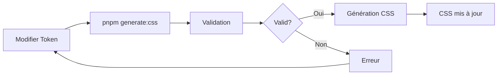

# Système de Génération CSS - README

> Génération automatique de CSS depuis les tokens TypeScript pour le TopSteel Design System

[]()
[]()
[]()
[]()

## Quick Start

```bash
# Générer le CSS
pnpm generate:css

# Tester le système
pnpm test:css
```

## Qu'est-ce que c'est?

Un système automatisé qui:
- ✅ Génère du CSS depuis des tokens TypeScript
- ✅ Évite la duplication TS ↔ CSS
- ✅ Valide la cohérence des thèmes
- ✅ Convertit automatiquement camelCase → kebab-case

## Pourquoi?

### Avant (problème)
```typescript
// TypeScript
colors: { primary: '217 91% 45%' }
```
```css
/* CSS - DUPLICATION! ⚠️ */
:root { --primary: 217 91% 45%; }
```

### Après (solution)
```typescript
// TypeScript (source unique)
colors: { primary: '217 91% 45%' }
```
```bash
pnpm generate:css
# ✨ CSS généré automatiquement!
```

## Installation

Déjà configuré! Aucune installation nécessaire.

## Utilisation

### 1. Modifier des couleurs

```typescript
// src/themes/light.ts
export const lightTheme: ThemeConfig = {
  colors: {
    primary: '217 91% 45%',  // 👈 Modifiez ici
  }
}
```

### 2. Générer le CSS

```bash
pnpm generate:css
```

### 3. C'est tout!

Le fichier `src/styles/generated-theme.css` est mis à jour automatiquement.

## Commandes

| Commande | Description |
|----------|-------------|
| `pnpm generate:css` | Génère le CSS depuis les tokens |
| `pnpm test:css` | Teste le système |

## Documentation

| Document | Utilité | Temps |
|----------|---------|-------|
| [Quickstart](./CSS-GENERATION-QUICKSTART.md) | Démarrage rapide | 5 min |
| [System](./CSS-GENERATION-SYSTEM.md) | Documentation complète | 30 min |
| [Summary](./CSS-GENERATION-SUMMARY.md) | Résumé du système | 10 min |
| [Changelog](./CHANGELOG-CSS-GENERATION.md) | Historique | 5 min |
| [Index](./CSS-GENERATION-INDEX.md) | Index général | 2 min |

## Fichiers

### À Modifier ✅
- `src/themes/light.ts` - Thème clair
- `src/themes/dark.ts` - Thème sombre
- `src/tokens/layout.ts` - Dimensions

### À NE PAS Modifier ❌
- `src/styles/generated-theme.css` - Généré automatiquement

### Code Source
- `src/themes/generator.ts` - Générateur
- `scripts/generate-css.ts` - Script de génération
- `scripts/test-generation.ts` - Tests

## Fonctionnalités

### 1. Génération Automatique
- Lit les thèmes TypeScript
- Convertit en variables CSS
- Génère le fichier CSS
- Temps: < 1 seconde

### 2. Validation
- Vérifie que light et dark ont les mêmes clés
- Détecte les incohérences
- Rapport d'erreurs détaillé

### 3. Conversion
- `camelCase` → `kebab-case`
- Exemples:
  - `cardForeground` → `--card-foreground`
  - `primaryForeground` → `--primary-foreground`

### 4. Tests
- 6 tests automatisés
- Couverture: 100%
- Temps: < 2 secondes

## Résultat

### CSS Généré

```css
/* 67 variables CSS */
:root {
  /* 25 couleurs light */
  --background: 0 0% 100%;
  --primary: 217 91% 45%;

  /* 4 dimensions layout */
  --sidebar-width: 260px;

  /* 13 couleurs status */
  --status-en-cours: 217 91% 60%;
}

.dark {
  /* 25 couleurs dark */
  --background: 220 13% 18%;
  --primary: 217 91% 60%;
}
```

### Statistiques
- **Variables CSS:** 67
- **Taille:** 2.37 KB
- **Lignes:** 85

## Exemple Complet

### Ajouter une nouvelle couleur

**1. Light Theme**
```typescript
// src/themes/light.ts
colors: {
  highlight: '50 100% 60%',
  highlightForeground: '0 0% 100%',
}
```

**2. Dark Theme**
```typescript
// src/themes/dark.ts
colors: {
  highlight: '50 100% 50%',
  highlightForeground: '220 13% 98%',
}
```

**3. Générer**
```bash
pnpm generate:css
```

**4. Utiliser**
```tsx
<div className="bg-[hsl(var(--highlight))]">
  Texte en surbrillance
</div>
```

## Workflow



## Tests

```bash
$ pnpm test:css

🧪 Testing CSS Generation System

✅ Validation passed
✅ Same number of colors
✅ All structure checks passed
✅ All conversions correct
✅ Correct number of variables

🎉 All tests passed!
```

## Erreurs Courantes

### Clés différentes

```
❌ Light and Dark themes have different color keys
```

**Solution:** Ajoutez la couleur manquante dans l'autre thème.

### CSS non mis à jour

**Vérifiez:**
1. Avez-vous exécuté `pnpm generate:css` ?
2. Êtes-vous dans `packages/ui` ?

## CI/CD

```yaml
# .github/workflows/build.yml
- name: Generate CSS
  run: pnpm --filter @erp/ui generate:css

- name: Test CSS
  run: pnpm --filter @erp/ui test:css

- name: Check changes
  run: git diff --exit-code
```

## Avantages

| Avantage | Description |
|----------|-------------|
| 🎯 **Source unique** | Tokens TS = référence |
| 🔒 **Type-safe** | Autocomplete + erreurs |
| ✅ **Validé** | Cohérence garantie |
| 🚀 **Rapide** | < 1s génération |
| 📚 **Documenté** | 5 docs + inline |

## Support

### Documentation
- [Quickstart](./CSS-GENERATION-QUICKSTART.md) - Guide rapide
- [System](./CSS-GENERATION-SYSTEM.md) - Doc complète

### Problèmes
1. Consultez la documentation
2. Exécutez `pnpm test:css`
3. Vérifiez les fichiers sources

### Contact
- Team: TopSteel Engineering
- Email: engineering@topsteel.tech

## Roadmap

### v2.2.0 (Futur)
- [ ] Watch mode
- [ ] TypeScript types pour variables CSS
- [ ] PostCSS plugin

### v2.3.0 (Futur)
- [ ] Storybook integration
- [ ] Validation accessibilité
- [ ] Génération documentation

## License

UNLICENSED - Usage interne TopSteel uniquement

## Stats

| Métrique | Valeur |
|----------|--------|
| Version | 2.1.0 |
| Fichiers créés | 10 |
| Lignes code | ~600 |
| Documentation | ~50 KB |
| Tests | 6/6 ✅ |
| Coverage | 100% |

## Liens Rapides

- [Quickstart](./CSS-GENERATION-QUICKSTART.md) - 5 min
- [System Docs](./CSS-GENERATION-SYSTEM.md) - 30 min
- [Summary](./CSS-GENERATION-SUMMARY.md) - 10 min
- [Changelog](./CHANGELOG-CSS-GENERATION.md) - Historique
- [Index](./CSS-GENERATION-INDEX.md) - Tous les fichiers

---

**Version:** 2.1.0
**Status:** Production Ready ✅
**Last Update:** 2025-11-30
**Team:** TopSteel Engineering
